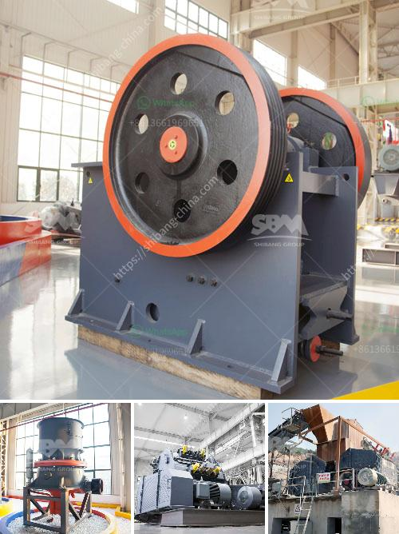

<h3>What is a tertiary crusher?</h3>
A tertiary crusher is a machine used for breaking up coarse material into smaller pieces. It is generally used to crush larger pieces of material, which are initially too large to be processed by secondary crushers. A tertiary crusher is used to produce finely crushed material when further reduction is needed past primary and secondary crushing.

Many high-capacity operations require the use of a tertiary crusher, as the size of the materials produced from primary and secondary crushing can be too large to be handled by downstream equipment. This is where a tertiary crusher comes into play, breaking down the material into smaller pieces that can be easily managed by the next stage of processing.

One of the main types of tertiary crushers is the cone crusher, a compression crusher that tends to produce a more cubical product. The cone crusher can be used for both secondary and tertiary crushing when utilized in combination with a primary crusher.

Other types of tertiary crushers include vertical shaft impactors (VSI) and horizontal shaft impactors (HSI). These crushers use the principles of impact and attrition to reduce the size of the material. VSI crushers are particularly effective in producing cubical-shaped particles, which are desirable for some applications such as road construction.

The primary function of a tertiary crusher is to further reduce the size of the material following the initial stages of crushing. Depending on the specific application, a tertiary crusher may be required to produce particles of a specific size and shape. This is often achieved by using a combination of different crushers in a crushing circuit.

In addition to reducing the size of the material, tertiary crushers can also be used to create a more uniform product. This is achieved by controlling the feed size and ensuring that only material within a specific range is processed by the crusher. This can help to improve the overall efficiency and performance of the downstream process.

Tertiary crushers are often used in the aggregate industry to produce cubical-shaped particles, which are desirable for certain applications such as concrete production. They can also be used in the mining industry to reduce the size of ore before processing. By reducing the size of the ore, more valuable minerals can be extracted, improving the overall efficiency of the operation.

In conclusion, a tertiary crusher is a machine used to finely crush material to a smaller size. It is often required in high-capacity operations where the size of the material produced from primary and secondary crushing is too large to be handled by downstream equipment. Tertiary crushers can be cone crushers, vertical shaft impactors, or horizontal shaft impactors, depending on the specific application. They are used to further reduce the size of the material and create a uniform product. Tertiary crushers are commonly used in the aggregate and mining industries.
<h3>Contact us</h3><ul><li><strong>Whatsapp:&nbsp;<a href="https://wa.me/8613661969651">+8613661969651</a></strong></li><li><a href="https://swt.shibang-china.com/?git&amp;zhl&amp;What is a tertiary crusher"><strong>Online Service(chat now)</strong></a></li></ul><h3>Related</h3><ul><li><a href='What is the waste of ore crushing plant .md'>What is the waste of ore crushing plant ?</a></li><li><a href='What is the design of the explosion proof valve for a coal mill.md'>What is the design of the explosion proof valve for a coal mill?</a></li><li><a href='What is the ore crusher discharge port size.md'>What is the ore crusher discharge port size?</a></li><li><a href='What equipment can be used to crush 6 mm aggregate into dust.md'>What equipment can be used to crush 6 mm aggregate into dust?</a></li><li><a href='What does a ball mill do in mining.md'>What does a ball mill do in mining?</a></li></ul>