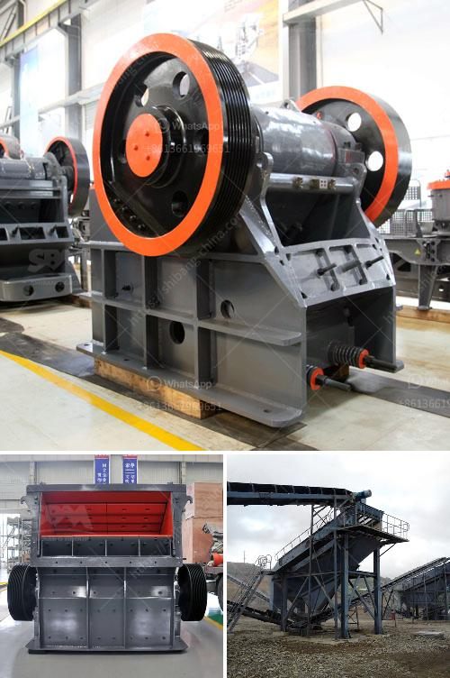

<h3>What is a vertical pulverizer?</h3>
A vertical pulverizer is a type of machinery that is used to grind various materials. It is designed with a vertical grinding chamber that provides a compact and efficient way of pulverizing materials. The vertical pulverizer machine takes advantage of gravity to feed materials into the grinding chamber, ensuring an even and consistent flow of material for efficient grinding.

The main purpose of a vertical pulverizer is to reduce the size of large coal or cement clinkers into smaller particles. It is commonly used in the coal-fired power plants and cement factories for efficient combustion or clinker production.

The vertical pulverizer operates by grinding the material between the grinding roller and the grinding plate. The grinding action is driven by the rotation of the grinding table, which in turn is driven by a motor. As the material is ground, it is carried by the airflow through the classifier, where the desired particle size is achieved. The oversized particles are returned to the grinding zone for further reduction, while the properly sized particles are collected and discharged.

One of the key advantages of a vertical pulverizer is its ability to produce a narrow particle size distribution. This is important in industries that require specific particle sizes to achieve optimal results, such as coal-fired power plants. A narrow particle size distribution ensures uniform combustion, resulting in higher fuel efficiency and lower emissions. Similarly, in cement production, a narrow particle size distribution ensures consistent clinker quality, leading to higher strength and durability of the final product.

In addition to its efficiency in grinding, a vertical pulverizer is also known for its reliability and low maintenance requirements. The vertical design allows for easy access to all parts of the machine, simplifying maintenance tasks such as replacing grinding elements or inspecting the classifier. This reduces downtime and overall maintenance costs.

Another advantage of a vertical pulverizer is its small footprint. Compared to horizontal pulverizers, the vertical design takes up less space in the plant, making it more suitable for retrofitting or installations in confined areas. The compact size also simplifies transportation and installation.

Today, manufacturers continue to improve the design and performance of vertical pulverizers. Advanced features, such as adjustable grinding pressure and automated controls, enable operators to fine-tune the process parameters for optimal grinding efficiency. These advancements, along with ongoing research and development, ensure that vertical pulverizers remain a reliable and efficient solution for various industries.

In conclusion, a vertical pulverizer is a machinery used in industries such as coal-fired power plants and cement factories to grind materials into smaller particles. It offers advantages such as a narrow particle size distribution, reliability, low maintenance requirements, and a small footprint. With ongoing advancements in design and functionality, vertical pulverizers continue to provide efficient and reliable grinding solutions for various applications.
<h3>Contact us</h3><ul><li><strong>Whatsapp:&nbsp;<a href="https://wa.me/8613661969651">+8613661969651</a></strong></li><li><a href="https://swt.shibang-china.com/?git&amp;zhl&amp;What is a vertical pulverizer"><strong>Online Service(chat now)</strong></a></li></ul><h3>Related</h3><ul><li><a href='what does a raymond coal mill cost？.md'>what does a raymond coal mill cost？</a></li><li><a href='What is the difference between an impact cone and jaw crusher.md'>What is the difference between an impact, cone, and jaw crusher?</a></li><li><a href='What RPM does the jaw crusher spin.md'>What RPM does the jaw crusher spin?</a></li><li><a href='What is 42 and 65 in 42×65 gyratory crusher.md'>What is 42 and 65 in 42×65 gyratory crusher?</a></li><li><a href='What is chrome ore used for.md'>What is chrome ore used for?</a></li></ul>