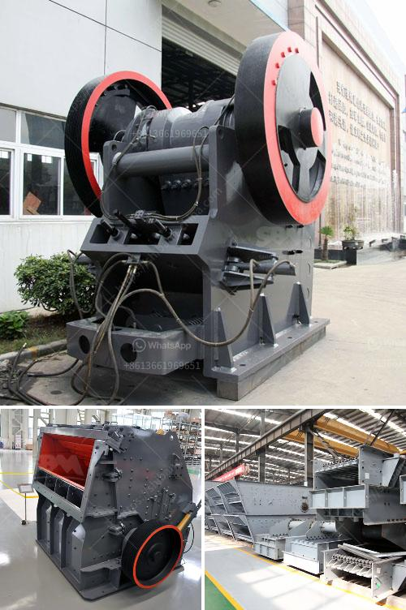

<h3>What is aggregates in mining ?</h3>
Aggregates in mining refer to a variety of materials used in construction, including sand, gravel, crushed stone, slag, recycled concrete, and geosynthetic aggregates. They are essential resources for building infrastructure such as roads, bridges, buildings, and airports. These materials are widely used in the construction industry for their durability, versatility, and availability.

Mining aggregates involves extracting these materials from natural deposits, such as rivers, lakes, or quarries. The process typically begins with the selection of a suitable site and obtaining permits and licenses. Once the location is secured, heavy equipment and machinery, such as excavators, bulldozers, and crushers, are used to extract and process the aggregates.

The mining process starts with the removal of overburden – the top layer of soil, vegetation, and any other materials that cover the aggregate deposits. This is followed by excavation to reach the desired depth, where the aggregates are located. The extracted materials are then sorted and separated based on their size, shape, and quality.

Aggregates are often categorized into different sizes, such as coarse, fine, and base. Coarse aggregates, typically consisting of crushed stone or gravel, are used in the production of concrete and asphalt mixtures. They provide strength and stability to the final product. Fine aggregates, including sand, are used for various purposes, such as plastering, masonry, and creating a smooth surface for finishing works. Base aggregates are used as a foundation for roads and pavements, providing stability and load-bearing capacity.

The demand for aggregates in the construction industry is vast and ever-growing. As urbanization continues to expand and infrastructure projects are on the rise, the need for quality aggregates remains constant. They are considered the backbone of construction projects, playing a crucial role in their success and longevity.

However, mining aggregates can have potential environmental impacts. Extraction activities can disrupt ecosystems, impact wildlife habitats, and alter the natural watercourse. It is essential for mining companies to implement sustainable practices to minimize these impacts. This includes proper land rehabilitation, water management, and adopting efficient technologies to reduce energy consumption and emissions.

Moreover, the use of recycled aggregates has gained prominence in recent years. Recycling materials from demolished structures or industrial by-products not only reduces the need for extensive mining but also promotes environmental sustainability. Recycled aggregates can be used in various applications, including road bases, backfill materials, and drainage layers.

In conclusion, aggregates in mining play a vital role in the construction industry. They are indispensable for building infrastructure and are used in a wide range of applications. However, it is important for mining companies to prioritize sustainable practices and explore alternatives such as recycled aggregates to minimize environmental impacts. By doing so, the mining industry can ensure the availability of these essential resources for future generations while reducing its ecological footprint.
<h3>Contact us</h3><ul><li><strong>Whatsapp:&nbsp;<a href="https://wa.me/8613661969651">+8613661969651</a></strong></li><li><a href="https://swt.shibang-china.com/?git&amp;zhl&amp;What is aggregates in mining "><strong>Online Service(chat now)</strong></a></li></ul><h3>Related</h3><ul><li><a href='What is needed to open a quarry .md'>What is needed to open a quarry ?</a></li><li><a href='What is a belt conveyor machine .md'>What is a belt conveyor machine ?</a></li><li><a href='What is Crushing and Screening .md'>What is Crushing and Screening ?</a></li><li><a href='What is the minimum possible crushing size of limestone after it has been crushed in a crusher.md'>What is the minimum possible crushing size of limestone after it has been crushed in a crusher?</a></li><li><a href='What does a compound pendulum jaw crusher.md'>What does a compound pendulum jaw crusher?</a></li></ul>