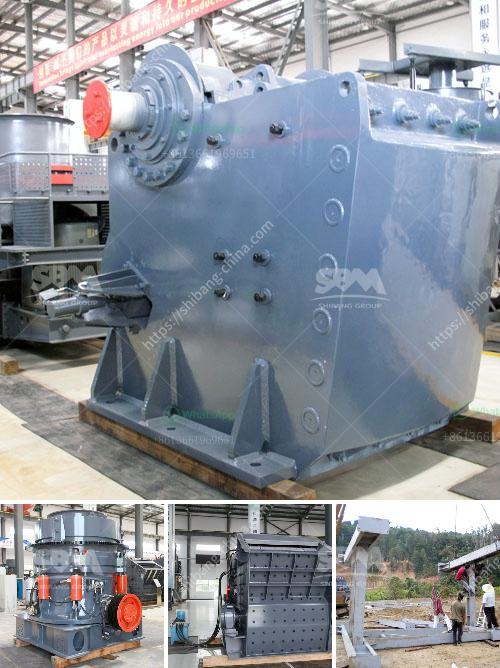

<h3>What is an impact crusher and what is its working principle?</h3>
An impact crusher is a machine that uses striking as opposed to pressure to reduce the size of a material. Impact crushers are designated as a primary, secondary, tertiary, or quarternary rotor crusher depending on which processing stage the equipment is being utilized. These impact crushers are manufactured with a high inertia rotor for improved crushing efficiency and precision.

The working principle of an impact crusher involves the use of impact to decrease the size of a material. Initially, the material is struck by rotating hammers against a sturdy surface. Once the particles are gripped in the grinding chamber, they are gradually crushed against the wall until they become small enough to pass through the opening at the bottom.

One of the key components of an impact crusher is the rotor. It is composed of a heavy-duty steel plate and a spindle that holds the hammers. A rotor is divided into four rotor cavities, each equipped with two hammers. As the rotor spins, the hammers strike the material, causing it to be crushed against the sturdiest part of the machine - the impact wall.

The machine controls the intensity of the impact by adjusting the distance between the rotor and the impact wall. The closer the rotor is to the impact wall, the more powerful the impact will be, resulting in a finer crushing. Conversely, if the rotor is further away, the impact will be weaker and the crushing will not be as fine.

An important feature of impact crushers is their ability to produce a cubical-shaped end product. With the help of a vibrating screen, the crushed material can be sorted into different sizes. This ensures that the end product is of consistent quality and can be used for specific applications such as road construction, concrete manufacturing, and recycling.

Impact crushers are commonly used in quarrying, mining, recycling, and construction projects. They are highly versatile machines that can handle a wide range of materials, including asphalt, limestone, concrete, and gravel.

In addition to their versatility, impact crushers offer a key advantage over other types of crushers - they can efficiently process materials with a high moisture content. This is particularly beneficial in areas where the weather conditions are humid or during the rainy season, as it allows for uninterrupted operation of the machine.

Furthermore, impact crushers are relatively low maintenance machines. They contain fewer moving parts than other crushers, reducing the chances of mechanical failure and lowering maintenance costs.

In conclusion, an impact crusher is a machine that uses striking to break down materials. Its working principle is based on the impact between the rotor and the impact wall. The intensity of the impact can be adjusted to produce a range of desired end products, from coarse road base to fine gravel. Impact crushers are widely used in various industries, providing the necessary crushing power to break down materials efficiently and produce high-quality end products.
<h3>Contact us</h3><ul><li><strong>Whatsapp:&nbsp;<a href="https://wa.me/8613661969651">+8613661969651</a></strong></li><li><a href="https://swt.shibang-china.com/?git&amp;zhl&amp;What is an impact crusher and what is its working principle"><strong>Online Service(chat now)</strong></a></li></ul><h3>Related</h3><ul><li><a href='what are the equipment in iron ore crusher？.md'>what are the equipment in iron ore crusher？</a></li><li><a href='What equipment is used to mine tungsten stone crusher.md'>What equipment is used to mine tungsten stone crusher?</a></li><li><a href='What type of quarry crusher is .md'>What type of quarry crusher is ?</a></li><li><a href='What is 42 and 65 in 42×65 gyratory crusher.md'>What is 42 and 65 in 42×65 gyratory crusher?</a></li><li><a href='What equipment is used on a bauxite site.md'>What equipment is used on a bauxite site?</a></li></ul>