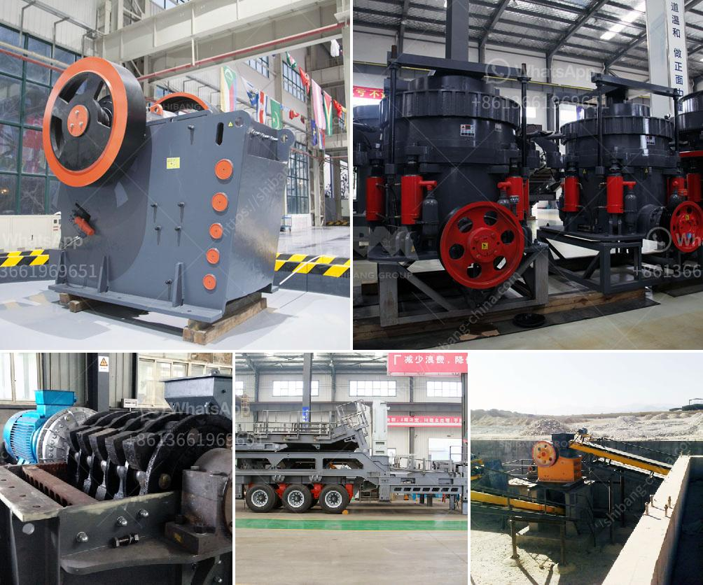

<h3>What is an open-circuit ball mill?</h3>
An open-circuit ball mill refers to a type of ball mill that operates without a closed-circuit system and is feed directly from a crusher. Open-circuit ball mills are often used in cement production to grind clinker and gypsum to produce cement. In the traditional cement production process, the clinker is first crushed in a jaw crusher and then ground in a ball mill.

The raw materials for cement production are limestone and clay or shale. These natural resources are abundant in many regions, making cement production a vital industry globally. The primary step in the cement manufacturing process is the extraction and preparation of raw materials.

Once the raw materials are extracted, they are crushed and homogenized to form a uniform mixture. This mixture, known as raw meal, is then heated in a rotary kiln at high temperatures to produce clinker. The clinker is a grayish-black material with a grain size of about 3-25 mm. It acts as the main component in cement production.

To produce cement from clinker, it is necessary to grind the clinker finely with gypsum. This grinding process is performed in a ball mill, a type of grinding machine renowned for its versatility and wide range of applications. A ball mill typically consists of a cylindrical shell that rotates around its axis, partially filled with grinding media such as steel balls, raw materials, or even liquids.

In a closed-circuit system, the clinker and gypsum are combined and ground together in the ball mill. The resulting fine powder, known as cement, is then sent to the storage silos for further processing or packaging. In contrast, an open-circuit ball mill operates independently without the need for a pre-grinding system. The clinker is fed directly to the mill from the crusher.

Open-circuit ball mills are used widely in cement industry. In the cement manufacturing process, clinker is fed to the mill along with limestone and gypsum. The feed is then ground in a rotating ball mill, with water added to form a slurry. The slurry is pumped into storage tanks, where it is further agitated to achieve uniformity and homogeneity.

The advantage of using an open-circuit system is its simplicity and cost-effectiveness. It requires less equipment and infrastructure compared to closed-circuit systems, making it suitable for small-scale cement production. Additionally, open-circuit ball mills can be easily adapted for changes in feed size distribution, grindability, or moisture content, allowing for greater operational flexibility.

However, open-circuit ball mills have some limitations. Without a closed-circuit system, the material retention time in the mill is shorter, resulting in reduced grinding efficiency. Additionally, the absence of an external classifier makes it challenging to control the particle size distribution of the final product.

In conclusion, an open-circuit ball mill is a type of ball mill that operates without a closed-circuit system. It is feed directly from a crusher and is widely used in cement production. While it offers simplicity and cost-effectiveness, it also has limitations in terms of grinding efficiency and control over particle size distribution.
<h3>Contact us</h3><ul><li><strong>Whatsapp:&nbsp;<a href="https://wa.me/8613661969651">+8613661969651</a></strong></li><li><a href="https://swt.shibang-china.com/?git&amp;zhl&amp;What is an opencircuit ball mill"><strong>Online Service(chat now)</strong></a></li></ul><h3>Related</h3><ul><li><a href='What is the way to block the material of sand crusher .md'>What is the way to block the material of sand crusher ?</a></li><li><a href='What is the major step in the process of openpit and underground mining.md'>What is the major step in the process of open-pit and underground mining?</a></li><li><a href='What kind of equipment is used for fine crushed stone？.md'>What kind of equipment is used for fine crushed stone？</a></li><li><a href='what equipment are used in the production of bentonite？.md'>what equipment are used in the production of bentonite？</a></li><li><a href='What is white silica sand used for .md'>What is white silica sand used for ?</a></li></ul>