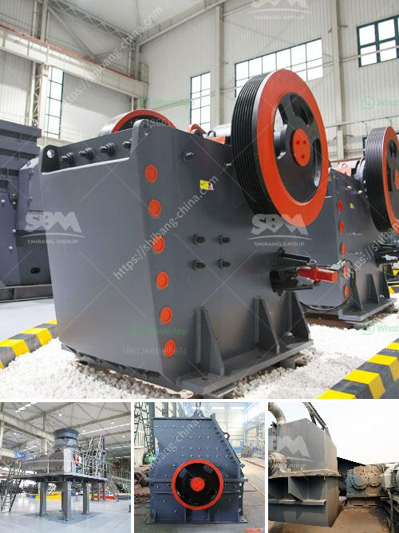

<h3>What is antimony ore used for?</h3>
Antimony is a naturally occurring element, commonly referred to as a semi-metal or metalloid. It is widely found in nature, primarily in the form of antimony ore, which is also known as stibnite. Antimony ore is found in large quantities in many countries, including China, Bolivia, Russia, and South Africa.

1. Flame retardant: One of the primary uses of antimony ore is in flame retardant applications. Antimony trioxide, a compound derived from antimony ore, is added to plastics, textiles, and coatings to make them more resistant to fire. It works by releasing water vapor when exposed to flames, which helps extinguish the fire and prevents it from spreading.

2. Batteries: Antimony is an essential component in lead-acid batteries. It improves the durability and longevity of batteries, making them more efficient. Antimony, in the form of an alloy called antimonial lead, is added to the positive electrodes of batteries, allowing them to deliver sustained power over a long period.

3. Antimony trisulfide: Antimony ore is processed to produce a compound called antimony trisulfide, which is used in the production of matches. The striking surface of matchboxes contains antimony trisulfide, which, when combined with potassium chlorate and sulfur, creates a friction-sensitive compound that ignites when rubbed against the striking strip.

4. Ceramics and glass: Antimony oxide, obtained from antimony ore, is used as a white pigment in ceramics and glass manufacturing. It provides opacity, brightness, and whiteness to the final product. Additionally, antimony compounds act as a fining agent, improving the clarity and brilliance of glass.

5. Metallurgy: Antimony has various applications in metallurgical processes. It is commonly used as a hardening agent in alloys. For example, antimony is added to lead to create an alloy that has increased strength and hardness. This alloy is then used in the production of bearings, storage batteries, bullets, and other items that require improved durability.

6. Medicinal purposes: Antimony has a long history of use in traditional medicine. However, due to its potential toxicity, its medicinal use has become restricted over time. Historically, antimony compounds were used to treat various ailments, including skin infections, digestive disorders, and parasitic infections.

7. Other uses: Antimony ore also finds applications in various other industries. For instance, it is used as a catalyst in the production of polyester fibers and polyethylene terephthalate (PET) resins. It is also utilized as an opacifier in paints, an additive in rubber, and as a pigment in inks and dyes.

While antimony ore has numerous applications, it is important to note that antimony and its compounds can be toxic. Prolonged exposure to antimony can have detrimental health effects, including respiratory issues, skin irritation, and gastrointestinal problems. Therefore, responsible handling and proper safety measures must be implemented to protect workers and the environment during the extraction and processing of antimony ore.

In conclusion, antimony ore is a versatile material with diverse applications. From flame retardants and batteries to ceramics and glass, its various compounds play crucial roles in a wide range of industries. However, it is crucial to balance its useful properties with the potential risks associated with this element.
<h3>Contact us</h3><ul><li><strong>Whatsapp:&nbsp;<a href="https://wa.me/8613661969651">+8613661969651</a></strong></li><li><a href="https://swt.shibang-china.com/?git&amp;zhl&amp;What is antimony ore used for"><strong>Online Service(chat now)</strong></a></li></ul><h3>Related</h3><ul><li><a href='What are equipments used in a cement plant .md'>What are equipments used in a cement plant ?</a></li><li><a href='What is the yield in mineral processing.md'>What is the yield in mineral processing?</a></li><li><a href='What can dolomite be used for and how to processing it.md'>What can dolomite be used for and how to processing it?</a></li><li><a href='What is a belt conveyor machine .md'>What is a belt conveyor machine ?</a></li><li><a href='What kind of mining crusher has a good high yield.md'>What kind of mining crusher has a good high yield?</a></li></ul>