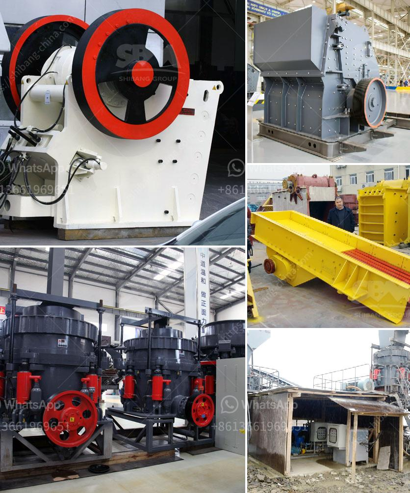

<h3>What is bauxite used to make? and how to extraction process?</h3>
Bauxite, a naturally occurring mineral, is primarily mined for the production of aluminum, a lightweight, versatile metal renowned for its unique properties. This pivotal mineral plays a significant role in various industries worldwide due to the extensive applications derived from its refined form. In this article, we will delve into the uses of bauxite and explore the extraction process involved.

One of the most prevalent uses of bauxite is the production of alumina, which is further processed to create aluminum metal. This remarkable metal boasts exceptional properties, such as high strength-to-weight ratio, excellent corrosion resistance, and thermal conductivity. Consequently, aluminum is commonly used in the aerospace industry to manufacture aircraft frames, wings, and other structural components. Additionally, it finds application in the transportation sector, as it is employed in the construction of automobiles, trains, and ships, where its lightweight nature contributes to fuel efficiency.

Bauxite plays a crucial role in the manufacturing of consumer goods as well. It is utilized to produce various household items like foils, cans, and cooking utensils due to aluminum's non-reactive nature and ability to retain heat. Furthermore, the construction industry extensively employs aluminum for windows, doors, cladding, and roofing, thanks to its resilience against weathering and corrosion.

The extraction process of bauxite comprises a series of steps, beginning with the stripping of overlying vegetation, soil, and rocky layers to expose the bauxite ore beneath. Once the topsoil is removed, the bauxite layer is blasted and excavated using large drilling machines and explosive charges. The extracted bauxite is then loaded onto trucks or rail cars and transported to refining plants.

At the refining plant, the bauxite ore is crushed into a fine powder and heated in high-pressure vessels, where it undergoes a chemical process known as the Bayer process. This process involves mixing the crushed bauxite with a hot sodium hydroxide solution, which dissolves the aluminum-bearing minerals while leaving behind impurities. The resulting solution is then filtered to remove these impurities.

After filtration, the solution is cooled and seeded with aluminum hydroxide crystals, initiating the precipitation of pure alumina compounds. The precipitated material is washed, filtered, and calcined in kilns at high temperatures, transforming it into alumina, a white powder with the chemical formula Al2O3. This alumina is then transported to aluminum smelters, where it is electrolyzed to produce metallic aluminum, the final product.

It is important to note that the extraction and refining processes of bauxite require significant energy inputs due to the high temperatures involved. Therefore, efforts are being made to develop sustainable practices, such as recycling aluminum and improving energy efficiency, to reduce the environmental impact of the bauxite mining and refining industry.

In conclusion, bauxite is a versatile and valuable mineral primarily used for the production of aluminum metal. Its lightweight and corrosion-resistant properties make aluminum a sought-after material in various industries, including aerospace, transportation, and construction. The extraction process involves mining, crushing, refining, and electrolyzing, resulting in the formation of alumina, which is then transformed into metallic aluminum. As the demand for aluminum continues to grow, it is important to explore sustainable practices to ensure the long-term viability of the bauxite industry.
<h3>Contact us</h3><ul><li><strong>Whatsapp:&nbsp;<a href="https://wa.me/8613661969651">+8613661969651</a></strong></li><li><a href="https://swt.shibang-china.com/?git&amp;zhl&amp;What is bauxite used to make and how to extraction process"><strong>Online Service(chat now)</strong></a></li></ul><h3>Related</h3><ul><li><a href='What are the specifications of the copper crusher.md'>What are the specifications of the copper crusher?</a></li><li><a href='What is the difference between impact crusher and jaw crusher.md'>What is the difference between impact crusher and jaw crusher?</a></li><li><a href='What is the smallest size of output for a hammer crusher.md'>What is the smallest size of output for a hammer crusher?</a></li><li><a href='What are the factors that promote the development of mining.md'>What are the factors that promote the development of mining?</a></li><li><a href='What machines are used in quarry mining What is the role of each.md'>What machines are used in quarry mining? What is the role of each?</a></li></ul>