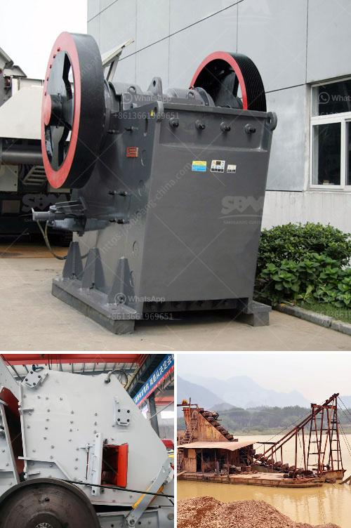

<h3>What is chrome ore used for?</h3>
Chrome ore, derived from the mineral chromite, is a vital ingredient in various types of steel production. Not only do these metallic alloys have various industrial applications, but they are also crucial for many everyday products. Chrome ore is primarily used in the manufacturing of stainless steel, which accounts for approximately 80% of all chromite usage. Chrome-supported stainless steel is highly resistant to corrosion and discoloration, making it ideal for various household items such as kitchen utensils, appliances, and bathroom fixtures.

One of the main properties of chrome ore is its high melting point, which enables the creation of stainless steel. This alloy is a combination of iron, chromium, and other elements like carbon, nickel, and molybdenum, depending on the desired properties. Chromium, the main component derived from chrome ore, provides stainless steel with its corrosion-resistant properties. This makes it an essential material for applications in environments where exposure to water, chemicals, and heat is common.

In addition to stainless steel, chrome ore is also used in the production of high-temperature and corrosion-resistant alloys known as superalloys. Superalloys are used in various industries such as aerospace, energy, and automotive manufacturing. These alloys can withstand extreme conditions, including high temperatures, pressure, and corrosive environments. Chrome ore provides the necessary strength, durability, and heat resistance required for these demanding applications.

Chrome ore mining and processing contribute significantly to employment opportunities and economic growth in various regions across the globe. While the majority of chromite resources are found in South Africa, Kazakhstan, and Turkey, many other countries also have significant deposits. The extraction and processing of chrome ore require large-scale, energy-intensive machinery and infrastructure. This provides employment for many individuals involved in the mining and processing sectors.

Furthermore, the use of chrome ore in stainless steel production supports various industrial sectors. Stainless steel is utilized in the construction of buildings, bridges, and infrastructure due to its strength and durability. It is also commonly found in automotive parts, railway tracks, and pipelines due to its resistance to corrosion and degradation over time. The versatility of stainless steel extends to various other applications, including cutlery, medical instruments, jewelry, and even art sculptures.

Despite its numerous industrial applications, chrome ore usage raises environmental considerations. The mining and processing of chromite can result in the release of hazardous substances and pollutants. Proper waste management, adherence to environmental regulations, and technological advancements can mitigate these environmental concerns.

In conclusion, chrome ore is a critical raw material in the production of stainless steel. Its corrosion resistance and high melting point make it an ideal component for various industrial and everyday applications. From kitchen utensils and appliances to aerospace components, the versatility of stainless steel derived from chrome ore is undeniable. However, it remains crucial for the industry to prioritize sustainable mining practices and environmental responsibility to ensure the continued availability and utilization of this important material.
<h3>Contact us</h3><ul><li><strong>Whatsapp:&nbsp;<a href="https://wa.me/8613661969651">+8613661969651</a></strong></li><li><a href="https://swt.shibang-china.com/?git&amp;zhl&amp;What is chrome ore used for"><strong>Online Service(chat now)</strong></a></li></ul><h3>Related</h3><ul><li><a href='What is the cost of artificial sand projects.md'>What is the cost of artificial sand projects?</a></li><li><a href='What equipment do you need for coal mining.md'>What equipment do you need for coal mining?</a></li><li><a href='what equipments are used in the production of bentonite？.md'>what equipments are used in the production of bentonite？</a></li><li><a href='what are the equipment in iron ore crusher？.md'>what are the equipment in iron ore crusher？</a></li><li><a href='What are the mechanical devices used in mining What is the role of each.md'>What are the mechanical devices used in mining? What is the role of each?</a></li></ul>