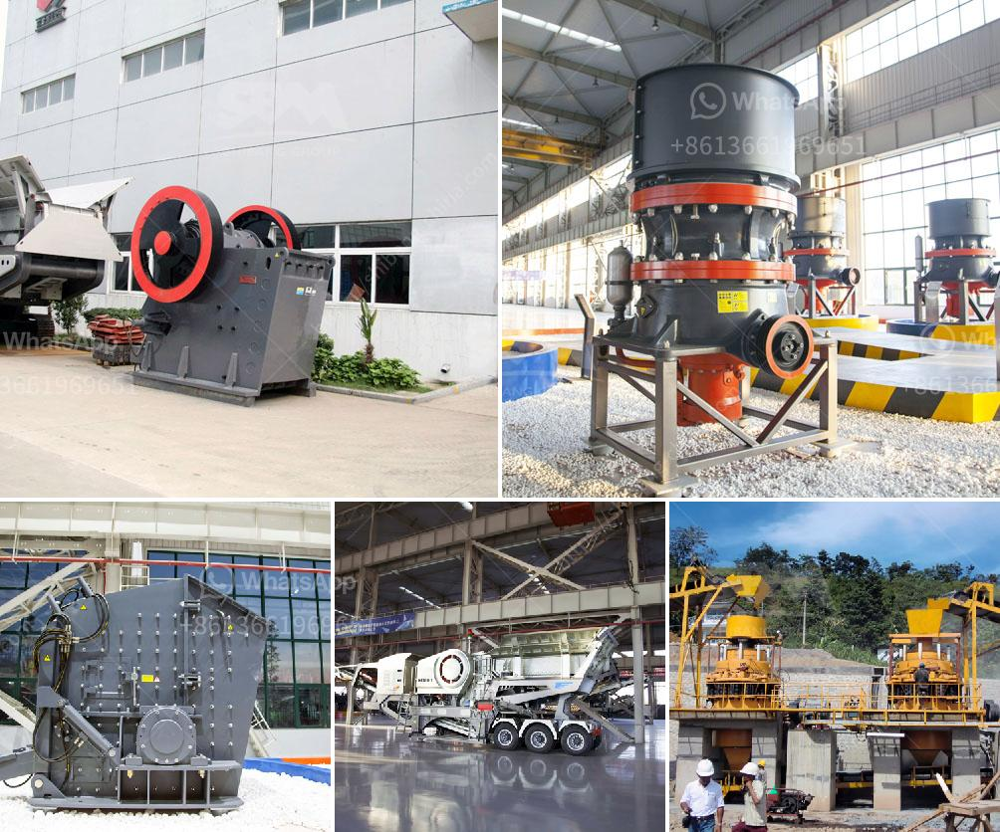

<h3>What is cone crusher ?</h3>
A cone crusher is a type of rock crusher that is used to crush materials to a certain size. It is mainly used in the material processing industry for stone crushing and mining purposes. Cone crushers come in various sizes and models, and operate in different ways.

The working principle of a cone crusher is similar to that of an gyratory crusher. However, cone crushers are designed to be more powerful and rugged, making them suitable for crushing hard materials. Cone crushers are often used in medium and fine crushing operations, widely used in mining industry, metallurgy industry, construction industry, road construction industry, chemical industry and silicate industry, etc.

A cone crusher is used to break blocks of mineral matter into smaller pieces of a desired size. The material is crushed between an eccentrically rotating cone and a concave hopper, both reinforced with a wear-resistant surface. Material introduced from above wedges between the cone and hopper surfaces and is crushed by compression.

With the development of mining technology, cone crushers are also divided into several types, including spring cone crushers, rolling bearing cone crushers, hydraulic cone crushers, and compound cone crushers. The working principles of these crushers are different, so their application fields are different as well.

The design of the cone crusher is unique, advanced, and requires less energy to operate. The operation is easy and convenient, and the degree of automation is high. Crushing cavity is specially designed according to customer requirements, and the particle size is even, which makes the cone crusher greatly improve production efficiency.

Cone crushers are typically used for secondary or tertiary crushing in hard rock and gravels crushing circuits. They are also suitable for crushing the materials with compression strength less than 350Mpa, such as limestone, sandstone, granite and basalt. However, they are ideal for producing specific products like asphalt and concrete aggregates.

Cone crushers are also extremely versatile and multifunctional machines that can be used in all stages of the crushing process. Cone crushers have been used as primary, secondary and tertiary crushers for quite a long time. They are widely employed for crushing hard and abrasive materials in both the aggregate and mining industries.

In summary, cone crusher applications and types remain fairly similar in value, but the crusher industry is not limited to these few types. There are many different crusher manufacturers in the market today. Cone crushers offer numerous benefits, including rugged construction, high productivity, easy adjustment, and low operation cost. With these advantages, cone crushers are more and more widely used in various industries. Whether you are processing coarse or fine materials, cone crushers ensure high productivity, efficient crushing, and a high-quality end product.
<h3>Contact us</h3><ul><li><strong>Whatsapp:&nbsp;<a href="https://wa.me/8613661969651">+8613661969651</a></strong></li><li><a href="https://swt.shibang-china.com/?git&amp;zhl&amp;What is cone crusher "><strong>Online Service(chat now)</strong></a></li></ul><h3>Related</h3><ul><li><a href='what is iron ore screening equipment？.md'>what is iron ore screening equipment？</a></li><li><a href='what are the steps limestone ore processed？.md'>what are the steps limestone ore processed？</a></li><li><a href='What do crusher model letters represent.md'>What do crusher model letters represent?</a></li><li><a href='What mechanical equipment is used to mine copper？.md'>What mechanical equipment is used to mine copper？</a></li><li><a href='What is the mining process of barite？.md'>What is the mining process of barite？</a></li></ul>