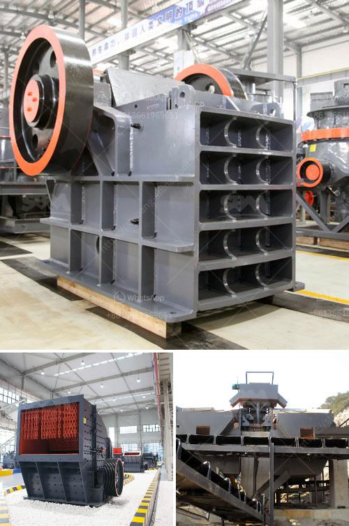

<h3>What is construction waste, and what can we do to reuse it?</h3>
Construction waste refers to the materials and debris generated during the construction, renovation, and demolition of buildings, roads, and other structures. It includes concrete, wood, metal, bricks, glass, plastics, and other materials that are discarded after construction activities. Construction waste is a significant global issue, accounting for a large portion of the total waste generated worldwide.

The construction industry is notorious for generating substantial amounts of waste. According to recent estimates, construction waste comprises approximately 35-40% of all solid waste produced globally. This waste contributes to environmental pollution, depletes natural resources, and occupies precious landfill space.

However, construction waste can also be seen as a valuable resource that, if managed properly, can be reused and recycled. Reduced waste generation, as well as efficient waste management practices, can have significant environmental and economic benefits. Here are some ways we can effectively reuse construction waste:

1. Salvaging materials: One of the most straightforward approaches is to salvage and reuse materials whenever possible. Salvaging items like doors, windows, fixtures, and even lumber can reduce waste and save money on purchasing new materials. These salvaged materials can be refurbished and incorporated into new construction projects or donated to organizations that support affordable housing or disaster recovery efforts.

2. Recycling: Recycling construction waste is another essential strategy. Materials like concrete, metal, wood, and asphalt can be broken down and processed into new products. By recycling, we can reduce demand for virgin resources, conserve energy used in the production of new materials, and minimize pollution associated with extraction and manufacturing processes.

3. Repurposing and upcycling: Construction waste can be creatively repurposed and upcycled into new items or used for different purposes. For example, wood from demolitions can be turned into furniture, decking, or even art installations. Bricks and concrete can be crushed to create gravel or used as fill material. By exploring innovative ideas and designs, we can give a new life to materials that would otherwise end up in a landfill.

4. Landfill diversion programs: Governments and organizations can establish programs that encourage landfill diversion of construction waste. Offering incentives or providing subsidies for recycling and reuse activities can motivate businesses and individuals to adopt more sustainable practices. Setting waste diversion targets and implementing strict regulations can also ensure compliance and reduce the environmental impact of construction activities.

5. Construction waste management plans: Before beginning any construction project, having a comprehensive waste management plan is crucial. This plan should outline strategies for waste reduction, sorting, recycling, and disposal. Effective waste management practices can help minimize waste generation, increase recycling rates, and ensure that hazardous materials are handled safely.

In conclusion, construction waste presents both challenges and opportunities. By adopting sustainable practices and thinking creatively, we can reduce waste generation, conserve resources, and mitigate the environmental impacts associated with the construction industry. Reusing, recycling, and repurposing construction waste must become a priority for individuals, businesses, and governments alike to achieve a more sustainable future.
<h3>Contact us</h3><ul><li><strong>Whatsapp:&nbsp;<a href="https://wa.me/8613661969651">+8613661969651</a></strong></li><li><a href="https://swt.shibang-china.com/?git&amp;zhl&amp;What is construction waste and what can we do to reuse it"><strong>Online Service(chat now)</strong></a></li></ul><h3>Related</h3><ul><li><a href='What happens to the crusher when the manganese liner starts to wear out.md'>What happens to the crusher when the manganese liner starts to wear out?</a></li><li><a href='What is a vertical pulverizer.md'>What is a vertical pulverizer?</a></li><li><a href='What to people use silica sand mining for .md'>What to people use silica sand mining for ?</a></li><li><a href='what is a mobile impactor crusher？.md'>what is a mobile impactor crusher？</a></li><li><a href='What do crusher model letters represent.md'>What do crusher model letters represent?</a></li></ul>