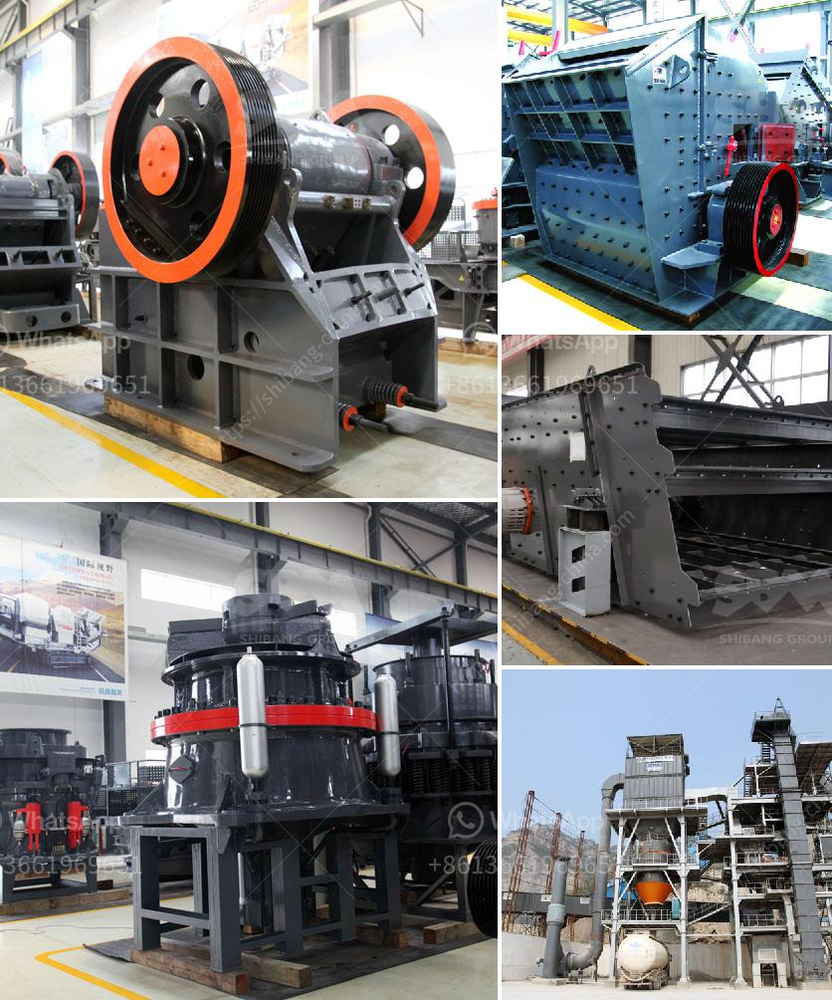

<h3>What is crushed quartz stone?</h3>
Crushed quartz stone is a versatile and durable material that is often used for residential and commercial purposes. It is made by crushing quartz rocks into small pieces and then cleaning them to remove any impurities or debris. This process creates a smooth and consistent texture, making crushed quartz stone perfect for various applications.

One of the most common uses of crushed quartz stone is as an aggregate in concrete mixes. Due to its high hardness and chemical resistance, quartz adds strength and durability to the concrete, making it ideal for heavy-duty applications such as building foundations and road construction. Its consistent size and shape also provide a more uniform and aesthetically pleasing appearance to the concrete surface.

Additionally, crushed quartz stone is commonly used as a decorative material in landscaping projects. Its natural luster and beautiful range of colors, including white, grey, and earth tones, make it a popular choice for paths, driveways, and garden borders. The crushed quartz stones can be arranged in various patterns and sizes, allowing for creative and unique designs that enhance the overall appeal of outdoor spaces.

Another significant application of crushed quartz stone is in the manufacturing of quartz countertops. Engineered quartz countertops have gained immense popularity in recent years due to their outstanding durability, low maintenance, and aesthetic appeal. Crushed quartz stones are mixed with binders, resin, and pigments to create slabs that mimic the appearance of natural stone. The resulting quartz countertops are highly resistant to stains, scratches, and heat, making them a practical choice for kitchens and bathrooms.

In the realm of jewelry and accessories, crushed quartz stone is often used as a filler in various products, such as pendants, earrings, and bracelets. The crushed stones are set into molds with resin or other materials, creating stunning pieces that sparkle and catch the light. The clear and transparent nature of quartz allows it to reflect and refract light, adding an enchanting touch to jewelry designs.

Moreover, crushed quartz stone has industrial applications as well. It can be used as a key component in the production of glass, ceramics, and electronic components. Due to its high melting point and chemical stability, quartz is an essential ingredient in creating transparent glass items such as windows, lenses, and laboratory equipment. It also acts as a flux in ceramic manufacturing processes, allowing for the formation of strong and heat-resistant products.

In conclusion, crushed quartz stone is a versatile and valuable material that has various applications across industries. From construction to landscaping, from jewelry to industrial manufacturing, it offers strength, durability, and aesthetic appeal. Its consistent texture and wide range of colors make it a sought-after choice for countless projects where beauty and functionality are desired.
<h3>Contact us</h3><ul><li><strong>Whatsapp:&nbsp;<a href="https://wa.me/8613661969651">+8613661969651</a></strong></li><li><a href="https://swt.shibang-china.com/?git&amp;zhl&amp;What is crushed quartz stone"><strong>Online Service(chat now)</strong></a></li></ul><h3>Related</h3><ul><li><a href='what equipments are used in the production of bentonite？.md'>what equipments are used in the production of bentonite？</a></li><li><a href='What is vsi in mobile stone jaw crusher.md'>What is vsi in mobile stone jaw crusher</a></li><li><a href='What are the Different Types of Crusher How to choose.md'>What are the Different Types of Crusher? How to choose?</a></li><li><a href='What are the uses of a cone crusher to mining operations.md'>What are the uses of a cone crusher to mining operations?</a></li><li><a href='What is the feed of the jaw crusher .md'>What is the feed of the jaw crusher ?</a></li></ul>