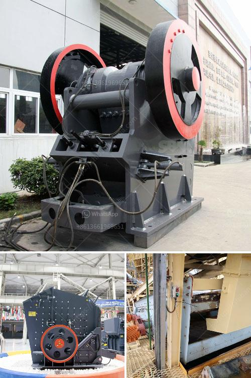

<h3>What is froth flotation used for in mines?</h3>
Mining is a complex and costly process that often involves the extraction of valuable minerals from ore bodies deep within the Earth's crust. One essential tool utilized by mines worldwide is froth flotation, a process that separates valuable minerals from ores allowing for their extraction.

Froth flotation, also known as ore flotation or flotation separation, relies on the physicochemical properties of minerals surfaces and their interaction with reagents. This process involves the use of frothers, collectors, and modifiers to selectively separate minerals from the gangue. The resulting mineral concentrate is then further processed for smelting or refining.

The primary objective of froth flotation is to maximize the value of the ore by selectively extracting desired minerals while leaving undesirable minerals behind. Mines employ this technique to recover a range of metals and minerals such as copper, gold, silver, zinc, lead, nickel, cobalt, molybdenum, phosphate, and many others.

The process begins by crushing and grinding the ore into fine particles. These particles are then mixed with water, creating a pulp. To this pulp, collectors, such as xanthates or fatty acids, are added. Collectors selectively adsorb onto the surface of target minerals, making them hydrophobic (repelling water) while leaving the gangue minerals hydrophilic (attracted to water).

After adding the collectors, frothers are introduced into the pulp, which help to create a stable foam or froth. This froth contains the target minerals that have attached to the air bubbles formed by the agitation of the pulp. The froth is then skimmed off the top of the flotation cell, while the gangue minerals sink to the bottom, referred to as the tailings.

The separated concentrate contains a high percentage of the valuable minerals, which can further undergo additional processing to achieve desired purity. The tailings, on the other hand, are discarded as waste, reducing the environmental impact of mining operations.

Froth flotation offers several advantages over other mineral processing techniques. It is a relatively low-cost process that requires minimal energy input compared to other methods such as gravity separation or magnetic separation. Additionally, froth flotation is highly selective, enabling miners to concentrate specific minerals efficiently.

The use of froth flotation in mining has revolutionized the industry. It has provided a means to extract valuable minerals that were previously deemed uneconomical due to low concentrations or complex ore compositions. As a result, it has greatly expanded the range of economically viable deposits that can be mined.

Furthermore, froth flotation has contributed to the sustainability of mining operations. By selectively extracting minerals, it minimizes the need for excessive and environmentally harmful excavation of vast amounts of ore. This reduces the ecological impact on surrounding ecosystems and communities while optimizing the use of resources.

In conclusion, froth flotation plays a crucial role in the mining industry by enabling the separation and extraction of valuable minerals from ores. Its selective nature, cost-effectiveness, and environmental benefits make it an indispensable tool for maximizing the value and sustainability of mining operations.
<h3>Contact us</h3><ul><li><strong>Whatsapp:&nbsp;<a href="https://wa.me/8613661969651">+8613661969651</a></strong></li><li><a href="https://swt.shibang-china.com/?git&amp;zhl&amp;What is froth flotation used for in mines"><strong>Online Service(chat now)</strong></a></li></ul><h3>Related</h3><ul><li><a href='What is a Raymond mill.md'>What is a Raymond mill?</a></li><li><a href='What plant and equipment are required for a coal extraction project.md'>What plant and equipment are required for a coal extraction project?</a></li><li><a href='What equipment is used in salt mining.md'>What equipment is used in salt mining?</a></li><li><a href='What equipment is used on a bauxite site.md'>What equipment is used on a bauxite site?</a></li><li><a href='What is a fixed jaw crusher plate and what are its uses.md'>What is a fixed jaw crusher plate and what are its uses?</a></li></ul>