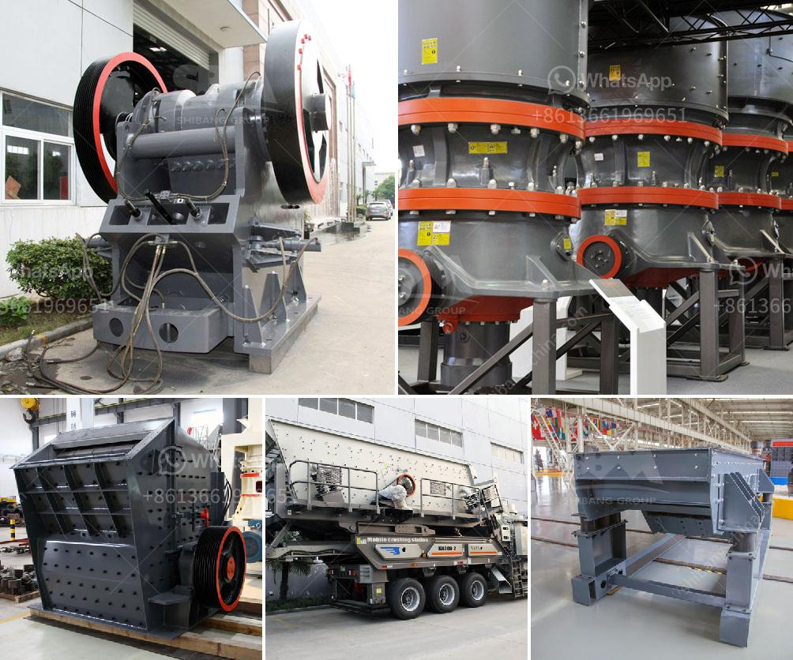

<h3>What is gradation in a crusher?</h3>
Crushers are machines used to reduce the size of rocks, stones, and ore. They are often utilized in aggregates production, construction material recycling, and in mining operations. One of the key parameters that defines the performance of a crusher is its gradation. But what exactly is gradation in a crusher?

In simple terms, gradation refers to the distribution of particle sizes in a material. In the context of crushers, it specifically relates to the size distribution of the crushed product. A well-graded crusher product is crucial for the efficient operation of the crushing process and ultimately for the quality of the final product.

The gradation of a crusher product is typically determined by the crusher's output settings and the feed material's characteristics. The crusher's output settings will affect the size distribution of the crushed product. For example, a crusher with a tight close-side setting (CSS) will produce finer material, while a crusher with a wider CSS will create a coarser product.

In addition to the crusher's output settings, the characteristics of the feed material, such as its hardness, shape, and moisture content, also play a role in determining the gradation. Harder materials tend to require higher crushing forces and may result in a coarser product. Material with irregular shapes, like flaky or elongated particles, can also impact the gradation.

Why is gradation important in a crusher? Well-graded material provides several benefits. Firstly, it ensures that the product has a consistent particle size distribution, which is desirable in many industries, particularly in the production of concrete and asphalt. Consistent particle sizes enhance the overall quality and performance of these materials.

Secondly, a well-graded product maximizes the efficiency of subsequent processes. In downstream operations, such as screening and washing, a uniform particle size distribution facilitates the separation of different materials, reduces the amount of wasted material, and lowers energy consumption.

Furthermore, a well-graded product can help optimize the overall crushing operation. By adjusting the crusher's output settings and understanding the feed material's characteristics, operators can achieve a desired gradation. This allows them to produce the right amount of fines and control the proportion of coarser particles, which can significantly impact the efficiency and costs associated with the entire crushing process.

It is worth noting that achieving the desired gradation may require a combination of techniques, such as adjusting the crusher's CSS, utilizing different types of crushing chambers or liners, and optimizing the feed material's properties. It often involves a trial-and-error approach to finding the optimal combination that meets the specific requirements of the application.

In conclusion, gradation in a crusher refers to the distribution of particle sizes in the crushed product. It is influenced by various factors, including the crusher's output settings and the feed material's characteristics. A well-graded product enhances the quality of the final product, improves downstream processes' efficiency, and optimizes the overall crushing operation. By understanding and controlling gradation, operators can achieve better results and maximize the performance of their crushers.
<h3>Contact us</h3><ul><li><strong>Whatsapp:&nbsp;<a href="https://wa.me/8613661969651">+8613661969651</a></strong></li><li><a href="https://swt.shibang-china.com/?git&amp;zhl&amp;What is gradation in a crusher"><strong>Online Service(chat now)</strong></a></li></ul><h3>Related</h3><ul><li><a href='What is antimony ore used for.md'>What is antimony ore used for?</a></li><li><a href='What is an overpressure fan in a cone crusher.md'>What is an overpressure fan in a cone crusher?</a></li><li><a href='What kind of equipment is used for fine crushed stone？.md'>What kind of equipment is used for fine crushed stone？</a></li><li><a href='What type of crusher is needed to crush sillimanite？.md'>What type of crusher is needed to crush sillimanite？</a></li><li><a href='What is the final product of columbite.md'>What is the final product of columbite?</a></li></ul>