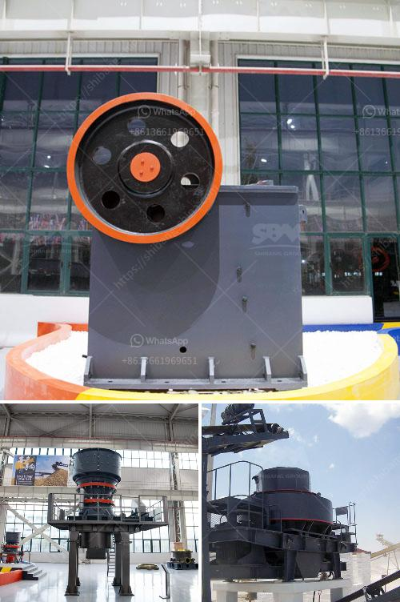

<h3>What is gyratory crushers ?</h3>
What is a gyratory crusher? This question has puzzled many industry professionals over the years. To help answer it, let's take a closer look at this versatile piece of equipment commonly used in mines and quarries worldwide.

A gyratory crusher is a type of primary crusher used in ore processing plants. It is characterized by its robust structure and high wearing parts, as well as providing a continuous and reliable operation. Unlike other crushers, the gyratory crusher has a crushing chamber designed to accept feed material of a relatively large size in relation to the mantle diameter. During operation, the “gyration” motion of the mantle creates a compressive force on the feed material, which is then crushed between the mantle and concave.

One of the primary advantages of a gyratory crusher is its ability to handle high capacity throughputs. With a large feed opening and a grooved mantle, the gyratory crusher can process rocks with a top size of several meters. Other significant advantages include a high reduction ratio, low operational costs, and a long service life of the wearing parts. Furthermore, gyratory crushers offer flexibility in adjusting the size of the crushed material, which simplifies the downstream process.

Gyratory crushers are typically categorized into two sections, namely primary and secondary crushers. Primary gyratory crushers are used in the primary crushing stage, while secondary gyratory crushers are used in the secondary or tertiary crushing stage. Both types of crushers are equipped with a concave liner that rotates to break the material against the fixed outer lining of the crusher chamber. The crushing action is achieved by the eccentric rotation of the main shaft, coupled with the spiral movement of the mantle.

Over the years, gyratory crushers have evolved to become more efficient and safer to operate. Modern gyratory crushers are equipped with hydroset, a hydraulic system that provides safety and setting adjustment functions. This feature allows operators to optimize the crusher settings to suit the desired product size, further increasing operational efficiency.

In conclusion, gyratory crushers are powerful machines that can handle large volumes of hard material efficiently. Their robust design, high reduction ratio, and flexibility make them ideal for various applications in the mining and quarrying industries. While they have been around for decades, technological advancements have made modern gyratory crushers safer and more user-friendly.

If you are operating a mine or a quarry and need a reliable and high-capacity crushing solution, a gyratory crusher could be the perfect choice. Its ability to handle large feed sizes, adjust the product size, and provide low operational costs make it a standout among other crushing equipment options.
<h3>Contact us</h3><ul><li><strong>Whatsapp:&nbsp;<a href="https://wa.me/8613661969651">+8613661969651</a></strong></li><li><a href="https://swt.shibang-china.com/?git&amp;zhl&amp;What is gyratory crushers "><strong>Online Service(chat now)</strong></a></li></ul><h3>Related</h3><ul><li><a href='What type of flywheel is used in the double toggle jaw crusher.md'>What type of flywheel is used in the double toggle jaw crusher</a></li><li><a href='What are the specifications of the crusher for crushing concrete.md'>What are the specifications of the crusher for crushing concrete?</a></li><li><a href='What causes tension rods in jaw crushers to break.md'>What causes tension rods in jaw crushers to break?</a></li><li><a href='What kind of crusher is used to create railway ballast.md'>What kind of crusher is used to create railway ballast?</a></li><li><a href='What are the features of a jaw crusher.md'>What are the features of a jaw crusher?</a></li></ul>