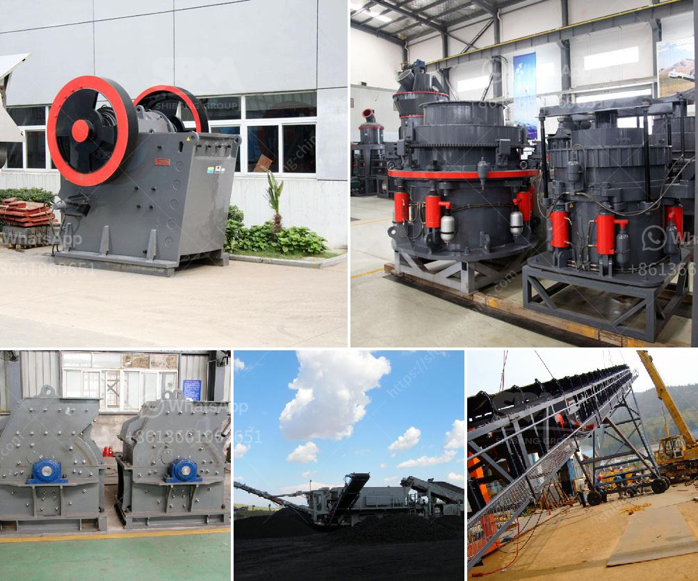

<h3>What is mobile crushing plant and how it works crushing ?</h3>
Mobile crushing plants are highly efficient and flexible, allowing crushing operations to be set up virtually anywhere. These plants are portable and can be relocated easily, increasing job site adaptability and enhancing productivity. In essence, a mobile crushing plant is a series of equipment linked together by wheel-mounted or crawler-mounted trucks or tanks that allow for different crushing stages to be performed.

The primary function of a mobile crushing plant is to reduce larger rocks into smaller pieces. As the name implies, it consists of various components that work together to perform this task. Each component plays a crucial role in the overall functioning of the plant.

The heart of the mobile crushing plant is the crusher. This is where the raw material is crushed into smaller pieces for further processing. There are different types of crushers available, each with its own unique features and benefits. Jaw crushers, impact crushers, and cone crushers are the most commonly used crushers in the industry.

The process of crushing starts with the raw materials being fed into the hopper of the mobile crushing plant. The hopper is equipped with a vibrating feeder that regulates the flow of material into the crusher. The material is then fed into the crusher cavity, where it is crushed between the fixed jaw plate and the movable jaw plate. The size of the crushed material can be adjusted by using the adjustable discharge opening.

After the material is crushed, it passes through a screening unit, which separates the desired product from the oversize material. The screened material is then conveyed to a stacking or stockpiling conveyor for further processing or transport. This process can be continuous, allowing for multiple stages of crushing and screening.

The mobile crushing plant is powered either by electrical power or by diesel engine. The power source used depends on the location and availability of electricity and the specific needs of the crushing operation. Portable diesel-powered units are particularly popular in remote areas where grid power may not be readily available.

One of the key advantages of mobile crushing plants is their mobility. They can be easily transported to different job sites, which eliminates the need for multiple installations and reduces the overall cost and time required for setting up a crushing plant. Additionally, the portable nature of these plants allows for efficient material handling and stockpiling.

In conclusion, mobile crushing plants are an efficient and versatile solution for crushing operations. They offer flexibility, mobility, and cost-effectiveness, making them ideal for various industries such as construction, mining, and recycling. The crushing process performed by these plants involves the raw materials being fed into the crusher, crushed into smaller pieces, screened, and then conveyed for further processing or transport. Whether powered by electricity or a diesel engine, mobile crushing plants can be easily relocated and set up at different job sites, contributing to increased productivity and profitability.
<h3>Contact us</h3><ul><li><strong>Whatsapp:&nbsp;<a href="https://wa.me/8613661969651">+8613661969651</a></strong></li><li><a href="https://swt.shibang-china.com/?git&amp;zhl&amp;What is mobile crushing plant and how it works crushing "><strong>Online Service(chat now)</strong></a></li></ul><h3>Related</h3><ul><li><a href='What kind of crusher is used to create railway ballast.md'>What kind of crusher is used to create railway ballast?</a></li><li><a href='7 different vibrating screens how do you choose.md'>7 different vibrating screens, how do you choose?</a></li><li><a href='What mill should be used for crushing rocks.md'>What mill should be used for crushing rocks?</a></li><li><a href='What is the definition of crushing in mining.md'>What is the definition of crushing in mining?</a></li><li><a href='what is the best installation for crusher plant production and maintenance？.md'>what is the best installation for crusher plant production and maintenance？</a></li></ul>