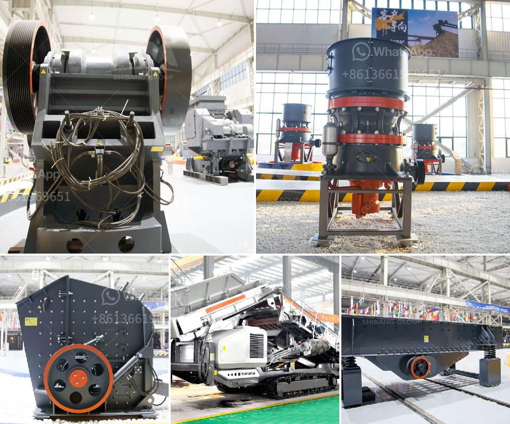

<h3>What is needed to open a quarry ?</h3>
With the increasing demand for construction materials around the world, opening a quarry can be a lucrative business venture. However, starting a quarry requires careful planning and sufficient resources. In this article, we will discuss the key aspects needed to open a quarry successfully.

1. Site Selection: The first and most crucial step in opening a quarry is selecting the right location. Consider factors such as proximity to markets, transportation links, and availability of raw materials. Conduct extensive research and consult with geologists to ensure that the chosen site has high-quality deposits.

2. Geological Assessment: Understanding the geology of the quarry site is essential to ensure the availability of desired materials and determine the extraction methods. Geologists should be involved in conducting surveys and assessments to identify the type, quality, and quantity of rock resources in the area.

3. Legal and Environmental Considerations: Opening a quarry involves complying with various legal and environmental requirements. Obtain all necessary permits, licenses, and permissions from local authorities. Conduct an environmental impact assessment to minimize any adverse effects on the ecosystem and nearby communities.

4. Business Plan: Developing a comprehensive business plan is vital for the success of the quarry venture. It should outline your objectives, market analysis, financial projections, and strategies for rock extraction, processing, and marketing. A solid business plan will help attract investors and secure financing for the project.

5. Equipment and Machinery: To operate a quarry efficiently, substantial investments in machinery and equipment are required. This may include earthmoving equipment, crushers, conveyor systems, loaders, and trucks for hauling materials. Consider leasing or buying used equipment to reduce initial capital expenditure.

6. Workforce: Hiring and training skilled employees are fundamental to the smooth functioning of a quarry. Depending on the scale of the quarry, you will need workers experienced in quarrying, geology, mining, operations, administration, and maintenance. Create a safe working environment and provide ongoing training to ensure employee satisfaction and productivity.

7. Safety Measures: Quarry operations involve inherent risks, making safety a top priority. Implement comprehensive safety measures, including proper signage, protective equipment, emergency protocols, and regular inspections. Comply with local regulations and industry best practices to minimize accidents and ensure the well-being of your workforce.

8. Transport and Logistics: Developing a reliable transportation and logistics system is critical to deliver the extracted materials to customers. Determine the most cost-effective and efficient methods for transporting rocks, considering factors like distance, road conditions, and the capacity of your hauling fleet.

9. Market Analysis: Identify potential clients and markets for your quarry products. Study the demand and supply dynamics regionally and globally. Build relationships with construction companies, contractors, and other stakeholders to secure contracts and agreements for the sale of your materials.

10. Marketing and Sales Strategy: Implement a robust marketing and sales strategy to promote your quarry business. Utilize online platforms, social media, industry exhibitions, and trade associations to increase visibility and attract new customers. Regularly communicate with existing clients to maintain strong business relationships.

Opening a quarry requires careful planning, substantial resources, and a detailed understanding of the industry. By following these key steps and investing in the necessary equipment, workforce, and marketing initiatives, you can establish a successful quarry business that caters to the growing demand for construction materials.
<h3>Contact us</h3><ul><li><strong>Whatsapp:&nbsp;<a href="https://wa.me/8613661969651">+8613661969651</a></strong></li><li><a href="https://swt.shibang-china.com/?git&amp;zhl&amp;What is needed to open a quarry "><strong>Online Service(chat now)</strong></a></li></ul><h3>Related</h3><ul><li><a href='What is the difference between impact cone jaw crushers .md'>What is the difference between impact cone jaw crushers ?</a></li><li><a href='What is the cost of roller mills.md'>What is the cost of roller mills?</a></li><li><a href='What mechanical equipment is used to mine copper？.md'>What mechanical equipment is used to mine copper？</a></li><li><a href='What is a ball mill used for in gold mining.md'>What is a ball mill used for in gold mining?</a></li><li><a href='What are the limitations affecting the ball mill feed.md'>What are the limitations affecting the ball mill feed?</a></li></ul>