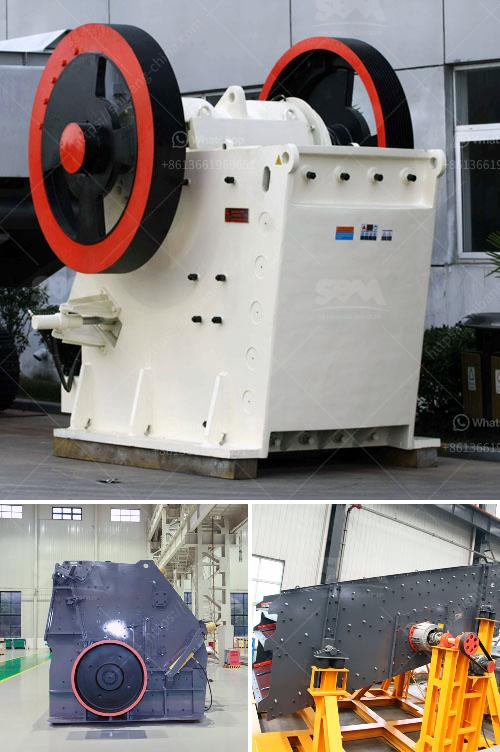

<h3>What is quarry crushing ?</h3>
Quarry crushing is the process of extracting valuable minerals or other geological materials from the earth. A quarry is a type of open-pit mine from which rock, stone, or minerals are extracted. Quarries are generally used for extracting building materials, such as dimension stone, construction aggregate, riprap, sand, and gravel. They are also used for producing chemical grade limestone, phosphate rock, and others.

The process of quarry crushing involves several stages and different types of machines. Firstly, the raw materials are extracted from the quarry with the help of blasting or drilling. Next, these extracted materials are transported to a primary crusher, where they are crushed to smaller sizes. From there, the crushed materials are transferred to a secondary or tertiary crusher for further processing. Finally, the materials are screened to separate the desired size and shape.

Crushing in a quarry plays a crucial role in maintaining the desired specifications and quality of the final product. By crushing the raw materials, quarry operators can effectively control the particle size distribution (PSD) of the crushed material, ensuring consistent quality throughout the production process. This is particularly important when producing aggregates for construction purposes, as specific sizes and shapes are required to meet industry standards.

There are several types of crushers commonly used in quarries. Jaw crushers and impact crushers are two widely used primary crushers. Jaw crushers are mainly used for coarse crushing, while impact crushers are commonly used for secondary or tertiary crushing. Cone crushers are also commonly used in quarrying operations and provide crushing solutions for hard and abrasive materials.

In addition to crushers, quarry crushing also involves the use of screening equipment to sort the crushed materials into different sizes. Vibrating screens and scalping screens are commonly used to remove oversized or undersized particles and ensure uniformity in the final product.

Furthermore, various other equipment and machinery are employed in quarry crushing operations. These may include conveyors, feeders, dust collectors, and control systems. All these components work together to facilitate the process of quarry crushing, ensuring efficiency, safety, and productivity.

Quarry crushing has a significant impact on the environment, especially in terms of noise, dust, and vibrations generated during the blasting and crushing operations. To mitigate these impacts, quarry operators are required to follow strict regulations and implement various control measures. These may include using water sprays to suppress dust, maintaining good haul road conditions to minimize vibrations, and conducting regular environmental monitoring.

In conclusion, quarry crushing is a critical process in the extraction of minerals and building materials from the earth. It involves various stages and different types of equipment to ensure the desired quality and specifications of the final product. Quarry operators must adhere to environmental regulations and implement control measures to mitigate the impacts on the surrounding environment.
<h3>Contact us</h3><ul><li><strong>Whatsapp:&nbsp;<a href="https://wa.me/8613661969651">+8613661969651</a></strong></li><li><a href="https://swt.shibang-china.com/?git&amp;zhl&amp;What is quarry crushing "><strong>Online Service(chat now)</strong></a></li></ul><h3>Related</h3><ul><li><a href='What is the operation of a vertical roller mill.md'>What is the operation of a vertical roller mill?</a></li><li><a href='What machines are required for a limestone powder factory.md'>What machines are required for a limestone powder factory?</a></li><li><a href='What is a ball mill for .md'>What is a ball mill for ?</a></li><li><a href='What is the process for mining manganese ore.md'>What is the process for mining manganese ore?</a></li><li><a href='What is the beneficiation technique for marble.md'>What is the beneficiation technique for marble?</a></li></ul>