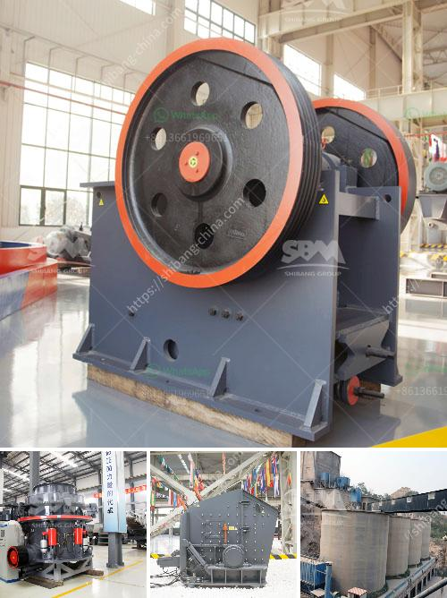

<h3>What is receiving feeder in a crusher?</h3>
A receiving feeder in a crusher is an essential component that aids in the efficient transfer of materials from the dump truck or any other storage container to the crusher plant. Without a feeder, the crushing process may be halted due to insufficient materials flowing into the crusher, resulting in a delay in production and potentially causing damage to the crusher.

The primary function of a receiving feeder is to control and regulate the flow of materials into the crusher, ensuring a consistent and steady supply. It works by utilizing a conveyor belt or a vibrating mechanism to transport the materials from the storage container to the crusher. The speed and quantity of materials fed into the crusher can be adjusted based on the processing requirements, allowing for optimal efficiency and productivity.

One of the key advantages of using a receiving feeder in a crusher is its ability to prevent overloading and blockages. By controlling the flow of materials, the feeder ensures that the crusher is not overwhelmed with a sudden surge of materials, which could potentially lead to equipment failure or breakdown. The steady and regulated supply of materials also minimizes the risk of blockages within the crusher, ensuring smooth and uninterrupted operation.

Another benefit of using a receiving feeder is its ability to remove fine particles and contaminants from the material stream before it enters the crusher. This helps to improve the overall quality of the crushed product by minimizing the presence of impurities. By removing unwanted materials, such as dirt, dust, or fines, the receiving feeder contributes to the production of a high-quality final product that meets the specified requirements and standards.

In addition to enhancing the efficiency and performance of the crusher, a receiving feeder also helps to reduce the workload for operators. By automating the material transfer process, it eliminates the need for manual handling, reducing the risk of potential injuries or accidents. Operators can focus on monitoring and controlling the crusher, maximizing their productivity and ensuring safe operation.

Overall, a receiving feeder plays a crucial role in the crushing process by facilitating the smooth and controlled transfer of materials into the crusher. It prevents overloading, minimizes blockages, and improves the quality of the final product. With its numerous benefits, the use of a receiving feeder in a crusher is an integral part of any crushing operation, enabling efficient and reliable production.
<h3>Contact us</h3><ul><li><strong>Whatsapp:&nbsp;<a href="https://wa.me/8613661969651">+8613661969651</a></strong></li><li><a href="https://swt.shibang-china.com/?git&amp;zhl&amp;What is receiving feeder in a crusher"><strong>Online Service(chat now)</strong></a></li></ul><h3>Related</h3><ul><li><a href='How oftenwhat maintenance needs to be done on crushing plant.md'>How often/what maintenance needs to be done on crushing plant</a></li><li><a href='What is the capacity of the grinding mill.md'>What is the capacity of the grinding mill?</a></li><li><a href='What good sand making equipment manufacturers are there.md'>What good sand making equipment manufacturers are there?</a></li><li><a href='What equipment do you need for coal mining.md'>What equipment do you need for coal mining?</a></li><li><a href='What is the yield in mineral processing.md'>What is the yield in mineral processing?</a></li></ul>