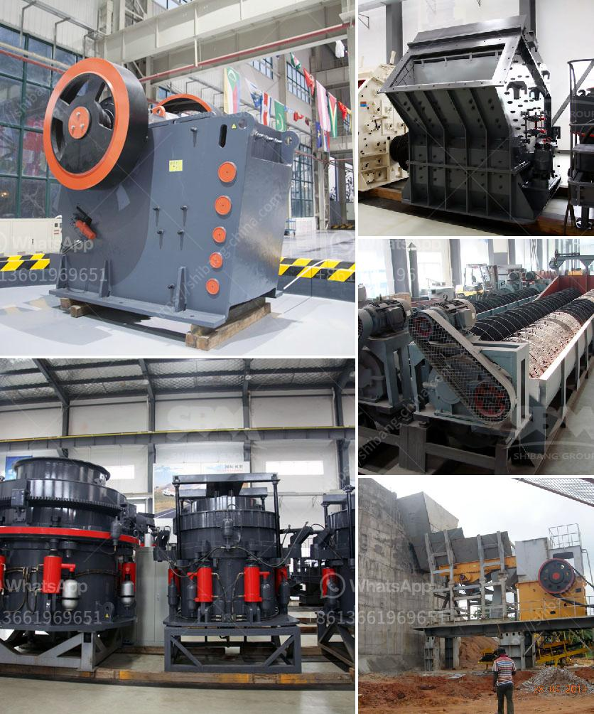

<h3>What is rotary screen cement plant ?</h3>
Rotary screen cement plants are a technological advancement in the cement industry. These plants are capable of efficiently separating coarse from fine materials, which allows cement producers to improve the quality of their product.

Rotary screens are cylindrical sieving machines used in the cement manufacturing process. They help to ensure a consistent and high-quality end product by removing oversized particles and impurities from the material feed. This results in a more refined and homogeneous mixture, enhancing the overall cement performance.

The working principle of a rotary screen cement plant involves the rotation of a cylindrical drum that is perforated with a specific mesh size. The material feed is introduced at one end of the drum and travels along its length. The rotation of the drum causes the material to move, while the perforated surface acts as a sieve, separating the fine particles from the larger ones.

The design of the rotary screen is crucial for its efficiency. The drum is inclined slightly to facilitate the movement of the material from the entry point to the exit point. The size and arrangement of the perforations on the drum's surface determine the size of the separated particles. The mesh size of the drum can be adjusted to meet the specific requirements of the cement production process.

One of the key advantages of rotary screen cement plants is their ability to handle a wide range of feed materials. They are effective in separating both wet and dry materials, which is particularly beneficial in regions with varying climatic conditions. The rotary screen can handle materials with a high moisture content, preventing clogging and maintaining a continuous flow.

In addition to their sieving capabilities, rotary screen cement plants also contribute to environmental sustainability. By removing oversized particles and impurities from the material feed, they help reduce the amount of waste generated during the cement production process. This not only enhances the efficiency of cement manufacturing but also reduces the environmental impact typically associated with the disposal of waste materials.

Furthermore, rotary screen cement plants require minimal maintenance compared to alternative screening methods, such as vibrating screens. The drum's simple design and the absence of complex mechanical parts ensure reliable operation and lower maintenance costs. This makes them an attractive option for cement producers looking to enhance their operations while minimizing downtime.

In conclusion, rotary screen cement plants are a valuable technological innovation in the cement industry. Their ability to efficiently separate coarse from fine materials contributes to the production of higher quality cement. Additionally, their flexibility in handling various feed materials, minimal maintenance requirements, and positive environmental impact make them a preferred choice for cement manufacturers. As the cement industry continues to evolve, rotary screen cement plants will likely play a significant role in improving the efficiency and sustainability of cement production.
<h3>Contact us</h3><ul><li><strong>Whatsapp:&nbsp;<a href="https://wa.me/8613661969651">+8613661969651</a></strong></li><li><a href="https://swt.shibang-china.com/?git&amp;zhl&amp;What is rotary screen cement plant "><strong>Online Service(chat now)</strong></a></li></ul><h3>Related</h3><ul><li><a href='What is the best use of quarry limestone.md'>What is the best use of quarry limestone?</a></li><li><a href='What is a cement plants tertiary crusher.md'>What is a cement plant's tertiary crusher?</a></li><li><a href='What is the cost of a 32ton per hour aggregate crusher in China.md'>What is the cost of a 32-ton per hour aggregate crusher in China?</a></li><li><a href='What is the cost of a jaw crusher.md'>What is the cost of a jaw crusher?</a></li><li><a href='What machines are used in mines.md'>What machines are used in mines?</a></li></ul>