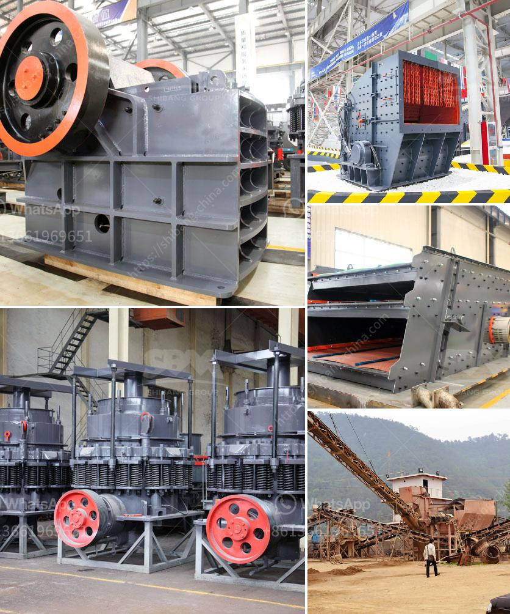

<h3>What is the applicability of a jaw crusher?</h3>
A jaw crusher is a machine that utilizes the compression force to break materials into desired sizes. The crushing chamber of a jaw crusher consists of a fixed jaw and a movable jaw, which simulates the movement of the animal's jaws to complete the material crushing operation. Therefore, the jaw crusher is widely used in the primary crushing of various materials in many industries, including mining, metallurgy, building materials, roads, railways, water conservancy, chemical industry, and so on.

One of the key advantages of a jaw crusher is its ability to process hard and abrasive materials. In many applications, the jaw crusher is also used as a second-stage crushing unit. Due to its versatility, the jaw crusher can be used for both primary and secondary crushing stages. When combined with other crushing equipment, such as cone crushers or impact crushers, the jaw crusher can produce multiple sizes of final products.

In the mining industry, jaw crushers are mainly used for crushing large rocks or ore into smaller particles for further processing. They are an essential piece of equipment in the mining and mineral processing industries, where they are used to reduce the size of ore to a manageable level. The jaw crusher can handle a wide range of materials, such as limestone, granite, shale, river stone, bluestone, sandstone, calcium carbide, iron ore, copper ore, and so on.

In the construction industry, jaw crushers are used for crushing large rocks into smaller pieces to be used for construction materials. They are commonly used on construction sites for road and bridge construction projects. The jaw crusher can crush various types of materials, including concrete, asphalt, and brick.

Another application of the jaw crusher is in recycling. With the increasing demand for sustainable practices, recycling has become an important part of waste management. Jaw crushers are used to crush and recycle various types of waste materials, including demolition waste, concrete, brick, and asphalt. The crushed materials can be reused in construction projects or sold for revenue.

Furthermore, the jaw crusher has found its applicability in the aggregate industry. In aggregate production, jaw crushers are used to crush large rocks or ore into smaller pieces to be used as construction aggregates. This is crucial for producing high-quality and durable construction materials, such as concrete and asphalt.

In conclusion, the jaw crusher is a versatile machine that has found its applicability in various industries. From mining and construction to recycling and aggregate production, jaw crushers are capable of crushing a wide range of materials. With their strong and robust design, jaw crushers are reliable and efficient machines that can handle even the toughest materials. Therefore, if you are in need of crushing equipment, a jaw crusher is definitely worth considering.
<h3>Contact us</h3><ul><li><strong>Whatsapp:&nbsp;<a href="https://wa.me/8613661969651">+8613661969651</a></strong></li><li><a href="https://swt.shibang-china.com/?git&amp;zhl&amp;What is the applicability of a jaw crusher"><strong>Online Service(chat now)</strong></a></li></ul><h3>Related</h3><ul><li><a href='What is cone crusher .md'>What is cone crusher ?</a></li><li><a href='What are the nickel smelting equipment .md'>What are the nickel smelting equipment ?</a></li><li><a href='What is a Raymond mill.md'>What is a Raymond mill?</a></li><li><a href='What is chrome ore used for.md'>What is chrome ore used for?</a></li><li><a href='What plate is used for the curtain in an impact crusher.md'>What plate is used for the curtain in an impact crusher?</a></li></ul>