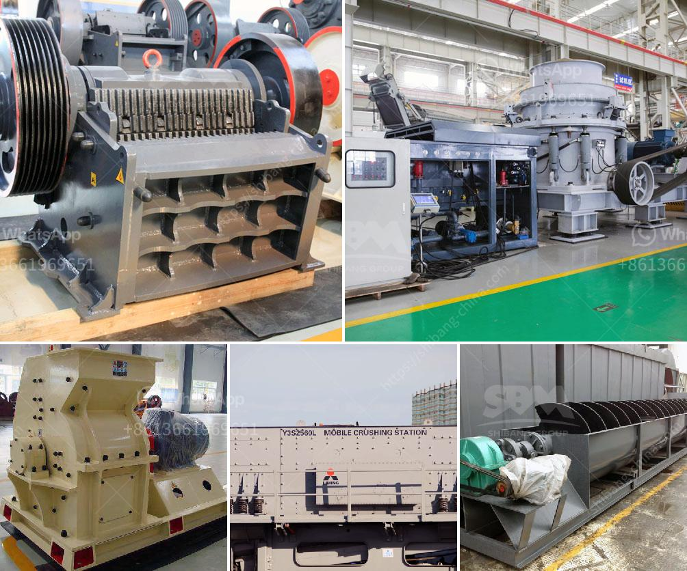

<h3>What is the application of a ball mill?</h3>
A ball mill is a cylindrical device used in grinding or mixing materials like ores, chemicals, ceramic raw materials, and paints. The ball mill is a key piece of equipment for grinding crushed materials, and it is widely used in production lines for powders such as cement, silicates, refractory material, fertilizer, glass ceramics, etc. as well as for ore dressing of both ferrous and non-ferrous metals.

One of the main applications of a ball mill is in ore dressing. Being located in nature with various minerals, the removal of these impurities is essential for the extraction of metals such as gold, silver, copper, iron, etc., which are used in various manufacturing industries. The process of ore dressing includes crushing – the ore is crushed into fine particles to facilitate extraction – and grinding – the fine particles are further reduced in size using a ball mill.

In the cement industry, a ball mill is used for dry grinding of cement clinker, and the ball mill mainly consists of a rotating cylindrical shell filled with grinding media such as ceramic or metal balls. The product is further ground to a fine powder in a separator, and the separator separates the ground materials based on size.

The use of ball mills in the mining industry is another example of their versatility as a grinding tool. The open-pit mining process requires grinding materials to obtain finer particles, which ultimately increases the mining productivity. The ball mill efficiently grinds extremely hard materials, such as limestone, marble, granite, etc., enabling them to be transformed into high-quality construction materials.

In the pharmaceutical industry, ball mills are often used as a mechanical means for pulverizing solid materials. It finds application in powder form mixing, blending, and grinding of substances, resulting in particle size reduction. In addition, ball mills are also used for the synthesis of materials such as black powder, various plastics, and rubber products.

Furthermore, ball mills are employed in the field of chemistry, where the intimate mixing of reactant powders with the solvent takes place. The mixture undergoes a series of reactions, leading to the formation of the desired product. This process is known as mechanical alloying. Ball milling is therefore one of the essential methods used in advanced materials research.

Apart from these applications, ball mills can also be used for mechanical alloying in research laboratories, as well as quality control and failure analysis in material science laboratories. They are not only energy-efficient but also versatile in terms of sample size and material.

In conclusion, a ball mill is a versatile and efficient tool that fulfills various purposes in industries such as mining, cement, and pharmaceuticals. Its application in ore dressing, cement production, or even in research laboratories confirms its vast usefulness and significance.
<h3>Contact us</h3><ul><li><strong>Whatsapp:&nbsp;<a href="https://wa.me/8613661969651">+8613661969651</a></strong></li><li><a href="https://swt.shibang-china.com/?git&amp;zhl&amp;What is the application of a ball mill"><strong>Online Service(chat now)</strong></a></li></ul><h3>Related</h3><ul><li><a href='What is a ball mill for .md'>What is a ball mill for ?</a></li><li><a href='What is the waste of ore crushing plant .md'>What is the waste of ore crushing plant ?</a></li><li><a href='What is the procedure for obtaining a stone quarry license.md'>What is the procedure for obtaining a stone quarry license?</a></li><li><a href='What does aggregate crusher mean.md'>What does "aggregate crusher" mean?</a></li><li><a href='What is Raymond mill and ball mill process .md'>What is Raymond mill and ball mill process ?</a></li></ul>