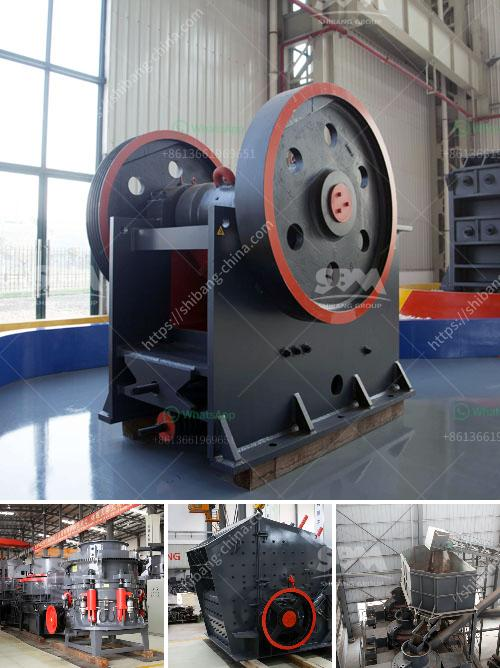

<h3>What is the ball milling method?</h3>
In recent years, the ball milling method has attracted attention in the field of mechanical engineering owing to its wide application potential. The technique is a widely-used, inexpensive process for producing uniform powders and nanoscale materials. Ball milling involves grinding materials together with a spinning drum filled with heavy balls, resulting in a fine powder widely used in ceramics, pigments, and various other applications.

The ball milling method owes its name to the initial reliance on balls to grind materials to achieve a uniform size reduction. However, modern ball milling processes use cylindrical jars or vials filled with ceramic balls as grinding media. This method allows for greater control over the grinding process and better quality of the final products.

The ball milling method relies on the energy input to impact the particles and reduce their size. During the milling process, the balls collide with each other and the powders, resulting in a cascade of smaller particles. This collision and impact between the balls and the powders generate high-energy shock waves that facilitate the breakdown of the material. Additionally, the combination of centrifugal force and gravitational force on the balls aids in the grinding process.

One of the major advantages of ball milling is its versatility. It can be used to grind various materials, ranging from metals and alloys to ceramics and polymers. It is a commonly used method for producing metallic powders such as aluminum, nickel, and copper powders, which find applications in industries like aerospace and automotive. Moreover, ball milling can be used for the synthesis of nanostructured materials by controlling the milling parameters such as milling speed, time, and the ratio of balls to powder.

The ball milling method also enables low-cost, large-scale production of particles with a controlled size distribution. In the pharmaceutical industry, this technique is utilized to reduce particle size and enhance drug dissolution, leading to better bioavailability. Furthermore, ball milling is extensively used in the field of mechanical alloying, where different elements are mixed together to produce new alloys with improved properties.

However, the ball milling method is not without limitations. It is a time-consuming process, especially when working with large quantities of materials or complex mixtures. Additionally, the high-energy impacts during milling can result in excessive heat generation, which may affect the properties of some materials. Nevertheless, these challenges can be overcome with careful control of the milling parameters.

In conclusion, the ball milling method is a versatile and effective technique for producing uniform powders and nanostructured materials. Its wide range of applications across various industries underscores its importance in modern engineering. With further advancements in the field, the ball milling method is expected to contribute to the development of innovative materials and manufacturing processes.
<h3>Contact us</h3><ul><li><strong>Whatsapp:&nbsp;<a href="https://wa.me/8613661969651">+8613661969651</a></strong></li><li><a href="https://swt.shibang-china.com/?git&amp;zhl&amp;What is the ball milling method"><strong>Online Service(chat now)</strong></a></li></ul><h3>Related</h3><ul><li><a href='What is the way to block the material of sand crusher .md'>What is the way to block the material of sand crusher ?</a></li><li><a href='What is needed to open a quarry .md'>What is needed to open a quarry ?</a></li><li><a href='What products are produced from a cone crusher.md'>What products are produced from a cone crusher?</a></li><li><a href='What is a pressurized coal mill.md'>What is a pressurized coal mill?</a></li><li><a href='What equipment is used for silver mining.md'>What equipment is used for silver mining?</a></li></ul>