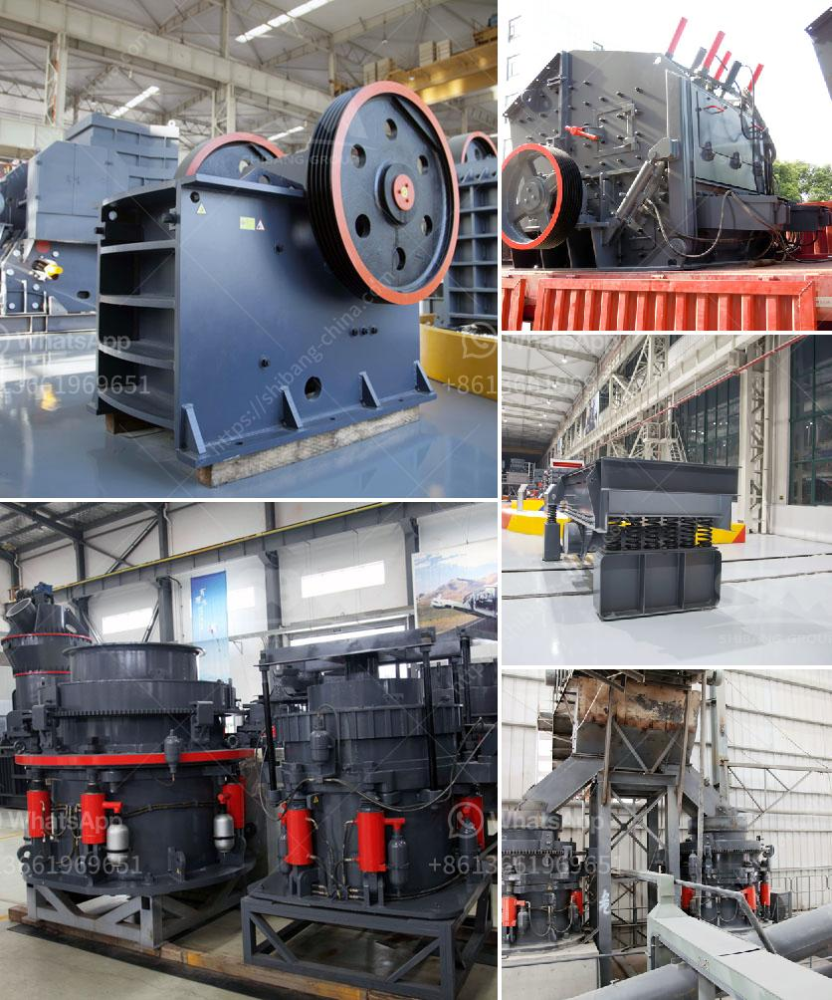

<h3>What is the bearing specification for an impact crusher?</h3>
An impact crusher is a machine used for breaking down large rocks into smaller pieces. It is commonly used in the mining industry for crushing and grinding materials into desired sizes. The bearings used in an impact crusher are crucial for its operation, as they help the rotating parts of the machine transmit the necessary power to crush the rocks.

These bearings are 180mm bore diameter and 300mm outside diameter. They typically have a bore alignment of 0.001 to 0.003mm and a radial clearance range between 0.04 and 0.06mm.

These bearings are 200mm bore diameter and 400mm outside diameter. They have a bore alignment specification of 0.001 to 0.003mm and a radial clearance range between 0.04 and 0.06mm.

The outer race is an important component of the bearing system as it supports the rotating parts of the impact crusher. It is made of high-strength material and is designed to withstand heavy loads and impacts. The outer race typically has a hardness rating of 58-62 HRC (Rockwell hardness scale) and a depth of 3-4mm.

The inner race is another critical component of the bearing system. It provides a smooth surface for the rotating parts to slide against without causing friction or wearing out quickly. The inner race is made of high-quality steel and has a similar hardness rating and depth as the outer race.

The rolling elements are the balls or rollers that help reduce friction and distribute the load evenly across the bearing. In impact crushers, spherical roller bearings are commonly used due to their ability to accommodate high radial and axial loads.

Proper lubrication is essential for the smooth operation and longevity of the bearing system. The bearings should be adequately lubricated with high-quality grease, and regular maintenance and re-greasing intervals should be followed to ensure optimal performance.

The operating temperature of the bearings should be closely monitored to prevent overheating and premature failure. The recommended operating temperature for impact crusher bearings is between 70-90 degrees Celsius. If the temperature exceeds this range, it may indicate inadequate lubrication, misalignment, or excessive loads.

Regular inspections and maintenance should be performed to detect any signs of wear, damage, or misalignment in the bearing system. Any issues should be addressed promptly to prevent major breakdowns and costly repairs.

In conclusion, the bearing specifications for an impact crusher play a crucial role in its overall performance and longevity. The proper selection of bearings, regular maintenance, and adherence to the recommended operating conditions are essential for ensuring a smooth and efficient operation of the impact crusher. By following these guidelines, operators can maximize the productivity and minimize downtime associated with bearing failures.
<h3>Contact us</h3><ul><li><strong>Whatsapp:&nbsp;<a href="https://wa.me/8613661969651">+8613661969651</a></strong></li><li><a href="https://swt.shibang-china.com/?git&amp;zhl&amp;What is the bearing specification for an impact crusher"><strong>Online Service(chat now)</strong></a></li></ul><h3>Related</h3><ul><li><a href='What is the difference between jaw crusher and cone crusher？.md'>What is the difference between jaw crusher and cone crusher？</a></li><li><a href='What is a hammermill crusher machine.md'>What is a hammermill crusher machine?</a></li><li><a href='What are the parts of a mill in a cement plant.md'>What are the parts of a mill in a cement plant?</a></li><li><a href='What plant and equipment are required for a coal extraction project.md'>What plant and equipment are required for a coal extraction project?</a></li><li><a href='what are the equipment in iron ore crusher？.md'>what are the equipment in iron ore crusher？</a></li></ul>