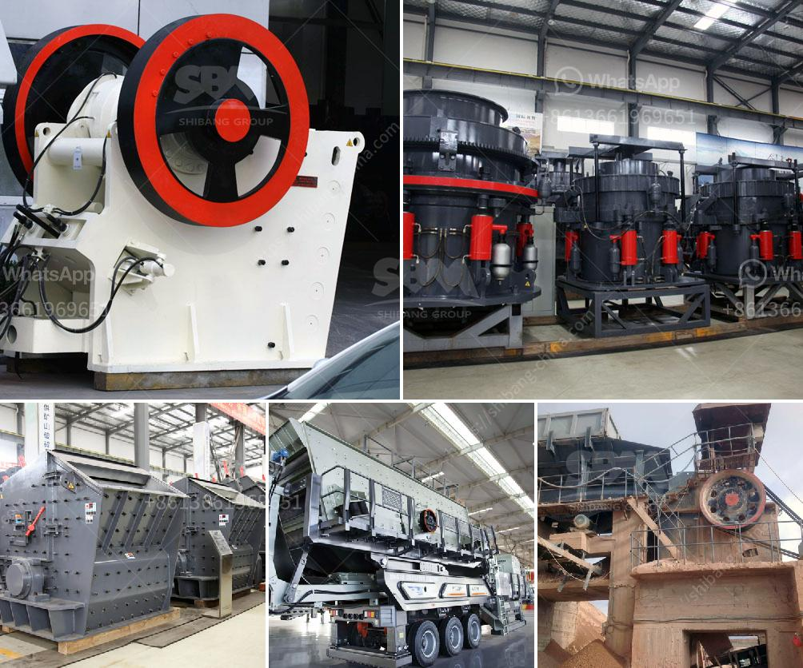

<h3>What is the beneficiation technique for marble?</h3>
Marble, a beautiful and valuable natural stone, has been used for centuries in various applications, including architecture, sculpture, and interior design. But before this exquisite stone can find its way into our homes and other structures, it goes through a process known as beneficiation. This technique aims to enhance the quality and value of marble, making it more desirable and suitable for a wide range of uses.

Beneficiation of marble involves a series of steps that are designed to remove impurities and transform the raw stone into a product that can be used in construction and other industries. The main goal of this process is to increase the marble's quality by removing any undesirable elements, such as excess minerals or other substances that affect its appearance, durability, or performance.

One of the first steps in the beneficiation of marble is the extraction of the raw stone from the quarry. This process involves carefully analyzing the location and characteristics of the marble deposit to determine the most effective and efficient extraction method. Once the marble blocks are extracted, they are transported to the processing plant for further treatment.

The next stage in marble beneficiation involves cutting the blocks into slabs or tiles of various sizes and thicknesses. This process is carried out using specialized machinery, such as diamond wire saws or gang saws, which ensure precision cutting and minimize waste. The slabs or tiles can then be further processed based on their intended use or market demand.

After cutting, the marble undergoes a series of treatments to enhance its quality and appearance. One common technique used in marble beneficiation is polishing, which involves grinding the surface of the stone to create a smooth and glossy finish. This process not only enhances the marble's aesthetic appeal but also improves its resistance to wearing and staining.

Another important step in marble beneficiation is the application of sealants or impregnating agents. These substances penetrate the stone's pores and help prevent moisture absorption, stains, and other damages. They also enhance the stone's natural color and patterns, making it more visually appealing.

Marble can also undergo a process called resin impregnation, which involves injecting a liquid resin into the stone's fissures and cracks. Once the resin hardens, it helps reinforce the marble and improve its structural integrity. This technique is especially beneficial for marbles with pronounced veining or fragile characteristics, as it enhances their durability and stability.

Finally, the finished marble products are carefully inspected, packaged, and shipped to customers around the world. From luxurious buildings to elegant homes, the beauty and versatility of beneficiated marble continue to captivate and inspire architects, designers, and homeowners.

In conclusion, beneficiation is a critical process in the production of marble. Through various techniques, impurities are removed, and the stone is transformed into a high-quality, aesthetically pleasing, and durable product. It is this process that allows marble to fulfill its potential as a symbol of elegance and luxury, enabling it to grace our surroundings with timeless beauty for generations to come.
<h3>Contact us</h3><ul><li><strong>Whatsapp:&nbsp;<a href="https://wa.me/8613661969651">+8613661969651</a></strong></li><li><a href="https://swt.shibang-china.com/?git&amp;zhl&amp;What is the beneficiation technique for marble"><strong>Online Service(chat now)</strong></a></li></ul><h3>Related</h3><ul><li><a href='What are the parts of a ball mill.md'>What are the parts of a ball mill?</a></li><li><a href='What is the price of mobile crusher.md'>What is the price of mobile crusher?</a></li><li><a href='What are the advantages of a roll crusher compared to other crushers.md'>What are the advantages of a roll crusher compared to other crushers?</a></li><li><a href='What kind of crusher is used to produce stone dust.md'>What kind of crusher is used to produce stone dust?</a></li><li><a href='what is a primary and secondary crusher？.md'>what is a primary and secondary crusher？</a></li></ul>