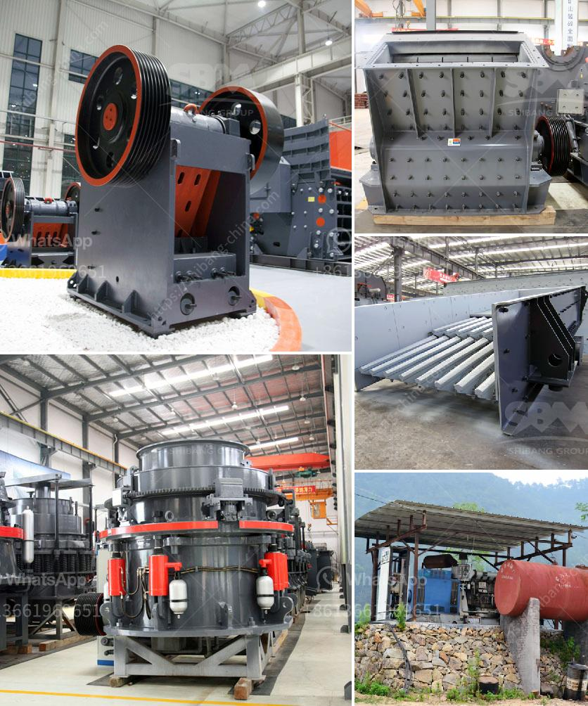

<h3>What is the best crusher for sandstone?</h3>
Sandstone is a widely used building material, prized for its durability and aesthetic appeal. However, not all sandstones are created equal, and some are better suited for specific applications than others. When it comes to crushing sandstone, the choice of the best crusher depends on the properties of the material, as well as the desired end product.

Sandstone is a sedimentary rock composed mainly of sand-sized minerals or rock grains. Most sandstone is composed of quartz and/or feldspar because these are the most common minerals in the Earth's crust. Sandstones often have fossils or fossilized tracks of ancient life, making them visually appealing and adding to their charm.

There are several types of crushers that can be used to crush sandstone. Each crusher has its own unique characteristics and advantages, and their selection depends on the properties of the sandstone, such as hardness, density, and composition.

One popular choice for the primary crushing stage is a jaw crusher. Jaw crushers feature a moving jaw that crushes the material against a stationary jaw. This type of crusher is best suited for applications with low abrasive rocks or where stones need to be crushed into smaller sizes.

Another option is a gyratory crusher. These crushers have a conical crushing head that gyrates in an eccentric motion against the stationary outer shell, crushing the material between the head and the shell. Gyratory crushers are suitable for high-capacity primary crushing applications, especially for hard and abrasive materials.

Cone crushers are another type of compression crusher suitable for crushing sandstone. A cone crusher consists of an inverted cone-shaped crushing chamber and a mantle fixed on the central vertical spindle. The material is crushed by the eccentric rotation of the mantle against the concave liner. Cone crushers are effective for medium to hard rocks and are commonly used for secondary and tertiary crushing stages.

If the sandstone needs to be further reduced in size, a vertical shaft impact (VSI) crusher can be used. VSI crushers use a high-speed rotor and anvils for impact crushing. This type of crushing is ideal for producing a high percentage of fine aggregate particles and cubical-shaped products.

In conclusion, there are several types of crushers that can be used for crushing sandstone, each with its own benefits and limitations. The best crusher for sandstone will depend on the specific properties of the material and the desired end product. It is important to choose a crusher that meets all applicable safety standards and provides high productivity and efficiency. Consulting with a knowledgeable supplier or engineer can help determine the best crusher for a specific sandstone crushing application.
<h3>Contact us</h3><ul><li><strong>Whatsapp:&nbsp;<a href="https://wa.me/8613661969651">+8613661969651</a></strong></li><li><a href="https://swt.shibang-china.com/?git&amp;zhl&amp;What is the best crusher for sandstone"><strong>Online Service(chat now)</strong></a></li></ul><h3>Related</h3><ul><li><a href='What is the price of barite crusher？.md'>What is the price of barite crusher？</a></li><li><a href='What is the cascading effect in a ball mill.md'>What is the cascading effect in a ball mill?</a></li><li><a href='What is Crushing and Screening .md'>What is Crushing and Screening ?</a></li><li><a href='What is the disk spacing in a jaw crusher known as.md'>What is the disk spacing in a jaw crusher known as?</a></li><li><a href='What is an opencircuit ball mill.md'>What is an open-circuit ball mill?</a></li></ul>