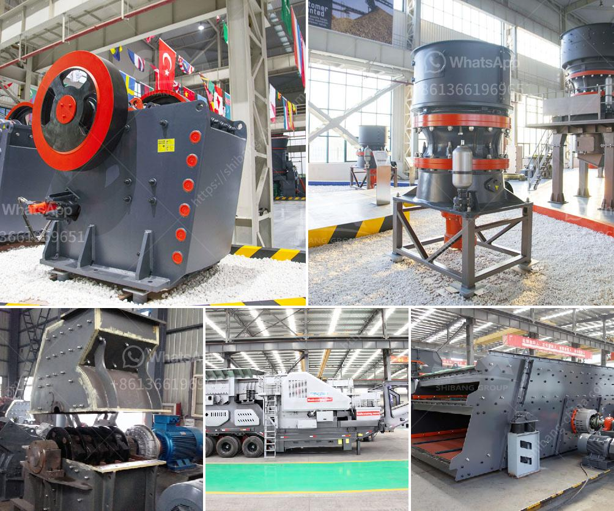

<h3>What is the best design for stone screening equipment</h3>
When it comes to stone screening equipment, the design plays a crucial role in ensuring optimal efficiency, performance, and durability. This article will delve into the key factors that define the best design for stone screening equipment, considering the specific requirements and challenges faced by the industry. By understanding these design aspects, stakeholders can make informed decisions while selecting the right equipment for their screening operations.

The first pillar of an excellent stone screening equipment design is a robust and durable construction. Since stone screening involves heavy-duty materials, the equipment must be built with high-quality materials to withstand harsh conditions. Sturdy frames, reinforced supports, and heavy-duty components are the hallmarks of a reliable design that can endure vibration, impact, and abrasion.

Efficiency in screening equipment lies in its ability to efficiently separate the desired stone sizes from unwanted materials while minimizing losses of valuable aggregates. A well-designed screening mechanism achieves this by utilizing the principles of vibration, gravity, and varying mesh sizes. The inclusion of multiple decks or layers in the screening bed enhances efficiency by allowing accurate separation at different stages, resulting in quality final products without significant downtime for maintenance or adjustments.

A superior stone screening equipment design is one that caters to a wide range of screening applications by being adaptable and versatile. This includes the ability to handle different types of stone, varying moisture levels, and even low or high feed rates. Adjustable inclination angles and precise control of screen vibration parameters (frequency and amplitude) provide the necessary flexibility to fine-tune the equipment to specific requirements.

The best stone screening equipment design prioritizes ease of use and maintenance. Intuitive controls, accessible inspection panels, and quick-change screen meshes are essential features for smooth operations and reduced downtime. A design that allows for easy access to critical components like drive systems, bearings, and motors facilitates routine servicing, repairs, and replacements, ensuring optimal performance and extended equipment lifespan.

Safety should always be a top priority in the design of stone screening equipment. Well-designed equipment incorporates safety features, such as emergency stops, guarding, and proper signage, to protect operators from potential hazards. Additionally, proper dust suppression mechanisms and noise reduction measures are important aspects of a design that prioritizes the well-being of both workers and the surrounding environment.

The best design for stone screening equipment combines robust construction, efficient screening mechanisms, adaptability, user-friendliness, and safety considerations. By investing in equipment aligned with these aspects, operators in the stone screening industry can enhance their productivity, reduce maintenance costs, and ensure a safer working environment. As technology continues to advance, it is essential for manufacturers to keep refining their designs to meet the evolving needs of the industry. Ultimately, the ideal design for stone screening equipment is the one that maximizes efficiency and durability, setting the stage for a more productive and sustainable screening process.
<h3>Contact us</h3><ul><li><strong>Whatsapp:&nbsp;<a href="https://wa.me/8613661969651">+8613661969651</a></strong></li><li><a href="https://swt.shibang-china.com/?git&amp;zhl&amp;What is the best design for stone screening equipment"><strong>Online Service(chat now)</strong></a></li></ul><h3>Related</h3><ul><li><a href='What are the spare parts of a stone crusher.md'>What are the spare parts of a stone crusher?</a></li><li><a href='What is a belt conveyor machine .md'>What is a belt conveyor machine ?</a></li><li><a href='What is antimony ore used for.md'>What is antimony ore used for?</a></li><li><a href='What is the process of mining orthoclase feldspar.md'>What is the process of mining orthoclase feldspar?</a></li><li><a href='What is the difference between a singletoggle and doubletoggle crusher.md'>What is the difference between a single-toggle and double-toggle crusher?</a></li></ul>