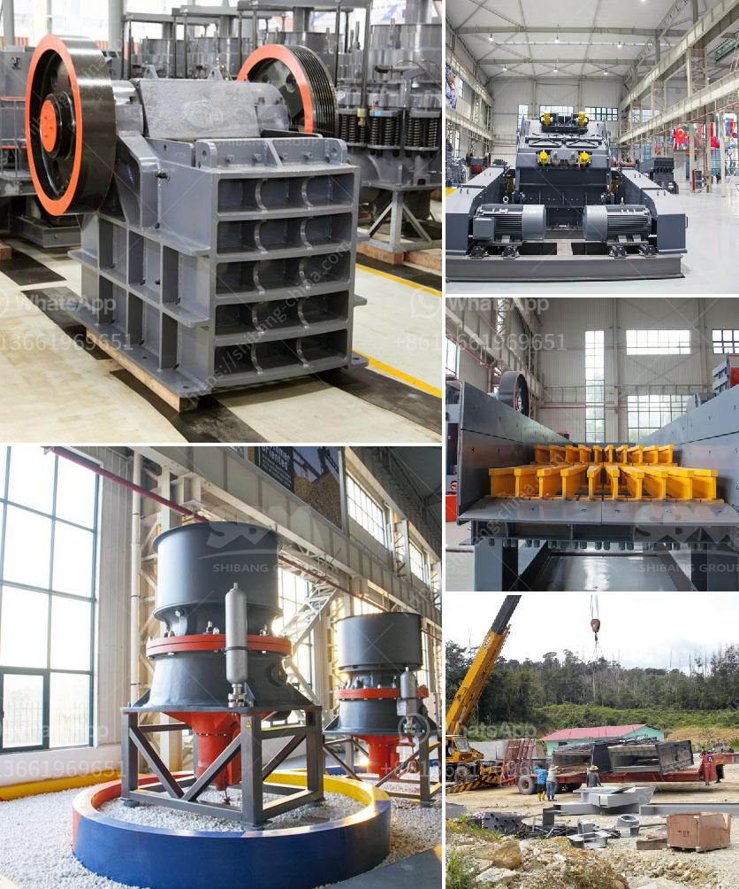

<h3>What is the best granite crusher machine?</h3>
Granite is a common and widely occurring type of intrusive, felsic, igneous rock. Granite has a medium to coarse texture, occasionally with some individual crystals larger than the groundmass forming a rock known as porphyry. Granite is nearly always massive (lacking internal structures), hard and tough, and therefore it has gained widespread use throughout human history as a construction stone.

When it comes to crushing granite, the best granite crusher machine should be able to produce finished products with high efficiency, low costs, and good particle shape.

One of the most effective ways to process granite is to use a granite impact crusher. This heavy-duty machine crushes granite into smaller particles that are ideal for transportation and further processing. Its impact crushing principle allows the product to have excellent grain shape and fewer edges and corners, enhancing its overall quality.

A popular crushing machine for granite is a jaw crusher. This machine is widely used and processes granite into smaller pieces for construction purposes. Jaw crushers have a simple design and operate efficiently, making them a great choice for granite crushing.

For secondary crushing applications, cone crushers are commonly used. They have a robust design, high crushing efficiency, and can handle various types of granite materials. Cone crushers also produce excellent grain shape and are ideal for use in the construction industry.

In recent years, the development of mobile crushers has been rapid. Granite mobile crushers are specifically designed for the crushing of hard and abrasive materials, making them ideal for crushing granite. Equipped with an advanced intelligent control system, these crushers provide a high degree of flexibility and convenience by allowing the operator to adjust the settings remotely.

1. Production capacity: The machine's production capacity should match the project's requirements. It is important to select a crusher that can process granite efficiently and with high output.

2. Efficiency and performance: Look for a machine that is designed to maximize efficiency and minimize downtime. The best granite crusher machine should be equipped with the latest technologies to ensure optimal performance.

3. Cost: Consider the initial cost of the machine as well as the cost of operation and maintenance. A machine that offers a good balance between performance and cost-effectiveness is essential.

4. Particle shape: Granite is often used for construction purposes, so it is important to choose a machine that produces aggregates with a good particle shape. This will ensure the final product meets the required specifications.

In conclusion, the best granite crusher machine depends on the specific requirements of the project. However, a granite impact crusher, jaw crusher, cone crusher, or mobile crusher are all good options to consider. Factors such as production capacity, efficiency, performance, cost, and particle shape should be carefully considered when making a decision. Ultimately, choosing the right machine will ensure that the crushing process is efficient, cost-effective, and produces high-quality granite aggregates.
<h3>Contact us</h3><ul><li><strong>Whatsapp:&nbsp;<a href="https://wa.me/8613661969651">+8613661969651</a></strong></li><li><a href="https://swt.shibang-china.com/?git&amp;zhl&amp;What is the best granite crusher machine"><strong>Online Service(chat now)</strong></a></li></ul><h3>Related</h3><ul><li><a href='What machines are used in quarry mining What is the role of each.md'>What machines are used in quarry mining? What is the role of each?</a></li><li><a href='what size material can be made with an impact crusher？.md'>what size material can be made with an impact crusher？</a></li><li><a href='What type of crusher is used for iron ore？.md'>What type of crusher is used for iron ore？</a></li><li><a href='what are the equipment in iron ore crusher？.md'>what are the equipment in iron ore crusher？</a></li><li><a href='What is a cement plants tertiary crusher.md'>What is a cement plant's tertiary crusher?</a></li></ul>