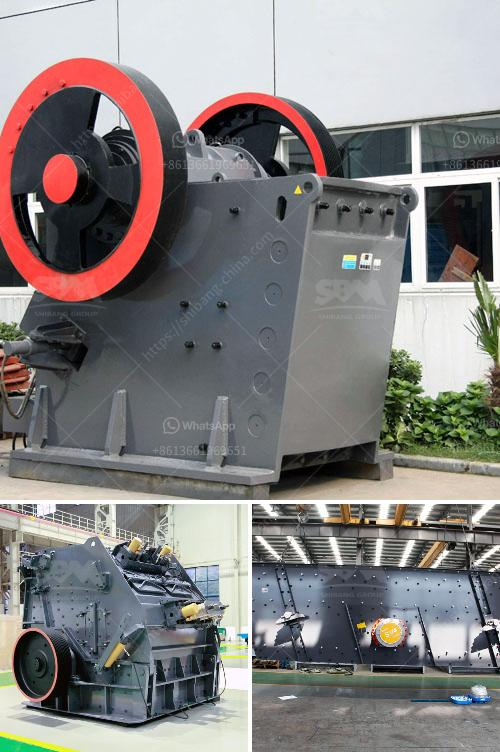

<h3>What is the best iron ore mobile crushing plant？</h3>
Iron ore is a challenging iron ore, where iron ore mines are found in rocks and minerals. However, due to the high hardness of the iron ore, it requires a crushing process using a mobile crushing plant. Iron ore is popularly used in various industries for extracting and processing raw materials. But what is the best iron ore mobile crushing plant?

When it comes to choosing the best iron ore mobile crushing plant, several factors need to be considered. These factors include the hardness and abrasiveness of the iron ore, production requirements, capital investment, and operational costs. Let's dive deeper into these aspects to determine the most suitable iron ore mobile crushing plant.

Firstly, it is essential to consider the hardness and abrasiveness of the iron ore. Different iron ores have different hardness levels, which impact the choice of the crushing plant. For instance, hematite and magnetite are highly abrasive iron ores, while taconite is less abrasive. Therefore, a crushing plant with robust and durable crushers is required to handle the high hardness and abrasiveness of the iron ore.

Secondly, production requirements play a crucial role in selecting the best iron ore mobile crushing plant. The production capacity needed depends on the scale of the iron ore mine and the desired output. Some mines may require a higher production capacity to meet their demands, while others may operate at a smaller scale. Identifying the production requirements will help determine the size and configuration of the mobile crushing plant.

Thirdly, capital investment is a significant consideration. The cost of the mobile crushing plant plays a crucial role in the decision-making process. The plant's cost includes the price of the machinery, installation costs, transportation, and other related expenses. It is important to find a balance between performance and cost-effectiveness to ensure a reasonable investment.

Lastly, operational costs are an important consideration in selecting the best iron ore mobile crushing plant. Operational costs include maintenance, fuel, and electricity expenses. The mobile crushing plant should have low operating costs while delivering high efficiency and productivity. Analyzing the operational costs will help ensure a sustainable and profitable operation.

Considering all these factors, one of the best iron ore mobile crushing plants is the portable jaw crusher and portable cone crusher combination. This combination offers high flexibility and adaptability for different iron ore mining operations. The portable jaw crusher is suitable for primary crushing, while the portable cone crusher is designed for secondary and tertiary crushing.

The portable jaw crusher and portable cone crusher combination provide excellent performances in terms of production capacity, crushing efficiency, and overall cost-effectiveness. These machines are equipped with advanced technologies and features, including hydraulic settings, wireless remote control, and intelligent control systems.

In conclusion, the best iron ore mobile crushing plant depends on various factors such as hardness, production requirements, capital investment, and operational costs. However, the portable jaw crusher and portable cone crusher combination offer high performance, flexibility, and cost-effectiveness, making them a top choice for iron ore mobile crushing. When selecting a mobile crushing plant, it is vital to analyze these factors and consult with industry experts to make an informed decision.
<h3>Contact us</h3><ul><li><strong>Whatsapp:&nbsp;<a href="https://wa.me/8613661969651">+8613661969651</a></strong></li><li><a href="https://swt.shibang-china.com/?git&amp;zhl&amp;What is the best iron ore mobile crushing plant？"><strong>Online Service(chat now)</strong></a></li></ul><h3>Related</h3><ul><li><a href='What is an opencircuit ball mill.md'>What is an open-circuit ball mill?</a></li><li><a href='What is the iron ore thickening process.md'>What is the iron ore thickening process?</a></li><li><a href='What mill should be used for crushing rocks.md'>What mill should be used for crushing rocks?</a></li><li><a href='What machinery is used to mine zinc .md'>What machinery is used to mine zinc ?</a></li><li><a href='What is the role of a mill in a coalfired power plant.md'>What is the role of a mill in a coal-fired power plant?</a></li></ul>