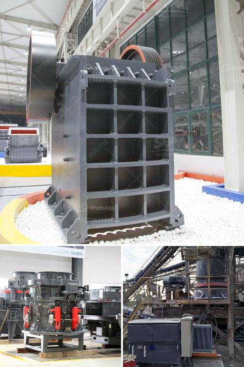

<h3>What is the best jaw crusher for coal processing?</h3>
Jaw crushers are commonly used equipment in coal processing. Due to their strong and durable construction, they have the capability to handle large quantities of coal and are designed to be efficient in crushing hard and abrasive materials. However, with the wide variety of jaw crusher models available in the market, selecting the right one for your coal processing operation can be a daunting task. In this article, we will discuss some key factors to consider when choosing the best jaw crusher for coal processing.

First and foremost, it is important to understand the purpose for which you need the jaw crusher. Different types of coal undergo different processing methods, and the requirements for the jaw crusher will vary accordingly. For instance, if you are processing bituminous coal, a rotary style crusher would be recommended. However, for anthracite coal, it is more suitable to choose a jaw crusher.

Another important factor to consider is the feed size of the coal. The jaw crusher should be able to receive coal of certain size or under from the mine without any technical issues. It is crucial to ensure that the chosen jaw crusher can handle the maximum feed size of the coal you intend to process.

Furthermore, the capacity is a crucial factor in determining the best jaw crusher for coal processing. Jaw crushers come in different capacities ranging from a few tons per hour to hundreds of tons per hour. Therefore, it is essential to choose a jaw crusher with the right capacity that can handle the anticipated coal load.

The energy consumption of the jaw crusher is also a significant consideration. High energy consumption not only affects your operational costs but also has an impact on the environment. Look for a jaw crusher that is designed to be energy efficient and has a low power consumption rating. High-quality jaw crushers are often equipped with energy-saving features such as a direct drive system or hydraulic system, which reduces energy loss and increases overall efficiency.

Maintenance and durability are other key aspects to consider when selecting a jaw crusher for coal processing. Look for jaw crushers that are easy to maintain and have a long service life. Jaw crushers with a sturdy and robust construction are more likely to withstand heavy-duty operations and offer a longer lifespan.

Lastly, take into account any specific requirements or preferences that you may have for the jaw crusher. Some jaw crushers offer additional features such as adjustable settings, easy access to the crushing chamber, or automatic tramp release. Consider your operational needs and consult with experts to find the best jaw crusher that meets all your requirements.

In conclusion, choosing the best jaw crusher for coal processing is a matter of carefully evaluating all the factors discussed above. Consider the purpose, feed size, capacity, energy consumption, maintenance, durability, and any additional features that are important to you. By doing so, you can select a jaw crusher that will provide efficient and reliable coal processing for your operation.
<h3>Contact us</h3><ul><li><strong>Whatsapp:&nbsp;<a href="https://wa.me/8613661969651">+8613661969651</a></strong></li><li><a href="https://swt.shibang-china.com/?git&amp;zhl&amp;What is the best jaw crusher for coal processing"><strong>Online Service(chat now)</strong></a></li></ul><h3>Related</h3><ul><li><a href='what are the by products of producing lead through mining.md'>what are the by products of producing lead through mining</a></li><li><a href='What are the spare parts of a stone crusher.md'>What are the spare parts of a stone crusher?</a></li><li><a href='what does a raymond coal mill cost？.md'>what does a raymond coal mill cost？</a></li><li><a href='What is the best design for stone screening equipment.md'>What is the best design for stone screening equipment</a></li><li><a href='What is froth flotation used for in mines.md'>What is froth flotation used for in mines?</a></li></ul>