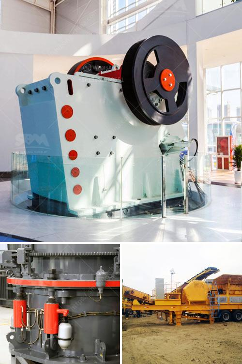

<h3>What is the best type of crusher for hard rock?</h3>
When it comes to crushing hard rock, there are few machines capable of doing the job as efficiently and effectively as the jaw crusher. These machines are able to process hard rock with ease, while reducing it to manageable sizes for further processing.

The design of a jaw crusher is highly effective in breaking down large rocks into smaller pieces, as it uses compressive force to fracture the material. This mechanical pressure is achieved by the two jaws of the crusher, one of which is fixed while the other reciprocates back and forth against it. The rock is fed into the gap between the jaws and is progressively crushed until it reaches the desired size.

One of the main advantages of jaw crushers is their ability to handle a wide variety of materials, including hard rock. This makes them ideal for primary crushing applications in the mining and quarrying industries. In addition, jaw crushers can also handle both coarse and fine crushing tasks, making them a reliable choice for secondary crushing as well.

Another key factor in choosing a jaw crusher for hard rock applications is its capacity. The capacity of a jaw crusher is defined by its feed opening dimensions, which describes the width and depth of its jaws. By specifying a larger feed opening, the machine can achieve higher capacity, which is important for processing hard rock and other challenging materials.

Furthermore, the high crushing ratio of jaw crushers, compared to other types of crushers, ensures that hard rocks are efficiently and effectively reduced in size. This allows for easier handling and transportation of the crushed material, as smaller pieces are more manageable.

However, it's important to note that jaw crushers are not without their limitations. One common drawback is their relatively lower reduction ratios, especially when compared to cone crushers. Reduction ratio refers to the ratio of the size of the feed material to the size of the crushed product. Cone crushers, for instance, typically provide a higher reduction ratio, resulting in finer end products.

Moreover, while jaw crushers are efficient in breaking down hard rock, they can be quite noisy during operation. This can pose a challenge, especially in urban areas, where noise pollution is a concern.

In summary, when it comes to crushing hard rock, the jaw crusher is the best choice. It is capable of processing hard rock efficiently and effectively, while providing a high reduction ratio and a reliable performance. However, it's important to consider the specific needs and limitations of your operation before making a final decision. Consulting with a professional and experienced crushing equipment supplier can help ensure that you choose the right crusher for your hard rock crushing needs.
<h3>Contact us</h3><ul><li><strong>Whatsapp:&nbsp;<a href="https://wa.me/8613661969651">+8613661969651</a></strong></li><li><a href="https://swt.shibang-china.com/?git&amp;zhl&amp;What is the best type of crusher for hard rock"><strong>Online Service(chat now)</strong></a></li></ul><h3>Related</h3><ul><li><a href='What causes tension rods in jaw crushers to break.md'>What causes tension rods in jaw crushers to break?</a></li><li><a href='What type of machine is used in the cement industry.md'>What type of machine is used in the cement industry?</a></li><li><a href='what does a raymond coal mill cost？.md'>what does a raymond coal mill cost？</a></li><li><a href='What is the process of mining marble.md'>What is the process of mining marble?</a></li><li><a href='What is the ball milling method.md'>What is the ball milling method?</a></li></ul>