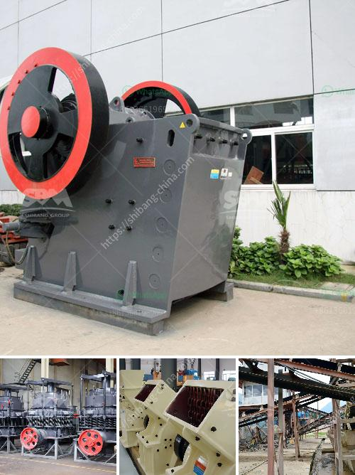

<h3>What is the best use of quarry limestone?</h3>
Quarry limestone, a sedimentary rock composed primarily of calcium carbonate, has several practical uses in today's world. From construction materials to toothpaste, all the way to agriculture and wastewater treatment, quarry limestone has proven to be an incredibly versatile and valuable resource.

One of the most common uses for quarry limestone is in the construction industry. Crushed limestone is often used as a base material under pavements, driveways, and roads. Its durability, stability, and ability to withstand heavy loads make it an ideal choice for these applications. Additionally, limestone can be crushed into different sizes and used as aggregate for concrete, further enhancing its usefulness in construction projects.

Limestone is also widely used for creating various building products. When heated, it undergoes a chemical reaction that transforms it into quicklime or calcium oxide. Quicklime is then mixed with other compounds to create hydrated lime, which is utilized in the manufacturing of plaster, mortar, and other building materials. These products are essential for constructing walls, foundations, and other structural elements.

Another important use of quarry limestone is in the agricultural sector. Due to its high calcium content, limestone is commonly used for soil amendment and pH regulation. Calcium is an essential nutrient for plant growth, and by applying limestone to acidic soils, farmers can neutralize the pH, making the soil more suitable for crops. Additionally, limestone provides important minerals such as magnesium and phosphorus to improve soil fertility.

Beyond construction and agriculture, quarry limestone is also utilized in water treatment facilities. As water passes through limestone, it reacts with the calcium carbonate, helping to neutralize acidity and remove impurities such as heavy metals. This process, known as remineralization, can greatly improve the quality of drinking water and is an important step in wastewater treatment as well.

Moreover, quarry limestone is utilized in the production of various consumer products. It serves as a crucial ingredient in the manufacturing of glass, ceramics, detergents, and even toothpaste. The calcium carbonate present in limestone acts as a filler and provides strength and bulk to these products. Limestone also absorbs sulfur gases, making it an effective component in flue gas desulfurization systems used in power plants to reduce air pollution.

In conclusion, quarry limestone has an array of practical and valuable uses in today's society. Whether it is used as a construction material, building products, soil amendment, water treatment, or even in the manufacturing of consumer goods, limestone's versatility is unmatched. Its availability and relatively low cost make it an attractive option for numerous industries. Thus, quarry limestone remains a vital resource that plays a pivotal role in enhancing our built environment, supporting agriculture, and safeguarding our water supply.
<h3>Contact us</h3><ul><li><strong>Whatsapp:&nbsp;<a href="https://wa.me/8613661969651">+8613661969651</a></strong></li><li><a href="https://swt.shibang-china.com/?git&amp;zhl&amp;What is the best use of quarry limestone"><strong>Online Service(chat now)</strong></a></li></ul><h3>Related</h3><ul><li><a href='what are the by products of producing lead through mining.md'>what are the by products of producing lead through mining</a></li><li><a href='What material is the jaw crusher tooth plate.md'>What material is the jaw crusher tooth plate?</a></li><li><a href='What are the advantages of dry magnetic separator？.md'>What are the advantages of dry magnetic separator？</a></li><li><a href='What is the role of a coal mill in the clinker manufacturing process.md'>What is the role of a coal mill in the clinker manufacturing process?</a></li><li><a href='What is the capacity of the grinding mill.md'>What is the capacity of the grinding mill?</a></li></ul>