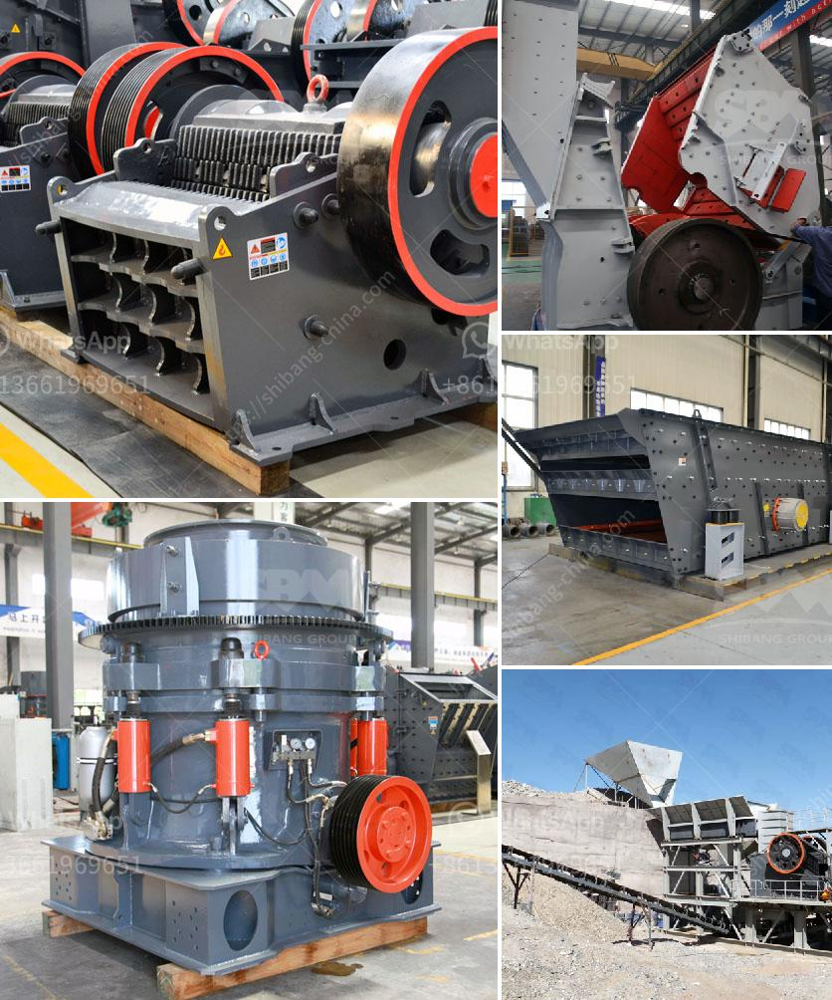

<h3>What is the capacity of the grinding mill?</h3>
Grinding mills are essential equipment in various industries where size reduction of raw materials is required. From mining and construction to pharmaceuticals and agriculture, grinding mills play a crucial role in the extraction and processing of minerals, food products, and other materials. One of the key parameters to consider when choosing a grinding mill is its capacity, which determines the volume of material that can be processed in a given time frame. In this article, we will discuss the capacity of grinding mills and its significance in different industries.

The capacity of a grinding mill is typically expressed in terms of the maximum amount of materials it can process per unit time. It is usually measured in terms of the mass or volume of materials processed per hour, day, or any other time interval. The capacity depends on several factors, including the size and design of the mill, the type of material being processed, the desired final product size, and the efficiency of the grinding process.

The size and design of the grinding mill are crucial factors that determine its capacity. Larger mills with higher power ratings generally have higher capacities as they can handle larger quantities of materials. The design of the mill, including the length and diameter of the grinding chamber and the configuration of the grinding elements, also affects its capacity. Mills with larger grinding chambers and more efficient grinding elements can process more material in a given time, resulting in higher capacity.

The type of material being processed is another important factor that impacts the capacity of the grinding mill. Different materials have different characteristics, such as hardness, brittleness, and moisture content, which can affect their grindability. Harder materials require more energy and time to grind, reducing the overall capacity of the mill. Similarly, materials with higher moisture content can clog the mill and reduce its capacity. Therefore, the capacity of a grinding mill may vary depending on the specific material being processed.

The desired final product size also influences the capacity of the grinding mill. Finer products generally require more grinding time and energy, which can lower the overall capacity of the mill. On the other hand, if a coarse product is desired, less grinding time may be required, resulting in higher capacity.

The efficiency of the grinding process determines how effectively the mill can extract the desired product from the raw materials. Factors such as grinding media, mill speed, and the presence of classification systems all affect the efficiency and, consequently, the capacity of the mill. Higher efficiency leads to higher capacity.

In conclusion, the capacity of a grinding mill determines the volume of materials it can process in a given time frame. Factors such as the size and design of the mill, the type of material being processed, the desired final product size, and the efficiency of the grinding process all play a role in determining the capacity. Understanding the capacity of a grinding mill is crucial for selecting the right equipment and optimizing production processes in various industries.
<h3>Contact us</h3><ul><li><strong>Whatsapp:&nbsp;<a href="https://wa.me/8613661969651">+8613661969651</a></strong></li><li><a href="https://swt.shibang-china.com/?git&amp;zhl&amp;What is the capacity of the grinding mill"><strong>Online Service(chat now)</strong></a></li></ul><h3>Related</h3><ul><li><a href='What can I use to crush rocks or granite.md'>What can I use to crush rocks or granite?</a></li><li><a href='What is the selling price of the hammer crusher.md'>What is the selling price of the hammer crusher?</a></li><li><a href='What is a single toggle jaw crusher.md'>What is a single toggle jaw crusher?</a></li><li><a href='What is the process of mining galena.md'>What is the process of mining galena?</a></li><li><a href='What determines the capacity of a stone crusher.md'>What determines the capacity of a stone crusher?</a></li></ul>