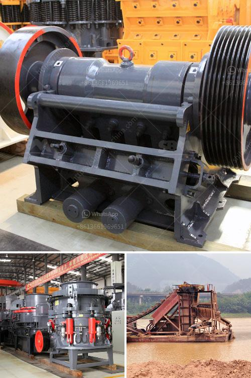

<h3>What is the capacity of the mobile crushers?</h3>
Mobile crushers, also known as stone crushers, are track-mounted or wheel-mounted rock crushing machines that are easily movable on and between production sites. They are widely used in aggregates production, recycling applications, and in mining operations. Mobile crushers can replace stationary crushing systems, which reduces the need for hauling and thus cuts operational costs.

The capacity of mobile crushers is determined based on the stone’s hardness, feed size, output size, and mobility requirements. These machines deliver high production capacity with capability to deliver graded product sizes. Further, they also offer flexibility and ease of movement, allowing operators to efficiently move them around the jobsite as needed.

1. Production rate: This refers to the number of tons of material crushed per hour. It varies depending on factors such as the type and hardness of the stone, the desired product size, and the jaw/aperture setting of the crusher. Some high-capacity mobile crushers can produce up to 500 tons of material per hour, which can be beneficial for larger construction projects.

2. Feed size: The maximum size of the stone that can be fed into the mobile crusher affects the capacity. Larger stones may need to be pre-crushed before they are fed into the crusher to ensure maximum efficiency and productivity. Mobile crushers typically accept feed sizes up to 600-700mm, although some models may accept larger feed sizes.

3. Output size: The final product size required by the customer also impacts the capacity of the mobile crusher. Different crushers are equipped with different crushing chambers that produce various particle sizes. For instance, cone crushers can produce a range of particle sizes by adjusting the closed-side setting, while impact crushers produce a more consistent end product.

4. Mobility requirements: The mobility of mobile crushers is another important factor to consider when determining their capacity. Some crushers are designed to work in a static location, while others are designed for mobile crushing operations. Mobile crushers with higher mobility typically have lower production capacity compared to static crushers. However, advances in technology have led to the development of highly mobile crushers that offer high capacity.

It is worth noting that the capacity of mobile crushers is not fixed and can vary depending on the specific application and material being crushed. Therefore, it is essential to consult the manufacturer or supplier to determine the appropriate capacity required for your specific needs.

In conclusion, the capacity of mobile crushers varies depending on several factors including production rate, feed size, output size, and mobility requirements. They offer high production capacity and flexibility, allowing for efficient and easy movement between job sites. When selecting a mobile crusher, it is crucial to consider these factors to ensure optimal performance and productivity.
<h3>Contact us</h3><ul><li><strong>Whatsapp:&nbsp;<a href="https://wa.me/8613661969651">+8613661969651</a></strong></li><li><a href="https://swt.shibang-china.com/?git&amp;zhl&amp;What is the capacity of the mobile crushers"><strong>Online Service(chat now)</strong></a></li></ul><h3>Related</h3><ul><li><a href='What equipment is required for quartz sand production.md'>What equipment is required for quartz sand production?</a></li><li><a href='What is the ball milling method.md'>What is the ball milling method?</a></li><li><a href='What equipment can be used to crush 6 mm aggregate into dust.md'>What equipment can be used to crush 6 mm aggregate into dust?</a></li><li><a href='What is construction waste and what can we do to reuse it.md'>What is construction waste, and what can we do to reuse it?</a></li><li><a href='What is an opencircuit ball mill.md'>What is an open-circuit ball mill?</a></li></ul>