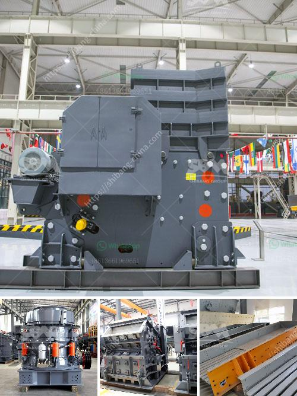

<h3>What is the cascading effect in a ball mill?</h3>
A ball mill is a type of grinder used to grind, blend, and sometimes for mixing materials for use in various applications. It works on the principle of impact and attrition: size reduction is done by impact as the balls drop from near the top of the shell.

In a ball mill, the particles are ground by repeated impact forces. The material being ground is trapped between the balls or between a ball and the lining of the mill. The cascading effect of the balls imparts sufficient energy to the particles causing them to break. It is critical to keep the ball load and mill power constant during operation to ensure efficient grinding.

The cascading effect in ball mill operations refers to the grinding action that takes place within the mill as a result of the velocity and kinetic energy imparted to the balls as they tumble. This cascading effect ensures that the grinding balls are lifted and thrown against the wall and the material is reduced in size by impact and attrition.

During normal operation, the ball charge is sufficiently distributed across the entire length and circumference of the mill. The cascading effect ensures that the grinding balls continuously impact and grind the material, preventing the formation of dead zones where grinding is negligible.

The cascading effect is directly influenced by the mill speed ratio, ball size and composition, liner design, and the material being ground. An optimal cascading effect results in efficient grinding and reduced wear and tear on the mill components.

Higher mill speeds increase the centrifugal force exerted on the grinding balls, which elevates their impact energy and enhances the cascading effect. However, excessively high mill speeds can lead to ineffective grinding as the balls tend to stick together or cling to the liner instead of freely cascading.

The size and composition of the grinding balls also significantly affect the cascading effect. Larger and heavier balls generate higher impact energy, favoring a more efficient grinding process. Similarly, the composition of the balls can impact the cascading effect: softer balls tend to deform upon impact, reducing their efficacy in breaking down the material.

The design of the mill liners also plays a crucial role in the cascading effect. The shape and profile of the liners can enhance the lifting action of the balls and control the flow of material within the mill, maximizing the cascading effect. Additionally, proper liner design promotes optimal distribution of the ball charge and reduces wear and tear on the liners themselves.

In conclusion, the cascading effect in a ball mill is an essential factor in achieving efficient grinding. By ensuring the proper combination of mill speed, ball size, ball composition, and liner design, the cascading effect can be optimized, leading to improved grinding performance and reduced wear and tear on the mill components.
<h3>Contact us</h3><ul><li><strong>Whatsapp:&nbsp;<a href="https://wa.me/8613661969651">+8613661969651</a></strong></li><li><a href="https://swt.shibang-china.com/?git&amp;zhl&amp;What is the cascading effect in a ball mill"><strong>Online Service(chat now)</strong></a></li></ul><h3>Related</h3><ul><li><a href='Which crusher discharges the most uniform material.md'>Which crusher discharges the most uniform material?</a></li><li><a href='what equipment are used in the production of bentonite？.md'>what equipment are used in the production of bentonite？</a></li><li><a href='what does a raymond coal mill cost？.md'>what does a raymond coal mill cost？</a></li><li><a href='What are the investments for a stone crusher.md'>What are the investments for a stone crusher?</a></li><li><a href='What type of crusher is good for bentonite and dolomite.md'>What type of crusher is good for bentonite and dolomite?</a></li></ul>