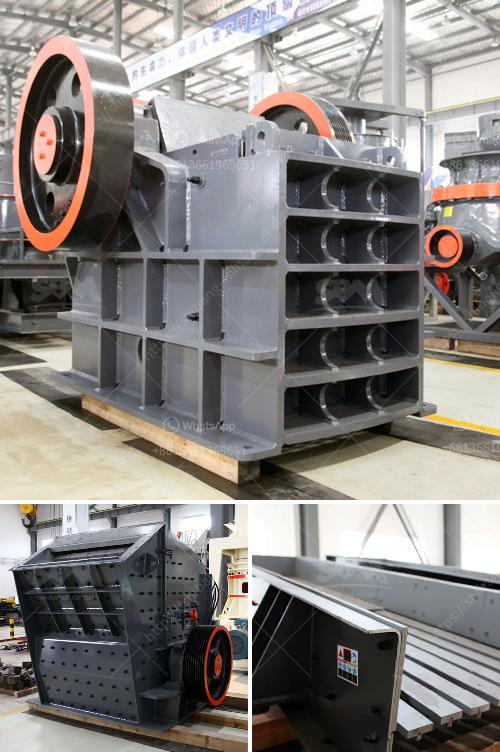

<h3>What is the common ore crusher for aluminum?</h3>
The mining industry plays a crucial role in the global economy, providing essential raw materials such as metals and minerals. Aluminum, one of the most abundant elements found in the Earth's crust, is widely used in various industries due to its desirable properties, including its lightweight nature and resistance to corrosion. In order to extract aluminum from its ore, it is necessary to use a crusher to break down the ore into small fragments for further processing. So, what is the common ore crusher for aluminum?

The most common ore crusher for aluminum is jaw crusher. Why jaw crusher is favored by so many aluminum manufacturers? It is because jaw crusher has unparalleled advantages compared with other ore crushers. On the one hand, jaw crusher manufacturers include a variety of models, which can meet the needs of different customers in terms of output and different motor power. On the other hand, jaw crusher has a simple structure, reliable operation, and low operating costs, which significantly reduces the production costs of aluminum manufacturers during the crushing process.

Jaw crusher requires a skilled workforce to operate due to its higher complexity compared to other ore crushers. Its mechanical properties and production capacity directly affect the productivity and efficiency of aluminum production. Additionally, regular maintenance and inspection of the jaw crusher are necessary to ensure its optimal performance. Neglecting these maintenance procedures can lead to increased costs and potential breakdowns, causing delays in the production process.

In recent years, with advances in technology, impact crushers have also become common ore crushers for aluminum. The impact crusher uses the principle of impact crushing to crush aluminum ore, which is more efficient and has a higher crushing ratio than other crushers. It is suitable for processing aluminum ores with a feed size less than 500mm and a compressive strength less than 360MPa. Furthermore, impact crushers are equipped with a hydraulic opening mechanism, which makes it easier to replace wearing parts and adjust the discharge size. This feature greatly reduces the downtime of the crusher and improves the overall efficiency of aluminum production.

Other types of ore crushers commonly used for aluminum ore processing include cone crushers and hammer crushers. Cone crushers are widely used due to their high production capacity, fine crushing, and good particle size control. Hammer crushers are suitable for crushing brittle materials such as limestone and coal, but they are less commonly used in aluminum ore processing due to their lower efficiency in breaking down tough aluminum ores.

In conclusion, the common ore crusher for aluminum is primarily the jaw crusher, thanks to its unparalleled advantages in terms of model variety, simple structure, reliable operation, and low operating costs. However, impact crushers, cone crushers, and hammer crushers are also used for aluminum ore processing in specific scenarios. Choosing the appropriate crusher depends on the specific characteristics of the aluminum ore and the desired end product.
<h3>Contact us</h3><ul><li><strong>Whatsapp:&nbsp;<a href="https://wa.me/8613661969651">+8613661969651</a></strong></li><li><a href="https://swt.shibang-china.com/?git&amp;zhl&amp;What is the common ore crusher for aluminum"><strong>Online Service(chat now)</strong></a></li></ul><h3>Related</h3><ul><li><a href='What is the waste from an orecrushing plant.md'>What is the waste from an ore-crushing plant?</a></li><li><a href='what are common raw materials for artificial sand.md'>what are common raw materials for artificial sand</a></li><li><a href='What is a hammer mill work.md'>What is a hammer mill work?</a></li><li><a href='What is the mining process of barite？.md'>What is the mining process of barite？</a></li><li><a href='what size material can be made with an impact crusher？.md'>what size material can be made with an impact crusher？</a></li></ul>