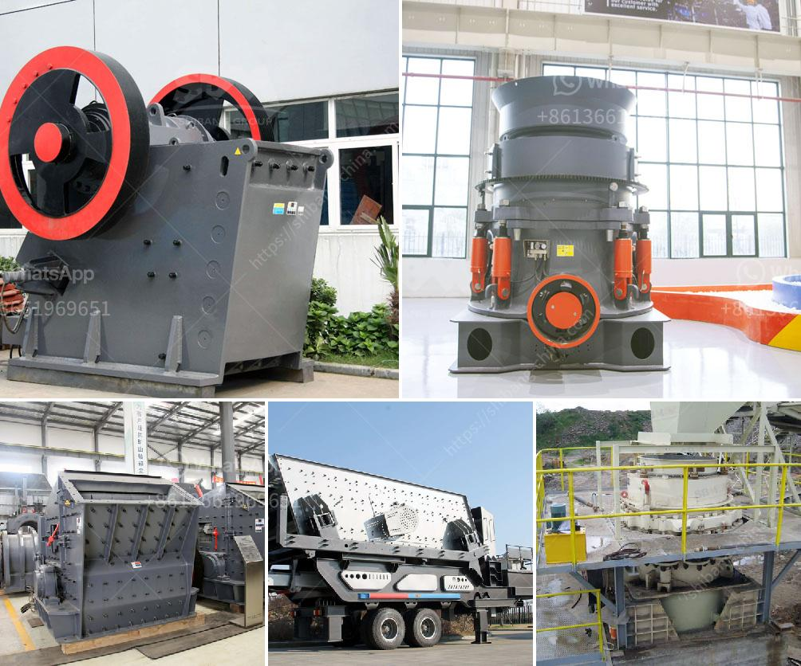

<h3>What is the cost of a 32-ton per hour aggregate crusher in China?</h3>
When it comes to purchasing an aggregate crushing machine, the first factor that needs to be considered is the price. As the largest manufacturer of mining and construction materials in China, SBM is always busy in providing high quality equipment for customers all over the world. So, what is the cost of a 32-ton per hour aggregate crusher in China?

To answer this question, it is important to understand that the aggregate crushing machine is not just a single equipment, but rather a complete production line. It consists of multiple machines, such as feeders, crushers, screens, and conveyors. Each machine has its own cost, and when combined together, the total cost can vary greatly.

The cost of a 32-ton per hour aggregate crusher mainly depends on the production capacity, as well as the configuration of the equipment. In general, jaw crushers and cone crushers are the common choices for crushing equipment. However, if there is a market demand for finer aggregate products, a vertical shaft impact crusher (VSI) can be added into the production line as well.

The cost of a 32-ton per hour aggregate crusher also varies depending on the type of machine and brand. In general, the more well-known and reputable the brand is, the higher the cost will be. This is because well-known brands often have more advanced technology, higher production efficiency, and better after-sales service.

In terms of machinery configuration, a basic configuration usually includes a primary jaw crusher, a secondary cone crusher or impact crusher, a vibrating feeder, a screening machine, and several conveyors. However, some customers may have specific requirements for their production needs, such as multiple or special types of crushers, larger capacity, or additional screening and washing equipment. These customized options will increase the cost accordingly.

To give a rough estimate, the cost of a 32-ton per hour aggregate crusher in China can range from $30,000 to $300,000. However, this is just the initial cost. Other operating and maintenance costs, such as labor, electricity, and wear parts, should also be taken into account.

In addition, it is worth mentioning that the price of raw materials, such as steel and electricity, can also affect the cost of the crusher. When the prices of raw materials fluctuate, the cost of the crusher may change accordingly.

Overall, when considering the cost of a 32-ton per hour aggregate crusher in China, it is important to evaluate the production capacity, machinery configuration, brand reputation, and additional operating costs. By understanding these factors, customers can make a more informed decision and find the most cost-effective aggregate crushing machine for their specific needs.
<h3>Contact us</h3><ul><li><strong>Whatsapp:&nbsp;<a href="https://wa.me/8613661969651">+8613661969651</a></strong></li><li><a href="https://swt.shibang-china.com/?git&amp;zhl&amp;What is the cost of a 32ton per hour aggregate crusher in China"><strong>Online Service(chat now)</strong></a></li></ul><h3>Related</h3><ul><li><a href='What are the investments for a stone crusher.md'>What are the investments for a stone crusher?</a></li><li><a href='What causes tension rods in jaw crushers to break.md'>What causes tension rods in jaw crushers to break?</a></li><li><a href='What are the specifications of the copper crusher.md'>What are the specifications of the copper crusher?</a></li><li><a href='What is the waste of ore crushing plant .md'>What is the waste of ore crushing plant ?</a></li><li><a href='What is needed to open a quarry .md'>What is needed to open a quarry ?</a></li></ul>