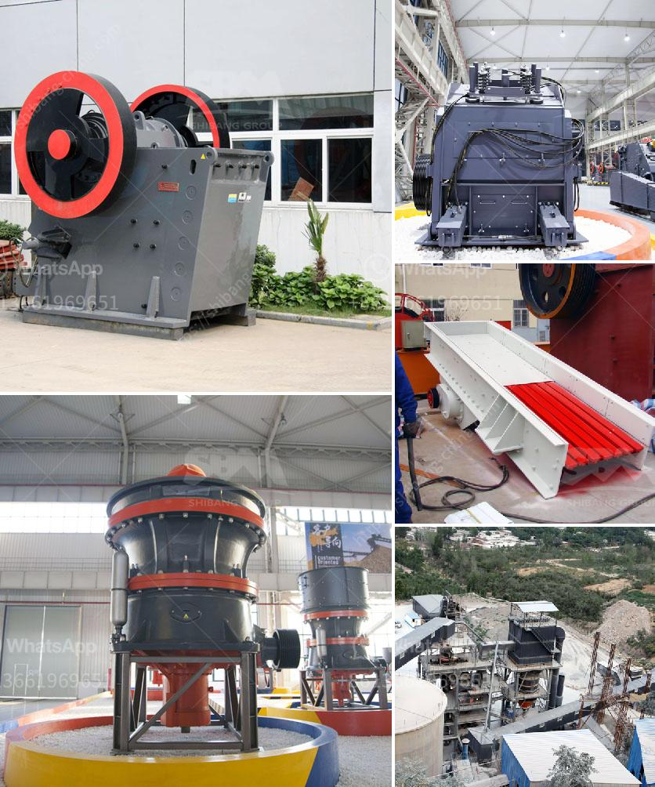

<h3>What is the cost of a jaw crusher?</h3>
A jaw crusher is a very common type of crushing equipment used in a mine or ore processing plant. The size of a jaw crusher is designated by the rectangular or square opening at the top of the jaws (feed opening). For instance, a 24 x 36 jaw crusher has a opening of 24" by 36", a 56 x 56 jaw crusher has a opening of 56" square.

The cost of a jaw crusher depends on what kind of jaw crusher you want. You can buy used jaw curshers chaper than new ones. Places to look for Jaw Crusher machines include: Websites such as Alibaba.com or Government auctions. Jaw Crusher machines cost a certain amount of money, and there is a lot of uncertainty about the actual cost.

The jaw crusher machines are priced according to the brand, quality, capacity and need. Jaw crushers are popular in the mining, construction, metallurgy, chemical, and other industries. Indicator of the cost of jaw crusher will be repeated after the crushing machine is used and the annual cost will be increased.

Jaw crushers can be divided into two types: single toggle jaw crusher and double toggle jaw crusher. Single toggle jaw crushers have illustrations of the swing action of the jaw and require a larger motor than a double toggle jaw crusher would need.

Double toggle jaw crushers are the preferred crushing solution for highly abrasive materials. They are mostly used in mining operations where the material is very hard and requires a lot of compression force.

The cost of a jaw crusher can vary depending on whether you are buying a new one or a used one. Since jaw crushers have been around for a long time, there are many used ones available. The cost will also depend on the condition of the jaw crusher and how well it has been maintained.

The main factors that affect the cost of a jaw crusher are the size, weight, capacity, and the materials that will be crushed. Some of the main features that you want to look for in a jaw crusher include:

- Easy maintenance: Look for a jaw crusher that is easy to maintain and has replaceable parts in case of wear and tear.

- Energy efficiency: Consider the energy consumption of the jaw crusher and choose one that is energy efficient to reduce operating costs.

In conclusion, the cost of a jaw crusher can vary depending on the size, weight, capacity, and materials being crushed. It is important to consider these factors when choosing a jaw crusher to ensure you get the best value for your money.
<h3>Contact us</h3><ul><li><strong>Whatsapp:&nbsp;<a href="https://wa.me/8613661969651">+8613661969651</a></strong></li><li><a href="https://swt.shibang-china.com/?git&amp;zhl&amp;What is the cost of a jaw crusher"><strong>Online Service(chat now)</strong></a></li></ul><h3>Related</h3><ul><li><a href='What is the process that coal goes through to become a finished product.md'>What is the process that coal goes through to become a finished product?</a></li><li><a href='What are the parts of a Raymond Mill.md'>What are the parts of a Raymond Mill?</a></li><li><a href='What points should be checked by a maintenance PM on a ball mill.md'>What points should be checked by a maintenance PM on a ball mill?</a></li><li><a href='What type of crusher should I use to crush quartzite rock.md'>What type of crusher should I use to crush quartzite rock?</a></li><li><a href='What is the need to replace the jaw crusher plate？.md'>What is the need to replace the jaw crusher plate？</a></li></ul>