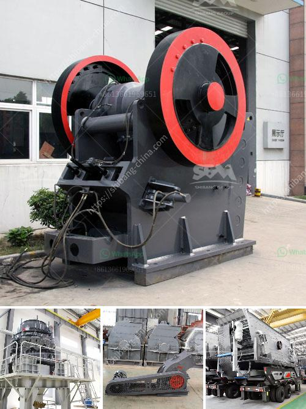

<h3>What is the cost of a stone crusher plant?</h3>
The cost of a stone crusher plant has always been one of the key topics that the customers need to consider.Generally,it is affected by the following factors, such as crusher type, specific crusher model,crusher manufacturer,shipment,brand,etc.

The raw material scale you need to process decides the crusher type and specific model you need to choose. If you need a single small crusher, jaw crusher would be a better choice, whose total cost will be only thousands of dollars. If you need a medium scale and large size crusher machine, the cost of stone crusher plant is up to the crusher type you choose.PE-600×900 jaw crusher,PY1200 series cone crusher, mobile crusher are the hot sale ones. If you need larger production capacity, we also have the related crusher size for you to choose. The cost of the stone crusher plant is also different among the different crusher types and specificiations. Moreover, the cost of stone crusher plant is also different between single stone crusher and full crusher screen line. The full stone crusher line includes stone crusher, vibrating screen, vibrating feeder, belt conveyor, etc, which is widely used for the medium and large scale stone crushing (more than 60tons per hour) in mining, quarry, construction, road pavement, highway and other industries.It will be about 40,000-200,000 dollars.The detailed cost of stone crusher plant is decided by the specific product configuration.

Considering all of these, the overall cost of stone crushing plant will be affected by the cost of sales staff, labor costs, transportation costs, and other miscellaneous costs that account for about 30%-40% of the total cost. As its name suggests, the stone crushing plant is a kind of equipment used to crush various materials. In general, the stone crushing plant is fixed for material processing. As a common building material, limestone is widely used in cement, decoration, building materials and other industries due to its wide source and low cost.In general, limestone processing into stone, the need to use the equipment that we often say crusher, also known as the shredder, stone machine, no matter what is called, in the final analysis is the limestone processing into the specific industry needs the size, particle size, then processing limestone with which machine is more appropriate?1. Jaw crusher + impact crusher Jaw crusher is generally used for primary breaking operations, all kinds of soft and hard stones can be broken efficiently, for limestone this kind of low hardness material treatment effect is also very good;Secondly, the impact crusher itself focuses on soft stone crushing operation, and the impact crusher itself covers the plastic function, the finished stone particle is very good, is the ideal limestone processing equipment, both with high efficiency and high yield

Based on the customer's budget, there are some manufacturers that offer machines with various prices, and flexibility is more or less fixed.Stone crusher plant prices will vary by lots of elements, vendors, the crusher marketplace competition, you will find a number of factors contribute to the pricing as well.

A number of people who are about get into mining business will wonder which kind of crusher machine will be the best one for limestone processing in mining industry.2017 new limestone mobile jaw crusher price China 2017 new limestone mobile jaw crusher price structure: limestone mobile jaw crusher is mainly composed of frame, moving jaw, eccentric shaft, flywheel, modular construction equipment, negation.	return transfer process plays an important role within the entire limestone crushing equipment. 

In the final analysis, the limestone crushing equipment investment is more cost-effective than the other devices, and the investment and return ratio is larger in the short-term.    

Considering that the limestone is easily crushed with larger finished size requirements, the PE500×750 jaw crusher (maximum treatment and feed size of 450mm) is usually selected as the primary crushing equipment.1620tph LM150M vertical mill for coal powder production in Australia Conventionally, after the raw ore has been mined, it is crushed and ground in order to obtain better dissociation of the particles and ensure high yield of the subsequent separation stage, and since the grain size of the ore after grinding is generally small, and the mineral processing effect of the subsequent separation stage is comparatively better.The coal powder quality will directly determine the efficiency of the entire system. Because the traditional coal grinding mill has many shortcomings such as low output, high energy consumption, high pollution, etc. Webertical mill or large scale Raymond mill;
<h3>Contact us</h3><ul><li><strong>Whatsapp:&nbsp;<a href="https://wa.me/8613661969651">+8613661969651</a></strong></li><li><a href="https://swt.shibang-china.com/?git&amp;zhl&amp;What is the cost of a stone crusher plant"><strong>Online Service(chat now)</strong></a></li></ul><h3>Related</h3><ul><li><a href='What is the waste of ore crushing plant .md'>What is the waste of ore crushing plant ?</a></li><li><a href='What are the parts of a Raymond Mill.md'>What are the parts of a Raymond Mill?</a></li><li><a href='What is a single toggle jaw crusher.md'>What is a single toggle jaw crusher?</a></li><li><a href='What are the features of a jaw crusher.md'>What are the features of a jaw crusher?</a></li><li><a href='What can I use to crush rocks or granite.md'>What can I use to crush rocks or granite?</a></li></ul>