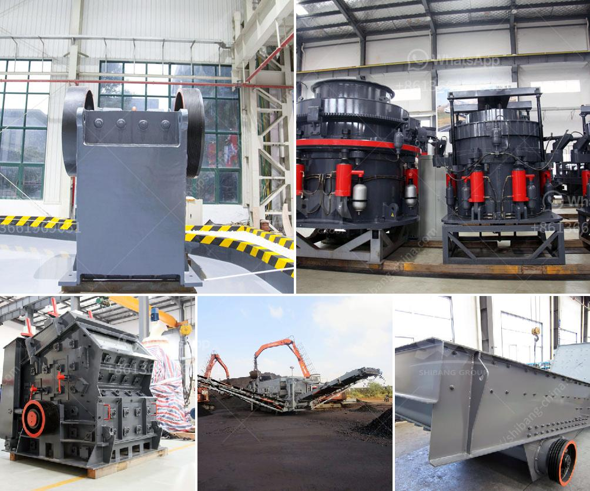

<h3>What is the cost of artificial sand projects?</h3>
Artificial sand, also known as crushed sand or manufactured sand, is primarily used for construction purposes. It is produced by crushing rocks, quarry stones, or larger aggregates into smaller pieces. The resultant artificial sand is more angular in shape and has a rougher texture compared to natural sand. While the cost of artificial sand projects can vary depending on various factors, it is generally a cost-effective alternative to natural sand.

One of the significant factors impacting the cost of artificial sand projects is the raw material used. Crushing rocks or quarry stones to produce artificial sand requires machinery like crushers, which incurs initial investment costs. Additionally, transportation costs of raw materials to the crushing plants and the distance between the quarry and construction site can affect the overall cost of the project.

The availability of suitable raw materials for producing artificial sand can also impact the cost. Not all regions have an abundant supply of rocks or quarry stones that are suitable for this purpose. In areas where such resources are scarce, transportation costs may be higher as raw materials need to be sourced from distant locations. This can result in an increase in the overall cost of artificial sand projects.

Furthermore, another significant cost associated with artificial sand projects is the cost of machinery required for the production process. Crushers, screening equipment, and other machinery are necessary to convert the raw materials into artificial sand efficiently. The cost of these machines depends on their capacity, quality, and other specifications. It is essential to invest in reliable and efficient machinery to ensure cost-effective production of artificial sand.

Apart from the initial investment in machinery, ongoing maintenance and operational costs also contribute to the overall expense of artificial sand projects. Regular maintenance checks, lubrication, and replacement of worn-out parts are necessary to keep the machines running smoothly and maximize their lifespan. These costs should be taken into account when evaluating the overall cost of artificial sand projects.

On the other hand, the cost-effectiveness of artificial sand should be considered from a long-term perspective. Natural sand is a finite resource and its extraction can have detrimental effects on the environment. Moreover, excessive mining of sand can lead to erosion, loss of natural habitats, and decreased groundwater levels. Artificial sand, being a sustainable alternative, helps in preserving natural resources and protecting the environment in the long run.

In conclusion, the cost of artificial sand projects is influenced by various factors, such as the availability and quality of raw materials, machinery investment, transportation costs, and ongoing maintenance expenses. While there are initial costs involved, artificial sand proves to be a cost-effective alternative to natural sand, both from an economic and environmental standpoint. By opting for artificial sand, construction projects can decrease their reliance on natural resources and contribute to a more sustainable future.
<h3>Contact us</h3><ul><li><strong>Whatsapp:&nbsp;<a href="https://wa.me/8613661969651">+8613661969651</a></strong></li><li><a href="https://swt.shibang-china.com/?git&amp;zhl&amp;What is the cost of artificial sand projects"><strong>Online Service(chat now)</strong></a></li></ul><h3>Related</h3><ul><li><a href='what is hammer crusher pakistan？.md'>what is hammer crusher pakistan？</a></li><li><a href='What can I use to crush rocks or granite.md'>What can I use to crush rocks or granite?</a></li><li><a href='What material is the jaw crusher tooth plate.md'>What material is the jaw crusher tooth plate?</a></li><li><a href='What kind of equipment is used for fine crushed stone？.md'>What kind of equipment is used for fine crushed stone？</a></li><li><a href='what is the cost of making gravel crusher plant 600tph？.md'>what is the cost of making gravel crusher plant 600tph？</a></li></ul>