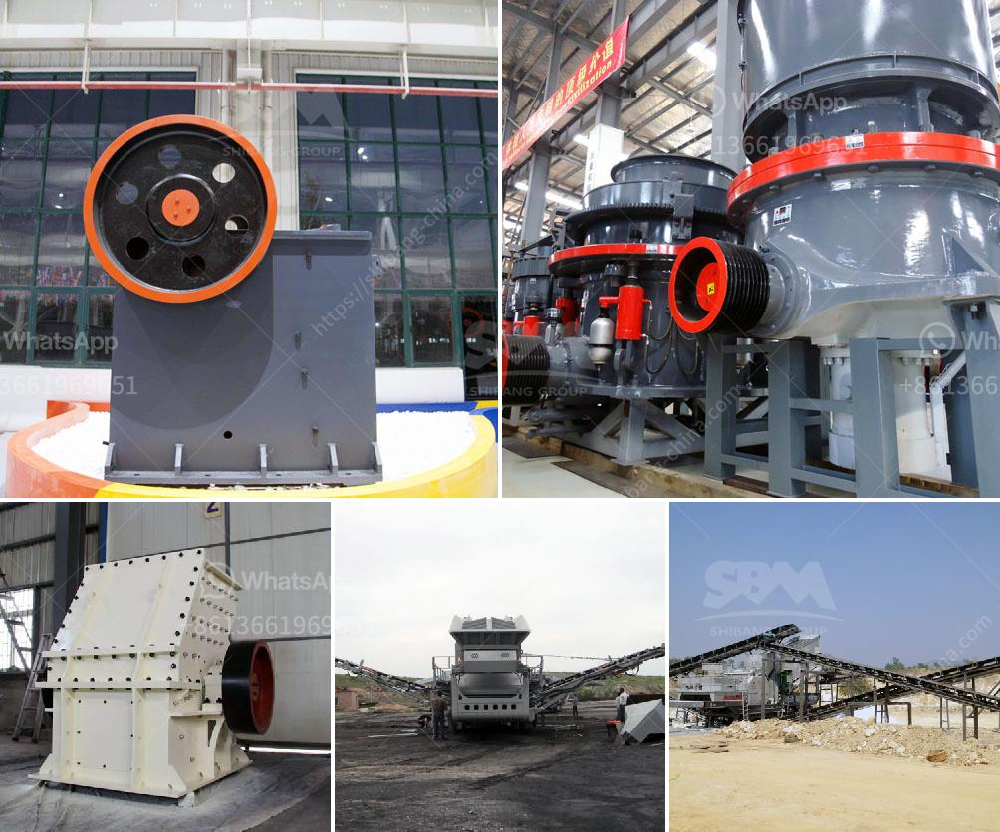

<h3>What is the cost of gravel crushing ?</h3>
Gravel is a popular material used for a variety of construction and landscaping projects. It is versatile, affordable, and readily available, making it a preferred choice for many individuals and businesses. However, when it comes to gravel crushing, there are costs involved that need to be considered.

The cost of gravel crushing primarily depends on several factors such as the type of gravel, the size and capacity of the crushing equipment, the location of the project, the quantity of gravel required, and the desired end product. These factors play a crucial role in determining the overall cost.

Firstly, the type of gravel is an essential factor. There are various types of gravel available in the market, including crushed stone, pea gravel, and river rocks, each with a different cost. Generally, crushed stone tends to be more expensive compared to pea gravel or river rocks. The type of gravel selected will affect the overall cost estimate.

Next, the size and capacity of the crushing equipment play a significant role in the cost estimation. Gravel crushing requires heavy machinery capable of breaking large stones into smaller sizes. The size and capacity of the equipment will determine the cost, as higher capacities and sizes typically require more expensive machinery.

Another crucial factor affecting the cost is the location of the project. The cost of transportation can significantly impact the overall expenses. If the gravel crushing project is situated in a remote area, the cost of mobilizing the equipment to the location can be quite high. Additionally, the distance from the source of gravel to the project site will also affect the transportation costs. Closer proximity to the gravel source generally leads to lower transportation costs.

The quantity of gravel required for the project also contributes to the cost estimation. Larger projects that require a substantial volume of gravel will naturally incur a higher cost compared to smaller projects. The cost of purchasing and transporting larger quantities of gravel adds up, making it an important consideration for budget planning.

Lastly, the desired end product can influence the overall cost as well. Different specifications, such as size and type of gravel required, can affect the complexity of the crushing process. Crushing gravel to specific sizes or producing gravel with special characteristics may require additional equipment or specialized processes, resulting in higher costs.

In conclusion, the cost of gravel crushing varies depending on several factors. The type and quantity of gravel, the size and capacity of the crushing equipment, the project location, and the desired end product specifications all contribute to the overall cost. It is crucial to consider these factors when planning a gravel crushing project to ensure an accurate cost estimate and successful execution within the allocated budget.
<h3>Contact us</h3><ul><li><strong>Whatsapp:&nbsp;<a href="https://wa.me/8613661969651">+8613661969651</a></strong></li><li><a href="https://swt.shibang-china.com/?git&amp;zhl&amp;What is the cost of gravel crushing "><strong>Online Service(chat now)</strong></a></li></ul><h3>Related</h3><ul><li><a href='What type of flywheel is used in the double toggle jaw crusher.md'>What type of flywheel is used in the double toggle jaw crusher</a></li><li><a href='What type of crusher is good for bentonite and dolomite.md'>What type of crusher is good for bentonite and dolomite?</a></li><li><a href='What are the functions of a gyratory crusher in mining.md'>What are the functions of a gyratory crusher in mining?</a></li><li><a href='What type of crusher is used for iron ore？.md'>What type of crusher is used for iron ore？</a></li><li><a href='what profits from crusher machine in kenya？.md'>what profits from crusher machine in kenya？</a></li></ul>