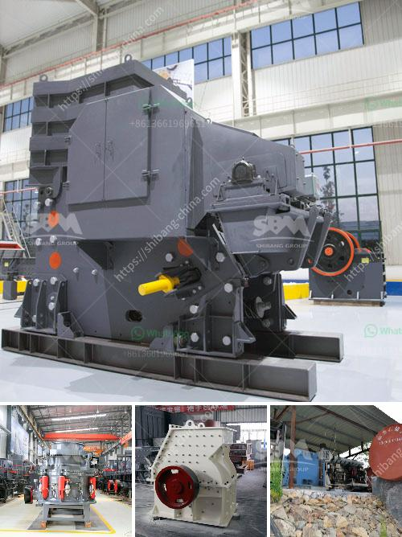

<h3>What is the cost of roller mills?</h3>
Roller mills are indispensable machines used in the milling industry to grind and separate grains into various components like flour, bran, and germ. They are widely used in both small-scale and large-scale milling operations due to their efficiency and versatility. However, one significant consideration for mill owners and operators is the cost of roller mills. In this article, we will delve into the factors that contribute to the cost of roller mills.

First and foremost, the cost of roller mills depends on their size and capacity. Roller mills come in various sizes and configurations to cater to the diverse needs of millers. Smaller roller mills with lower capacities are generally more affordable compared to larger ones that can handle higher volumes. Additionally, roller mills designed for specialized milling processes, such as those used in the production of specific flours, tend to be pricier due to their specialized features and added functionalities.

The cost of roller mills is also influenced by the brand and reputation of the manufacturer. Established brands with a proven track record of producing high-quality and reliable equipment often charge a premium for their roller mills. This is because these manufacturers invest heavily in research and development, ensuring that their roller mills incorporate the latest technology, are durable, and provide consistent performance. Reliable equipment and excellent after-sales service often come at a higher cost, but they offer peace of mind to mill owners, assuring them of minimal downtime and maintenance costs.

Another factor contributing to the cost of roller mills is the included features and options. Basic roller mills come with standard features, including adjustable rollers, a drive system, and a hopper. However, to enhance the functionality and efficiency of the roller mill, manufacturers offer additional options such as automated control systems, digital displays for better monitoring, and improved cooling systems to prevent overheating during prolonged use. The more features a roller mill has, the higher its cost is likely to be.

Additionally, the cost of roller mills is affected by the level of automation they offer. As automation in milling processes increases, so does the investment required. Automated roller mills not only reduce labor costs but also improve operational efficiency by providing precise control over grinding settings and integrating with other machinery in the milling process. However, the initial investment for such advanced automation technology can be higher.

Finally, geographic location and market conditions play a significant role in determining the cost of roller mills. Different regions have varying costs for raw materials, labor, and overhead expenses. Additionally, market demand and competition among manufacturers in a particular area can influence pricing. It is important for mill owners to compare prices from different suppliers and consider factors such as transportation costs and potential import duties when assessing the overall cost of roller mills.

In conclusion, the cost of roller mills varies depending on factors such as size, capacity, brand reputation, features, automation, geographic location, and market conditions. Mill owners and operators should carefully evaluate their specific milling requirements and budget constraints when selecting roller mills. By considering these factors, they can make an informed decision and choose a roller mill that provides the best value for their investment.
<h3>Contact us</h3><ul><li><strong>Whatsapp:&nbsp;<a href="https://wa.me/8613661969651">+8613661969651</a></strong></li><li><a href="https://swt.shibang-china.com/?git&amp;zhl&amp;What is the cost of roller mills"><strong>Online Service(chat now)</strong></a></li></ul><h3>Related</h3><ul><li><a href='What equipment is used to mine tungsten stone crusher.md'>What equipment is used to mine tungsten stone crusher?</a></li><li><a href='What is the input and output of a crusher machine.md'>What is the input and output of a crusher machine?</a></li><li><a href='What is the definition of crushing in mining.md'>What is the definition of crushing in mining?</a></li><li><a href='What is the role of a coal mill in the clinker manufacturing process.md'>What is the role of a coal mill in the clinker manufacturing process?</a></li><li><a href='What is the best type of crusher for hard rock.md'>What is the best type of crusher for hard rock?</a></li></ul>