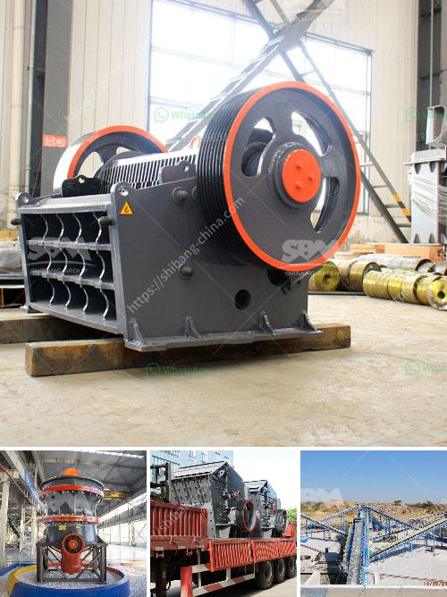

<h3>What is the definition of crushing in mining?</h3>
Mining is a complex and diverse industry that involves the extraction of valuable minerals and other geological materials from the Earth's crust. One crucial step in this process is crushing, which involves breaking down the materials into smaller pieces to facilitate further processing. In mining terminology, crushing refers to the breaking down of large rocks into smaller particles, resulting in various grades of crushed stone or ore.

The primary goal of crushing in mining is to reduce the size of the material for further processing or to extract valuable minerals trapped within the rock. There are several methods employed in the crushing process, including compression, impact, attrition, and shear. Each technique brings unique benefits and is chosen based on the properties of the material being crushed and the desired final product.

One commonly used method is compression crushing, which uses a force to compress the material against a stationary surface, resulting in the formation of smaller particles. This method is typically employed in harder materials, such as granite or basalt, where the strength of the rock allows for efficient compression.

Another widely used technique is impact crushing, in which the material is shattered by the rapid application of force through rotating hammers or bars. This method is effective for softer materials, such as limestone, and is commonly used in the production of aggregate for construction purposes.

In some cases, attrition crushing is employed, wherein the material is subjected to abrasion, rubbing, or friction between two surfaces, resulting in the reduction of particle size. This method is particularly useful for materials with low abrasion resistance, such as silica or talc.

Shear crushing involves applying a combination of forces to break the material along internal planes, resulting in a reduction in size. This technique is often used in the mining of coal, where the material is sheared and crushed between two rotating surfaces.

Regardless of the method used, crushing is an essential step in mining, as it facilitates the extraction of valuable minerals and ensures maximum recovery. The size reduction achieved through crushing contributes to the efficiency of subsequent processes, such as grinding, flotation, and leaching, by increasing the surface area available for chemical interactions. Moreover, properly sized crushed material allows for better handling and transportation, as well as increased homogeneity when blending different grades of material.

In conclusion, crushing in mining is the process of breaking down large rocks into smaller fragments to facilitate further processing or extract valuable minerals trapped within the material. Various techniques, including compression, impact, attrition, and shear, are employed depending on the properties of the material and the desired final product. Crushing plays a crucial role in the mining industry by enabling efficient mineral extraction and enhancing subsequent processing steps.
<h3>Contact us</h3><ul><li><strong>Whatsapp:&nbsp;<a href="https://wa.me/8613661969651">+8613661969651</a></strong></li><li><a href="https://swt.shibang-china.com/?git&amp;zhl&amp;What is the definition of crushing in mining"><strong>Online Service(chat now)</strong></a></li></ul><h3>Related</h3><ul><li><a href='What method of costing is used for the crusher industry.md'>What method of costing is used for the crusher industry?</a></li><li><a href='What are the spare parts of a stone crusher.md'>What are the spare parts of a stone crusher?</a></li><li><a href='What is a jaw crusher used for.md'>What is a jaw crusher used for?</a></li><li><a href='What is the difference between a wet and dry coal crusher and a hammer crusher.md'>What is the difference between a wet and dry coal crusher and a hammer crusher?</a></li><li><a href='What is the largest industrial crusher.md'>What is the largest industrial crusher?</a></li></ul>