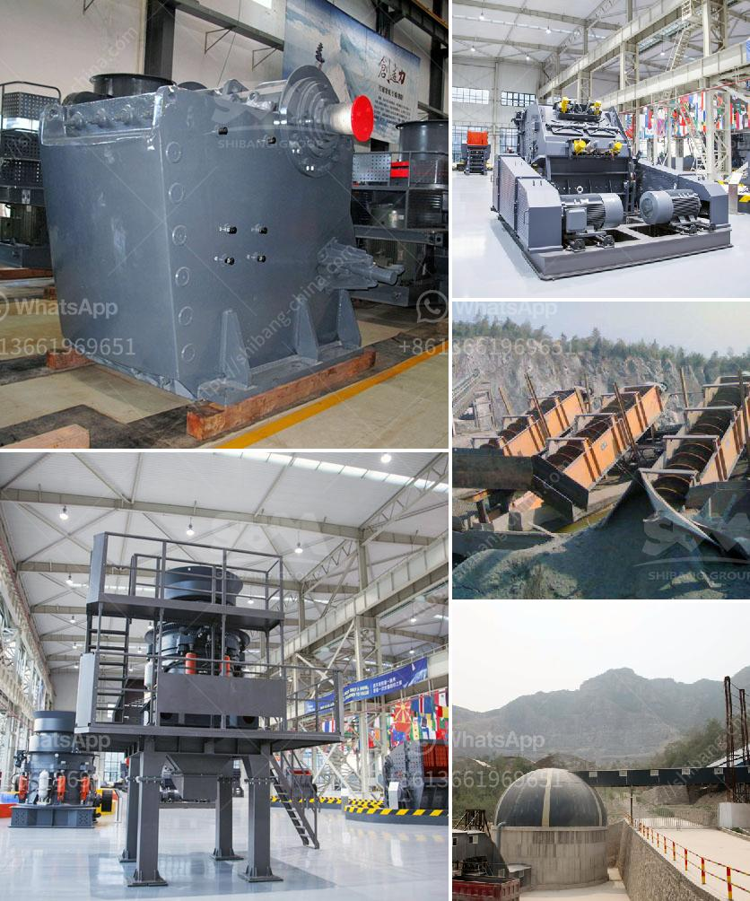

<h3>What is the density of crushed stone aggregate 10mm, 20mm, and 40mm?</h3>
The density of crushed stone aggregate 10mm, 20mm, and 40mm can vary considerably depending on the size and type of the stone and the intended use. The smaller size fractions (10mm and 20mm) tend to have higher densities, while the larger size fractions (40mm) have lower densities.

In general, the density of aggregate can range from around 1.5 to 2.8 g/cm³. However, the specific density depends on the specific gravity of the individual stone, the porosity of the stone, and how tightly the aggregate is compacted. It is worth noting that crushed stone with a higher density will provide more strength and durability when used in construction projects.

The density of 10mm aggregate is approximately 1.6 g/cm³. This compact size fraction is popularly used in various construction applications, including as a base material for road construction, as a drainage layer, and in concrete production. The higher density of the 10mm aggregate makes it suitable for load-bearing applications.

The density of 20mm aggregate is typically around 1.6-1.7 g/cm³. Like the 10mm fraction, the 20mm aggregate is widely used in construction projects. Its larger size makes it suitable for different applications, such as in concrete production for structural elements like beams and columns, as well as for foundations, asphalt surfacing, and drainage systems.

The density of 40mm aggregate is generally around 1.4-1.5 g/cm³. The larger size and lower density of this fraction make it useful for filling larger voids, stabilizing soft ground, and as a sub-base layer in road construction. The 40mm aggregate is commonly used in heavy-duty applications where strength and stability are crucial but where the cost and workability of concrete can be optimized.

It is important to note that these density values are approximate and can vary slightly depending on factors such as the moisture content and compaction of the aggregate. Therefore, it is recommended to conduct laboratory tests or refer to the specific data provided by the aggregate suppliers to ensure accuracy in construction projects.

In conclusion, the density of crushed stone aggregate varies depending on the size fraction, ranging from approximately 1.4 to 2.8 g/cm³. The 10mm and 20mm fractions have higher densities, making them suitable for various construction applications, while the 40mm aggregate has a lower density but finds use in specific heavy-duty applications.
<h3>Contact us</h3><ul><li><strong>Whatsapp:&nbsp;<a href="https://wa.me/8613661969651">+8613661969651</a></strong></li><li><a href="https://swt.shibang-china.com/?git&amp;zhl&amp;What is the density of crushed stone aggregate 10mm 20mm and 40mm"><strong>Online Service(chat now)</strong></a></li></ul><h3>Related</h3><ul><li><a href='what is the best installation for crusher plant production and maintenance？.md'>what is the best installation for crusher plant production and maintenance？</a></li><li><a href='What is the difference between jaw crusher and cone crusher？.md'>What is the difference between jaw crusher and cone crusher？</a></li><li><a href='What materials can the vertical roller mill grind.md'>What materials can the vertical roller mill grind?</a></li><li><a href='What is the price of a mobile crushing plant in Canada.md'>What is the price of a mobile crushing plant in Canada?</a></li><li><a href='What is a construction waste crusher ？.md'>What is a construction waste crusher ？</a></li></ul>