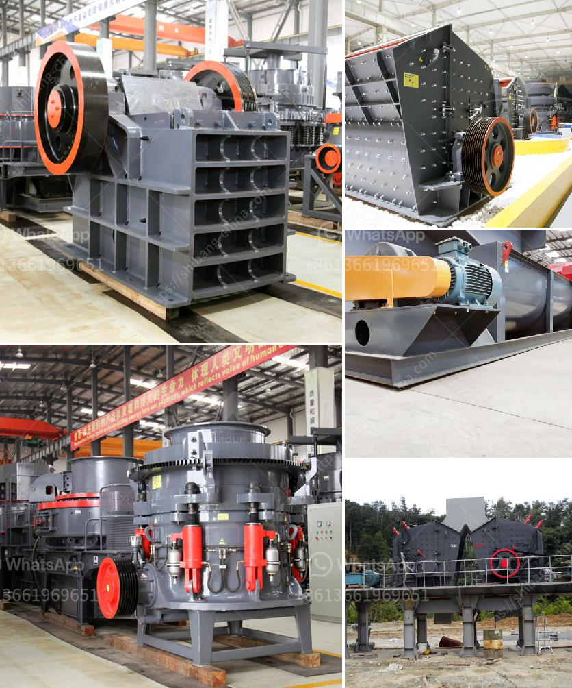

<h3>What is the design of the explosion proof valve for a coal mill?</h3>
Coal mills are used to grind and dry coal for combustion in thermal power plants, cement manufacturing plants, and other industries that require a pulverized fuel for efficient combustion. These mills operate under high temperatures and pressures, which can create a potentially hazardous environment. To ensure the safety of these operations, explosion-proof valves are used to release excessive pressure and prevent explosions.

The design of the explosion-proof valve for a coal mill is of utmost importance as it directly impacts the safety and efficiency of the milling process. These valves are designed to handle the high pressure and temperature conditions present in coal mills while ensuring reliable and safe operation.

The primary purpose of the explosion-proof valve is to release excessive pressure that could build up within the coal mill. This pressure can be caused by various factors, including coal dust accumulation, equipment malfunctions, or fluctuations in the coal supply. When the pressure inside the mill reaches a dangerous level, the explosion-proof valve is automatically triggered to open and vent the excess pressure to a safer environment.

The design of the explosion-proof valve includes several crucial features to ensure its effectiveness and reliability. Firstly, the valve is usually made of sturdy and heat-resistant materials, such as cast iron or stainless steel, to withstand the extreme conditions inside the coal mill. It must also be designed to open quickly and fully when activated, allowing the pressure to be released rapidly and preventing any potential damage to the mill or surrounding equipment.

Furthermore, explosion-proof valves often incorporate flame arrestors, which are devices that prevent flames or sparks from igniting the explosive atmosphere outside the mill. These flame arrestors consist of a fine mesh or closely spaced metal strips that can extinguish flames and prevent the propagation of fire.

The design of the explosion-proof valve also takes into account the specific requirements of coal mill operations. For example, coal mills generate significant amounts of coal dust, which can be highly explosive. To minimize the risk of dust explosions, explosion-proof valves may include features such as dust-tight seals and internal coatings that inhibit the accumulation of dust particles.

Additionally, explosion-proof valves in coal mills are often equipped with monitoring and control systems. These systems continuously monitor the pressure inside the mill and provide real-time feedback to operators. In the event of a pressure spike or abnormal conditions, the monitoring system can trigger the explosion-proof valve automatically, ensuring prompt action to prevent potential accidents.

In conclusion, the design of explosion-proof valves for coal mills plays a crucial role in ensuring the safety and efficiency of coal milling operations. These valves are engineered to withstand high pressure and temperature conditions and are designed to open quickly and fully when activated. Incorporating features such as flame arrestors, dust-tight seals, and monitoring systems, these valves provide a vital safety measure to prevent explosions and reduce the risks associated with coal mill operations.
<h3>Contact us</h3><ul><li><strong>Whatsapp:&nbsp;<a href="https://wa.me/8613661969651">+8613661969651</a></strong></li><li><a href="https://swt.shibang-china.com/?git&amp;zhl&amp;What is the design of the explosion proof valve for a coal mill"><strong>Online Service(chat now)</strong></a></li></ul><h3>Related</h3><ul><li><a href='What machinery is used to mine zinc .md'>What machinery is used to mine zinc ?</a></li><li><a href='What products are produced from a cone crusher.md'>What products are produced from a cone crusher?</a></li><li><a href='what equipments are used in the production of bentonite？.md'>what equipments are used in the production of bentonite？</a></li><li><a href='What is a composite cone crusher.md'>What is a composite cone crusher?</a></li><li><a href='What is the mining process of limestone.md'>What is the mining process of limestone?</a></li></ul>