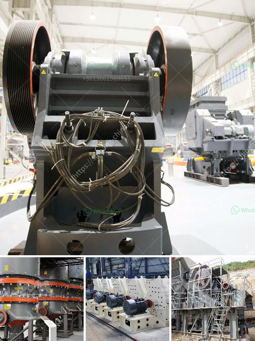

<h3>What is the difference between a ball mill and a roller mill?</h3>
A ball mill is a grinder that creates very fine powders for paints, pyrotechnics, ceramics, etc. using cylindrical rolls and balls made of various materials that roll on an axis. 

The two grinding techniques, the continuous grinding method and the batch grinding method, are widely used in ball mills. The grinding process involves reducing the size of the material by impact, shear, and pressure.

On the other hand, a roller mill utilizes cylindrical rollers to crush and grind material. The rollers crush the material between them as they rotate, creating a very fine and uniform powder. Roller mills are commonly used in industries such as mining and milling.

One key difference between a ball mill and a roller mill is that ball mills utilize steel balls in addition to the rollers, whereas roller mills use cylindrical rollers alone.

In ball milling, the ore particles are gradually crushed by the grinding media (steel balls) in a rotating cylindrical shell. Ball mills are generally used for grinding ores, coal/coke, and other materials for both wet and dry applications. The size reduction is achieved via the impact of the balls cascading and rolling within the mill chamber.

On the other hand, roller mills crush materials between the cylindrical rollers. The materials are fed into the mill and are crushed and ground by the pressure between the rollers and the rotating table. Roller mills are commonly used in pharmaceutical, mining, and food processing industries.

Another major difference between ball mills and roller mills is the energy consumption. A ball mill uses compressive impact and attrition forces to crush and grind materials, whereas a roller mill uses shear and compression forces. This results in finer and more uniform particle size distributions in roller mills compared to ball mills.

Furthermore, roller mills have a higher grinding capacity compared to ball mills, which allows for more material to be processed at a time. This is particularly advantageous in industries that require large quantities of material to be ground.

The size and shape of the grinding media also differ between ball mills and roller mills. In ball mills, the grinding media consists of steel balls, which come in various sizes. The larger the diameter of the ball, the slower it moves through the mill, increasing grinding time and efficiency. In roller mills, the grinding media are cylindrical rollers, which generate a shearing action on the material, resulting in a more efficient grinding process.

In conclusion, both ball mills and roller mills are effective for grinding materials. However, they differ in terms of their design, operating principle, energy consumption, and grinding capacity. Depending on the specific requirements of the application, one may be more suitable than the other. It is essential to consider factors such as the type of material, particle size requirements, and production capacity when choosing between a ball mill and a roller mill.
<h3>Contact us</h3><ul><li><strong>Whatsapp:&nbsp;<a href="https://wa.me/8613661969651">+8613661969651</a></strong></li><li><a href="https://swt.shibang-china.com/?git&amp;zhl&amp;What is the difference between a ball mill and a roller mill"><strong>Online Service(chat now)</strong></a></li></ul><h3>Related</h3><ul><li><a href='What is the price of coal crusher in Indonesia.md'>What is the price of coal crusher in Indonesia?</a></li><li><a href='What happens to the crusher when the manganese liner starts to wear out.md'>What happens to the crusher when the manganese liner starts to wear out?</a></li><li><a href='What type of crusher produces the least amount of fines.md'>What type of crusher produces the least amount of fines?</a></li><li><a href='What machines are used in quarry mining What is the role of each.md'>What machines are used in quarry mining? What is the role of each?</a></li><li><a href='What are the parts of a Raymond Mill.md'>What are the parts of a Raymond Mill?</a></li></ul>