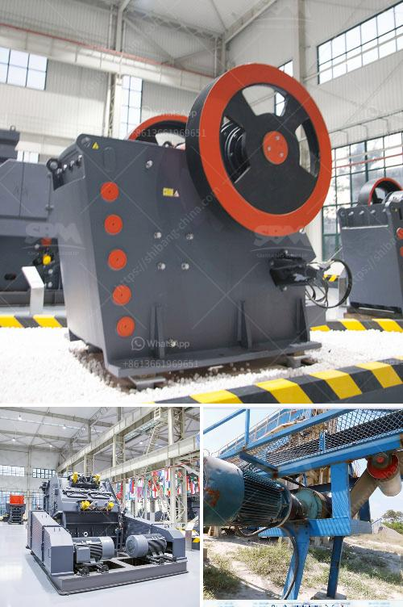

<h3>What is the difference between a single-toggle and double-toggle crusher?</h3>
A crusher is a machine designed to reduce large rocks into smaller rocks, gravel, or rock dust. In a double-toggle jaw crusher, the moving crusher jaw is driven by the eccentric shaft that moves the front and rear toggles up and down. Each shaft revolution causes the moving crusher jaw to close at the downstroke and open up during the upstroke.

In contrast, the single-toggle jaw crusher has fewer moving parts and less structural stress than a double-toggle jaw crusher. The single-toggle design means that the swing jaw is mounted directly on the eccentric shaft, which eliminates the need for springs and bearings. The eccentric motion of the swing jaw also reduces wear on the jaw plates.

One major difference between the two types of jaw crushers is the location of the pivot point on each crusher. While the pivot point for the single-toggle jaw crusher is at the bottom, the pivot point for the double-toggle jaw crusher is at the top. The double-toggle jaw crusher has a swing jaw that moves up and down under the force of an eccentric shaft, which moves the swing jaw at the bottom, resulting in a long jaw plate lifespan.

In the single-toggle jaw crusher, the swinging movement of the jaw plate does not play a significant role in driving the crushing process; it is driven by the eccentric motion of the main shaft. In contrast, the double-toggle jaw crusher is driven by the swing motion of the moving jaw plate, resulting in dynamic compression of the material. This crushing mechanism allows the jaw plates to apply high levels of force to the material, which results in faster processing and higher throughput.

Another difference between the double-toggle and single-toggle jaw crushers is the position of the eccentric shaft. In a double-toggle jaw crusher, the eccentric shaft is located behind the swinging jaw. This protects the eccentric shaft and bearings from damage due to debris, creating a reliable and potentially long-lasting machine. In contrast, the single-toggle jaw crusher has a fixed swing jaw that can only move in an up and down motion, reducing the potential for damage.

In summary, the single-toggle jaw crusher has fewer moving parts and is less stressed compared to the double-toggle jaw crusher. The lower throughput statement is a bit misleading because it's partially attributed to the type of bearings they have versus modern crushers, so if one was to upgrade the bearings, throughput could be closer to that of a modern jaw. Anyway, double-toggle jaw crushers are significantly larger and heavier, and tend to be more expensive than single-toggle jaw crushers. They are best used with abrasive, hard rock materials like granite and basalt.

Overall, the choice of crusher type depends on the desired throughput and size of the material being crushed. Single-toggle jaw crushers are best suited for crushing softer particles, while double-toggle jaw crushers are better for crushing hard, abrasive rocks.
<h3>Contact us</h3><ul><li><strong>Whatsapp:&nbsp;<a href="https://wa.me/8613661969651">+8613661969651</a></strong></li><li><a href="https://swt.shibang-china.com/?git&amp;zhl&amp;What is the difference between a singletoggle and doubletoggle crusher"><strong>Online Service(chat now)</strong></a></li></ul><h3>Related</h3><ul><li><a href='What plate is used for the curtain in an impact crusher.md'>What plate is used for the curtain in an impact crusher?</a></li><li><a href='What is froth flotation used for in mines.md'>What is froth flotation used for in mines?</a></li><li><a href='What does aggregate crusher mean.md'>What does "aggregate crusher" mean?</a></li><li><a href='What is the best type of crusher for hard rock.md'>What is the best type of crusher for hard rock?</a></li><li><a href='What are the mechanical devices used in mining What is the role of each.md'>What are the mechanical devices used in mining? What is the role of each?</a></li></ul>