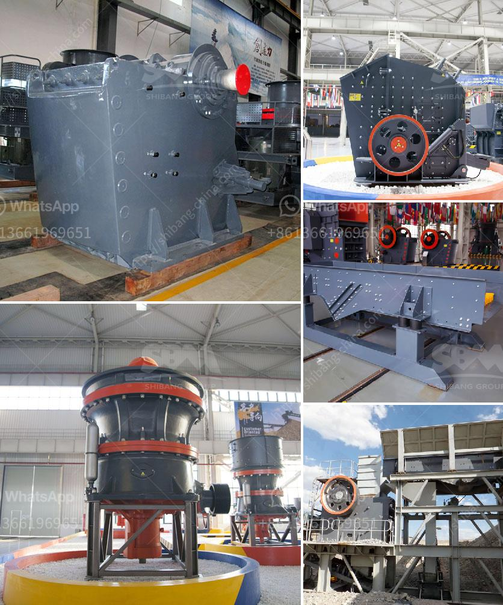

<h3>What is the difference between a standard and shorthead cone crusher?</h3>
Cone crushers are commonly used in secondary and tertiary crushing stages in comminution circuits. A cone crusher operates on the principle of squeezing material between a mantle and a concave. The crushing chambers differ in design for each respective application.

In a standard cone crusher, the main shaft is housed in a frame attached to a mantle. A pinion shaft assembly drives a bevel gear that rotates the cone. As material presses against the bowl liner by the mantle or cone, it is crushed into smaller pieces that fall through to the bottom.

A shorthead cone crusher, on the other hand, is designed to crush finer material and produce a finer product. It typically has a higher reduction ratio compared to a standard cone crusher. It uses a rounded crushing cone with a shorter, more steeply inclined crushing surface.

The main differences between the standard and shorthead cone crushers are the shape of the crushing chamber and the longer parallel zone in the shorthead cone crusher, resulting in higher crushing pressures. The shorthead cone crusher is usually used in applications where finer material needs to be crushed, such as producing a product with a finer particle size for the construction industry, chemical industry, and mining industry.

The shorthead cone crusher has a steeper head angle, a longer parallel zone, and a smaller crushing cavity compared to the standard cone crusher. Cone crushers are widely used in the mineral processing plant, aggregate plant, and cement plant for crushing of various ores and bulk materials.

The standard cone crusher is suitable for coarse and medium crushing while the shorthead cone crusher is suitable for fine crushing. Standard cone crushers are built with a robust design, and shorthead cone crushers are built with a lightweight and compact design. Both types of cone crushers can be electrically or hydraulically adjusted to achieve the desired product size.

In conclusion, the main difference between a standard and shorthead cone crusher is the shape of the crushing chamber and the longer parallel zone in the shorthead cone crusher. Additionally, the shorthead cone crusher has a steeper head angle, a longer parallel zone, and a smaller crushing cavity compared to the standard cone crusher.

When choosing between a standard and shorthead cone crusher, it is important to consider the desired product size, capacity requirements, and operating costs. A standard cone crusher is suitable for larger operations that require a higher capacity, whereas a shorthead cone crusher is ideal for smaller projects and operations that require finer materials.

Ultimately, the choice between the two cone crusher types depends on the specific application and the desired end product. Both standard and shorthead cone crushers have their own advantages and can effectively crush different types of materials, but it is crucial to consult with a knowledgeable supplier or engineer to determine the most suitable crusher for your needs.
<h3>Contact us</h3><ul><li><strong>Whatsapp:&nbsp;<a href="https://wa.me/8613661969651">+8613661969651</a></strong></li><li><a href="https://swt.shibang-china.com/?git&amp;zhl&amp;What is the difference between a standard and shorthead cone crusher"><strong>Online Service(chat now)</strong></a></li></ul><h3>Related</h3><ul><li><a href='What are the investments for a stone crusher.md'>What are the investments for a stone crusher?</a></li><li><a href='What is the project cost for ball grinding unit .md'>What is the project cost for ball grinding unit ?</a></li><li><a href='What RPM does the jaw crusher spin.md'>What RPM does the jaw crusher spin?</a></li><li><a href='What plate is used for the curtain in an impact crusher.md'>What plate is used for the curtain in an impact crusher?</a></li><li><a href='What is the process of crushing copper ore.md'>What is the process of crushing copper ore?</a></li></ul>