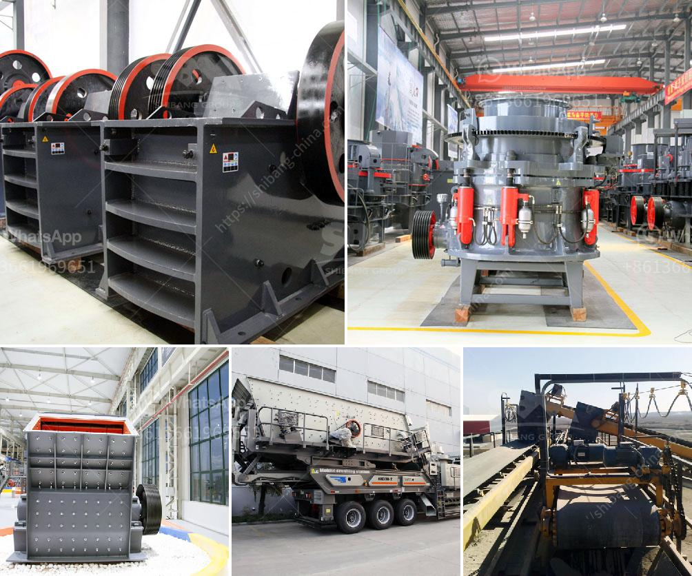

<h3>What is the difference between a wet and dry coal crusher and a hammer crusher?</h3>
Coal is a type of fuel that is commonly used in power generation, industrial applications, and heating. It is a sedimentary rock formed primarily from organic matter and contains varying amounts of carbon.

Coal crushers play an important role in the coal handling process. Whether it is underground mining, coal washing plants, or surface mining, the coal must be processed and crushed into different sizes, 0 ~ 25 mm particle size for coal gas stove, 25 ~ 8 mm for steam locomotive, 25 ~ 6 mm for the industrial furnace, and coal power plant requires grain coal of 0 ~ 25mm.

In the coal handling plant, crusher machine is used to crush the coal into smaller particle size for further processing. In the coal mining industry, coal crusher is also used to crush big coal into smaller then transport them by belt conveyor.

Wet and dry coal crushers can both be used in some areas of coal crushing applications. However, wet coal crushers require a significant amount of water. Therefore, coal mills should be used to further grind the coal before it can be used to generate steam.

Dry coal beneficiation processes were widely used in England and Wales, which has been a significant part of the pre-combustion coal cleaning technology, primarily by two interconnected factors: the shortage of natural resources and the increase in energy demand.

In recent years, due to the pollution caused by industrial coal and the tight supply of coal resources, energy prices have risen sharply, making the production and use of coal increasingly uneconomical. For this reason, dry coal beneficiation has become a popular solution, and the hammer crusher is an indispensable unit in this process.

It is well known that in the traditional wet coal crushing process, raw coal is crushed to -3 mm for power generation. Then this crushed coal is passed through a large number of water-containing separation equipment to separate fine coal and water in order to realize the separation of water and coal. This wet production process consumes a large amount of water and generates a large amount of slurry and wastewater containing a variety of pollutants, which brings serious problems to environmental protection.

Another common issue is that the wet coal will adhere to the crushing equipment, so the efficiency of wet coal crushers is lower compared to dry coal crushers.

Acknowledging these challenges, dry coal beneficiation technology has been developed in recent years. The principle of this process is to heat raw coal in a low-temperature environment to remove water while the coal is still in its solid form. This eliminates the need for a large amount of water during the crushing process and reduces pollution.

Dry coal crushers are specifically designed to handle the challenges associated with crushing fragile materials such as coal, including jaw crushers, impact crushers, and hammer crushers. But in recent years, impact crushers have become more popular because of its significant advantages.

In this article, we will analyze the difference between hammer crushers and impact crushers in order to help you choose the appropriate crushing equipment.

Hammer crusher is a ring granulator type crusher, which is widely used in coal mining industry. It is mainly used to crush coal in power plants, thermal power plants, and cement plants. Wet coal is not suitable to be crushed by hammer crusher, as its moisture content is high, so it will stick to the hammer crusher and cause blocking situations. Therefore, hammer crusher is widely used in coal beneficiation.

On the other hand, impact crushers are used for crashing medium-hard and brittle materials, such as limestone and coal. The crushing chamber is designed to break the materials into smaller pieces. However, wet and sticky coal can clog the crushing chamber, so the efficiency of impact crushers decreases.

In conclusion, considering the fact that wet coal requires high water content and should be processed by a wet coal crusher, wet coal crushers are widely used in the coal processing industry. On the other hand, considering the moisture content of the coal and the amount of dust generated during the crushing process, the dry process is more suitable for the production of coal powder for power plants or industrial furnaces.

In summary, the choice of wet and dry coal crushers is determined by the characteristics of the coal and the requirements of the product. The hammer crusher is convenient to use and easy to operate, while the impact crusher has a wide range of crushing capabilities and can handle many types of materials. For this reason, it is recommended to choose the impact crusher.
<h3>Contact us</h3><ul><li><strong>Whatsapp:&nbsp;<a href="https://wa.me/8613661969651">+8613661969651</a></strong></li><li><a href="https://swt.shibang-china.com/?git&amp;zhl&amp;What is the difference between a wet and dry coal crusher and a hammer crusher"><strong>Online Service(chat now)</strong></a></li></ul><h3>Related</h3><ul><li><a href='What is an overpressure fan in a cone crusher.md'>What is an overpressure fan in a cone crusher?</a></li><li><a href='What is the purpose of gypsum added at the mill when the clinker is ground .md'>What is the purpose of gypsum added at the mill when the clinker is ground ?</a></li><li><a href='What is the way to block the material of sand crusher .md'>What is the way to block the material of sand crusher ?</a></li><li><a href='What machines are required for a limestone powder factory.md'>What machines are required for a limestone powder factory?</a></li><li><a href='What type of crusher do I need for gold.md'>What type of crusher do I need for gold?</a></li></ul>