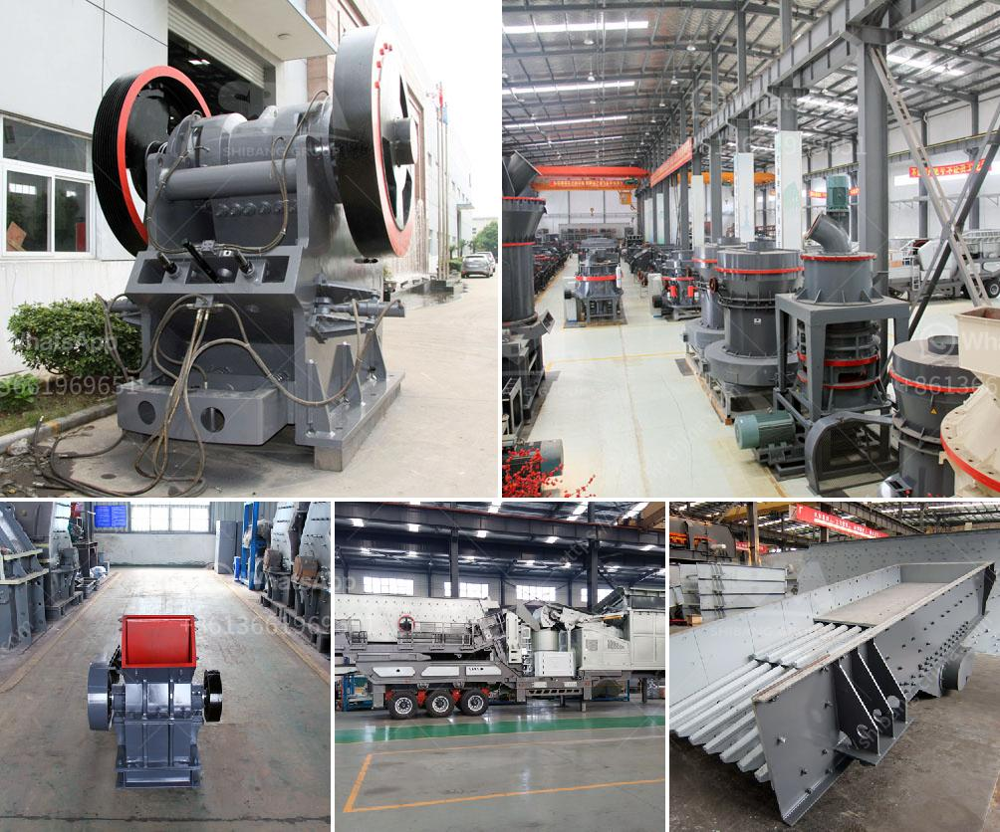

<h3>What is the difference between an impact, cone, and jaw crusher?</h3>
Crushers are indispensable machines in the mining and quarrying industry. Different types of stone crushers have different models, names, and functions. Sometimes they are named according to materials such as rock crushers, ore crushers, quarry crushers, granite crushers, concrete crushers, etc. Among those, jaw crusher is the most common, which can be divided into fixed jaw crushers and mobile jaw crushers depending on the way of installation.

Jaw crushers are characterized by their simple structure, easy maintenance and low cost. There are two types of jaw crushers: deep cavity and shallow cavity. Both of them have their own advantages and disadvantages.

Deep cavity jaw crusher is commonly used as the first stage coarse crusher for various ores and rocks. It can process all kinds of ores with compressive strength up to 320 MPa to medium size, often with cone crusher, impact crusher and sand making machine to form a complete set of sand and gravel production line. However, the deep cavity jaw crusher requires relatively large crushing equipment, and the cost of manpower and wear parts is high.

Cone crusher is different from impact crusher in the crushing cavity, the crushing cavity of cone crusher is composed of the concave and mantle, which has a wide application range and can process high hardness materials. So, as for the difference between jaw crusher and cone crusher, cone crusher plays a more important role in mining industry. Hydraulic cone crusher (cone crusher) adopts hydraulic  discharging system, which reduces the downtime and makes it easier to operate. Cone crusher can be divided into coarse crushing, medium crushing and fine crushing according to the different types and uses.

Impact crusher mainly uses the impact force to simulate the crushing of materials. The material enters into the crushing cavity and crushes by the impact of the high-speed rotating hammer. The crushed material is thrown to the impact plate and crushed again. The hammerhead is fixed on the rotor, which increases the hammering times and crushing effect. Besides, the striker plate is positioned to reduce the possibility of the raw material blocking. Impact crushers can be used as primary crushers, secondary crushers, or tertiary crushers depending on the size and technology.

They are equipped with beaters, also called hammers, and impact plates. They operate in the following way: they are fed from the upper part, then the stones are hit by the hammers and projected towards the plates. Primary and secondary crushers handle large pieces, while tertiary and quaternary models produce finer particles.

In summary, in the construction industry, the crusher serving for a period of time needs to be replaced. Therefore, the replacement of crusher is a frequent occurrence, how to choose the right crusher equipment, which determines the economical and efficient operation of the whole production line, is the key to success. The difference between the types of crushers can be classified into jaw, impact, and cone crushers. These crushers work by squeezing the material in different parts of the machine, and they have their own specific features, which we will list in the following sections.
<h3>Contact us</h3><ul><li><strong>Whatsapp:&nbsp;<a href="https://wa.me/8613661969651">+8613661969651</a></strong></li><li><a href="https://swt.shibang-china.com/?git&amp;zhl&amp;What is the difference between an impact cone and jaw crusher"><strong>Online Service(chat now)</strong></a></li></ul><h3>Related</h3><ul><li><a href='what equipment are used in the production of bentonite？.md'>what equipment are used in the production of bentonite？</a></li><li><a href='What is the ball milling method.md'>What is the ball milling method?</a></li><li><a href='What are the parts of a Raymond Mill.md'>What are the parts of a Raymond Mill?</a></li><li><a href='What is the ore crusher discharge port size.md'>What is the ore crusher discharge port size?</a></li><li><a href='What raw materials and equipment are needed for artificial sand.md'>What raw materials and equipment are needed for artificial sand?</a></li></ul>