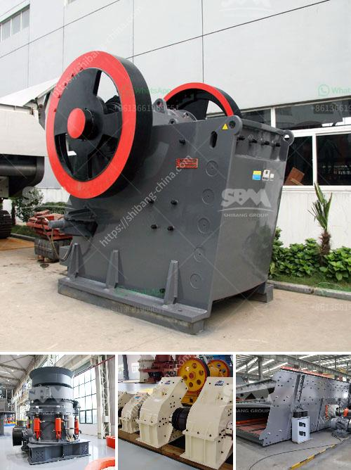

<h3>What is the difference between an impact crusher and a cone crusher?</h3>
When it comes to crushing equipment, there are two widely used types: impact crushers and cone crushers. These two crushers have different working principles and crushing methods, but they create similar results.

The key difference between these two types of crushers is the method of crushing. In impact crushers, the material is crushed by high-speed impact or collision between the anvil and the hammer. This creates a compression crushing effect, whereas in cone crushers, the material is crushed by compression between a concave and a mantle.

In an impact crusher, the feed opening is usually small and the material is accelerated rapidly by the rotor. This enables the crushing of larger and harder materials, as the energy is transferred directly to the particles, causing them to shatter upon impact. The impact crusher is versatile and can be used in both primary and secondary crushing applications.

On the other hand, cone crushers are used for intermediate and tertiary crushing. They rely on the compression crushing technique, where the material is crushed by a rotating mantle against a stationary concave. The concave and mantle together form the crushing chamber, which is filled with a feed material and squeezed by the mantle to produce the desired size reduction.

Another difference between impact crushers and cone crushers is their final product shape. In impact crushers, the material is forced to impact with the anvils or the blow bars that are fixed upon the rotor, producing a more cubical end product. In contrast, cone crushers generate particles with a more elongated shape.

Moreover, cone crushers often come with a fine crushing chamber configuration, which can produce smaller particles or fines for subsequent grinding or processing. This makes them suitable for applications where a higher reduction ratio is desired.

In terms of maintenance and operating costs, impact crushers tend to be more expensive upfront but have lower operating costs over time. They have fewer moving parts and are generally easier to maintain. Additionally, impact crushers can handle abrasive materials, making them suitable for crushing materials with high compressive strength.

Cone crushers, on the other hand, have higher wear costs and require regular maintenance due to the nature of their crushing action. However, they are generally more efficient when it comes to energy consumption and can produce finer particles. The choice between the two types of crushers ultimately depends on the specific requirements and the desired end product.

In conclusion, the main difference between impact crushers and cone crushers lies in the method of crushing and the resulting particle shape. Impact crushers use impact or collision forces to crush the material, while cone crushers use compression crushing. Impact crushers are generally used for primary crushing, while cone crushers are used for secondary or tertiary crushing. Understanding the differences between these two types of crushers can help you make an informed decision when selecting the appropriate crushing equipment for your application.
<h3>Contact us</h3><ul><li><strong>Whatsapp:&nbsp;<a href="https://wa.me/8613661969651">+8613661969651</a></strong></li><li><a href="https://swt.shibang-china.com/?git&amp;zhl&amp;What is the difference between an impact crusher and a cone crusher"><strong>Online Service(chat now)</strong></a></li></ul><h3>Related</h3><ul><li><a href='what is the quarrying process？.md'>what is the quarrying process？</a></li><li><a href='What are the models of Raymond mill.md'>What are the models of Raymond mill?</a></li><li><a href='What is a vertical pulverizer.md'>What is a vertical pulverizer?</a></li><li><a href='What is an overpressure fan in a cone crusher.md'>What is an overpressure fan in a cone crusher?</a></li><li><a href='What is the largest industrial crusher.md'>What is the largest industrial crusher?</a></li></ul>